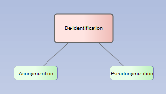
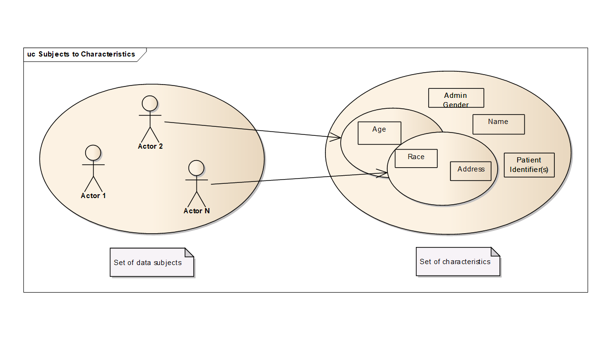
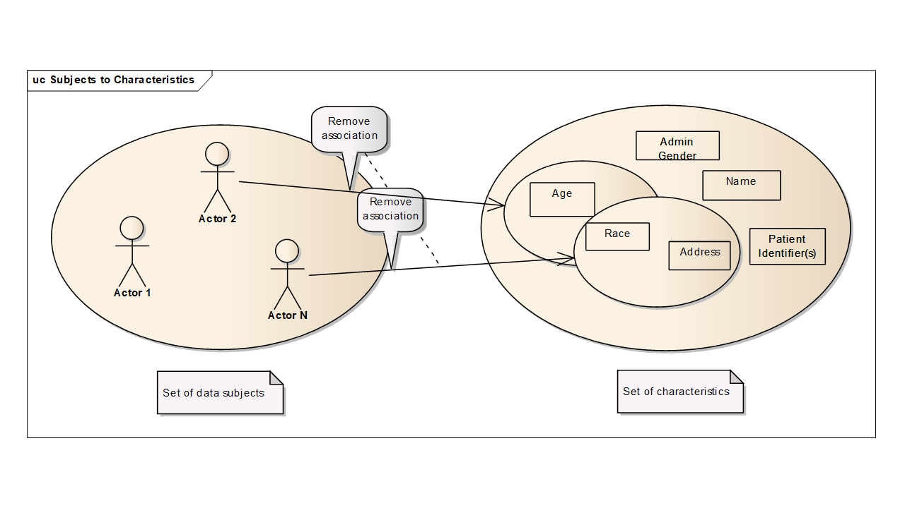
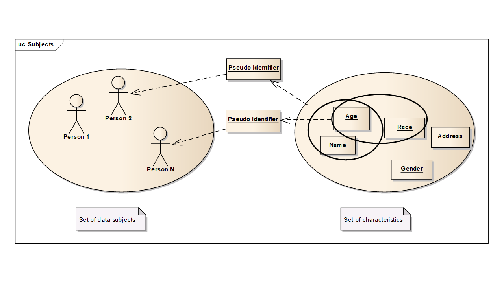
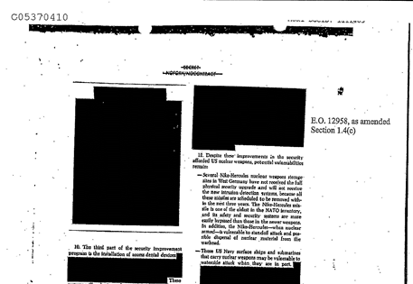

**Integrating the Healthcare Enterprise**

**[IHE IT Infrastructure](http's://profiles.ihe.net/ITI) Handbook**

**De-Identification**

**Draft (initial conversion to html)**

Date: TODO

Author: IHE IT Infrastructure Technical Committee

Email: ITI@ihe.net

**Please verify you have the most recent version of this document.** See
[here](http://ihe.net/Technical_Frameworks/) for Published versions and
[here](http://ihe.net/Public_Comment/) for Public Comment versions.

**Foreword**

This handbook, written by the IHE IT Infrastructure Technical Committee, is published as of 2022-xx-xx. Comments are invited and can be submitted via traditional methods at [ITI Public Comments](http://www.ihe.net/ITI_Public_Comments/) or by creating a [GitHub Issue](TODO add link). Please reference the section that your comment applies to.

General information about IHE can be found at [IHE.net](http://www.ihe.net/).

Information about the IHE IT Infrastructure domain can be found at [IHE Domains](http://ihe.net/IHE_Domains/).

Information about the organization of IHE Technical Frameworks and Supplements and the process used to create them can be found at [Profiles](https://www.ihe.net/resources/profiles/) and [IHE Process](http://ihe.net/IHE_Process/).

The current version of the IHE IT Infrastructure Technical Framework can be found [online](https://profiles.ihe.net/ITI/TF/index.html).

**CONTENTS**

- [1 Introduction to This Handbook](#1-introduction-to-this-handbook)

- [2 De-Identification, Pseudonymization, and Relinking](#2-de-identification-pseudonymization-and-relinking)

	- [2.1 General Approach](#21-general-approach)

	- [2.2 Definitions](#22-definitions)

	- [2.3 De-identification Background](#23-de-identification-background)

	- [2.4 Pseudonymization](#24-pseudonymization)

	- [2.5 Relinking or Re-identification](#25-relinking-or-re-identification)

	- [2.6 Threat Categories](#26-threat-categories)

- [3 Data Categories](#3-data-categories)

- [4 Algorithms](#4-algorithms)

	- [4.1 Redaction](#41-redaction)

	- [4.2 Fuzzing](#42-fuzzing)

	- [4.3 Generalization](#43-generlization)

	- [4.4 Longitudinal Consistency Constraints](#44-longitudinal-consistency-constraints)

	- [4.5 Recoverable Substitution](#45-recoverable-substitution)

	- [4.6 Text Processing](#46-text-processing)

	- [4.7 Pass-through](#47-pass-through)

	- [4.8 De-identification datatype/algorithm matrix](#48-de-identification-datatypealgorithm-matrix)

- [5 Process](#5-process)

	- [5.1 Step 1 – Requirements Design](#51-step-1--requirements-design)

	- [5.2 Step 2 – De-identification Design](#52-step-2--de-identification-design)

	- [5.3 Step 3 – Design Validation](#53-step-3--design-validation)

	- [5.4 Step 4 – Implementation](#54-step-4--implementation)

	- [5.5 Step 5 – Implementation Validation](#55-step-5--implementation-validation)

	- [5.6 Step 6 – Periodic Review of Implementation](#56-step-6--periodic-review-of-implementation)

- [6 De-Identification and Pseudonymization for IHE Profile Editors](#6-de-identification-and-pseudonymization-for-ihe-profile-editors)

- [7 Security Considerations](#7-security-considerations)

- [Appendices](#appendices)

	- [Appendix A: Annotated References](#appendix-a-annotated-references)

	- [Appendix B: Examples (HL7 2.x and CDA)](#appendix-b-examples-hl7-2x-and-cda))

	- [Appendix C: ATNA and Other Logging Considerations](#appendix-c-atna-and-other-logging-considerations)

	- [Appendix D: Acknowledgements](#appendix-d-acknowledgements)

- [Open Issues](#open-issues)

- [Closed Issues](#closed-issues)

# 1 Introduction to This Handbook

This handbook explains the PROCESS for removing individually identifiable information from healthcare data. This includes de-identification, pseudonymization, re-linking, design considerations, techniques, and risks. The intended audience is IHE Profile editors and healthcare information technology implementers needing a guide for designing and implementing de-identification systems.

De-identification is used to reduce privacy risks in a wide variety of situations:

- Extreme de-identification is used for educational materials that will be made widely public, yet must convey enough detail to be useful for medical education purposes. (There is an IHE profile for automation assistance for performing this kind of de-identification. Much of the process is customized to the individual patient and educational purpose.)

- Public health uses de-identified databases to track and understand diseases.

- Clinical trials use de-identification both to protect privacy and to avoid subconscious bias by removing other information such as whether the patient received a placebo or an experimental drug.

- Slight de-identification is used in many clinical reviews, where the reviewers are kept ignorant of the treating physician, hospital, patient, etc. both to reduce privacy risks and to remove subconscious biases. This kind of de-identification only prevents incidental disclosure to reviewers. An intentional effort will easily discover the patient identity, etc.

Public health and clinical trials might also have a requirement to be able to contact a person based on their de-identified records. This poses further constraints on the methods used to de-identify the records.

***It is important to understand that you can only reduce the risks. The only way to absolutely assure a person cannot be relinked to their data is to provide no data at all. De-identified data can still be full of identifying information, and may still need extensive privacy protections.***

This handbook describes a general process that should be adapted to specific situations. This handbook does not define a universal de-identification profile. Each situation must be evaluated according to its data needs and the environment. This must be specific to the information being processed, applicable laws and regulations, organizational policies, the operational environment, and more.

The design and operation of any de-identification profile or system must be validated and monitored. Validation should occur early in the design phase, again when the system is going live, and during operational use. The characteristics of many data sets change over time, and monitoring production de-identification systems helps ensure that they remain effective over time. An IHE profile editor may be unaware of these specifics and thus unable to provide detailed guidance. IHE profiles can provide help by eliminating unnecessary information from content modules, and perhaps providing guidance for common expected intended uses.

It is also important to remember data that is appropriately de-identified for one purpose (such as a clinical trial) may not be correctly de-identified for a new use of the data (such as using the same data set for a public health database).

ISO/TS 25237 describes the objectives of de-identification to include:

- secondary use of clinical data (e.g., research);

- clinical trials and post-marketing surveillance;

- pseudonymous care;

- patient identification systems;

- public health monitoring and assessment;

- confidential patient-safety reporting (e.g., adverse drug effects);

- comparative quality indicator reporting;

- peer review;

- consumer groups;

- medical device calibration or maintenance.

# 2 De-Identification, Pseudonymization, and Relinking

De-identification, anonymization, and pseudonymization are processes that reduce the probability of an individual being associated with that individual’s data. The most common healthcare use of these techniques is to protect individual patients, but they may also be applied to protect healthcare clinicians, devices, or organizations.

Anonymization and pseudonymization are the two types of de-identification. Anonymization is used for one-way de-identification for situations where there is no requirement to identify the patient based on these records. Pseudonymization is used when there is a requirement to be able to identify the patient based on these records. Re-identification may require contacting third parties to perform this task.

De-identification is also used to reduce risks such as bias in clinical studies or clinical reviews. De-identification is not often thought of in the context of treatment because you usually must associate the patient with his/her data in order to treat the patient. Some healthcare services, such as HIV testing, are delivered anonymously or pseudonymously. De-identification is more often an essential tool for secondary uses of data such as clinical trials and analytics.

De-identification removes data that are not strictly required for the intended purpose of those data.

- Anonymization disassociates all identifiers from the data;

- Pseudonymization uses controlled replacements to allow longitudinal linking and authorized re-identification. An example of pseudonymization is the use of an alias when that person is admitted to a hospital.

Clinical trials usually employ pseudonymization. Clinical trial processes remove identifying information, such as the patients’ demographics, that are not required. Where attributes about the patient must be preserved, different methods are used to obscure the real identity while maintaining the needed information. For example, most clinical trials replace the original patient ID and record numbers with a clinical trial ID and a subject ID. Only the clinical trial manager knows both numbers. A reviewer that needs to inform a patient about a finding must contact the clinical trial manager. Only the trial manager can determine the actual patient hospital and patient ID from theclinical trial ID and subject ID.

De-identification lowers, but does not eliminate, the risk of re-identification. The database relating clinical trial and subject ID to patient hospital and patient ID must be protected to preserve privacy. A poor choice of pseudonymous ID, such as a hash of patient name, enables easy re-identification.

A teaching file is an example of an anonymization scrubbing process. Teaching files, such as radiological images illustrating a specific patient condition, are manually reviewed, file-by-file, field-by-field, to determine which fields are needed for the intended instructional purpose, and to determine if the field (or fields) could be used to re-identify the subject of the images. Often textual descriptions of the patient condition are rewritten to retain the useful meaning, because narrative text is often critical to the purpose of instruction. There is no requirement to be able to identify the patient later, so all traces of the patient should be removed and the data made fully anonymous.

Maintenance and repair logs for equipment and software are a frequent patient disclosure risk where anonymization is very appropriate.

It is important to note that in certain legal jurisdictions the legal protection needed for the data changes once it has been de-identified. These regulations are subject to change, so the de-identification
processes must be adaptable.

In the USA, part of the clinical trial process is governed by an Institutional Review Board (IRB). This body is sometimes known as an Independent Ethics Committee, or an Ethical Review Board. The IRB is governed by Title 45 CFR Part 46 of the federal regulations which are subject to the “Common Rule” which states that federally funded clinical trials must have an IRB, and that the IRB must guarantee that it will provide and enforce protection of human subjects. The IRB accomplishes this, in part, by a pre-trial review of the protocol, and specifically reviews risks (both to human subjects and to the learning objectives of the trial).

Part of the human subject risk considered by IRBs is that to patient privacy, which most nations require protection of. In the US, regulations state “IRBs should determine the adequacy of the provisions to protect the **privacy** of subjects and to maintain the **confidentiality** of the data \[*see* Guidebook Chapter 3, Section D, "Privacy and Confidentiality"\]” One effective method to help reduce both study bias and privacy risk is to use data that has been pseudonymized. Since IHE profiles are not governed by IRBs, IHE writers need to provide enough info in their profiles to help implementers comply with anticipated future IRB policies.

## 2.1 General Approach

The process of de-identification focuses on risk reduction. This starts with defining the intended use of the de-identified data and understanding the needs of that use. This approach starts by allowing no data, which requires that the project team justify that each attribute is required to fulfill the use case objectives. As each attribute is examined, various methods of manipulation are considered. The data use purpose may be met by data that has been modified to reduce the amount of identifying information conveyed. The goal is to eliminate everything that the implementer can afford lose. The result is that only the minimal information needed for the intended use remains in the de-identified data-set.

In this process you must examine some key questions:

- What are the intended use requirements?

- What kinds of data elements are involved?

- From whom is the asset being protected? This is affected by the expected scope of disclosure and publication.

- What data attributes must be processed in a similar or consistent manner?

For each element you must consider the associated risk. Risk Assessment is the topic of the IHE ITI Cookbook: Preparing the IHE Profile Security Section and the reader is guided to that paper for more information. That paper discusses how to evaluate risks for likelihood and impact of disclosure and how to use various de-identification algorithms to mitigate identified risks.

Much of this analysis must be aided by subject matter experts. For example, consider what information is needed for a prescription record that will be part of a clinical review. Clearly the patient name, address, etc. are not needed for the review. Is the prescription number needed? The exact number is probably not needed, but a substitute unique number might be needed for software processing and tracking references, e.g., references from the dispense report. Is the dispensing pharmacy identification needed? Is the dispense time needed? Is the brand or lot number needed? These depend entirely upon the purpose of the review. If it is evaluating pharmacy performance the pharmacy identification needs to be psuedonymized. If not, the pharmacy identification may be anonymized. The subject matter expert can answer this kind of question. The answer will be different for different intended uses.

> This analysis will also be affected by regulatory requirements. Most
> nations have laws that identify particular sensitive data that must be
> given special protection, and other laws that may mandate disclosure
> of other information. Local regulatory expertise will be needed.
>
> At the end of the requirement analysis process a table of data
> elements, intended use, risks, mitigations, and residual risks will be
> created. Some standards, e.g., DICOM PS3.15 Annex E, provide tables
> that can act as the starting point for creating a use specific final
> table. Table 2.1-1 illustrates what a final table might contain.

**Table 2.1-1: Illustrative List of Fields and Risks**

<table>
<colgroup>
<col style="width: 16%" />
<col style="width: 17%" />
<col style="width: 20%" />
<col style="width: 15%" />
<col style="width: 31%" />
</colgroup>
<thead>
<tr class="header">
<th>Example Field</th>
<th>Intended Use</th>
<th>Risk Characteristics</th>
<th>Mitigation</th>
<th>Residual Risk</th>
</tr>
</thead>
<tbody>
<tr class="odd">
<td>Medical Record Number (MRN)</td>
<td>Re-identification is required when the patient must be notified of a
significant diagnosis.</td>
<td>Direct identification of a patient within a facility, or indirect
identification outside the facility.</td>
<td>Pseudonymize using separately stored Trial ID and Patient ID
relationship</td>
<td>Re-identification database must be protected</td>
</tr>
<tr class="even">
<td>National/regional identity numbers (SSN for the UA realm, Provincial
Health Card for Canada, NI for the UK, etc.)</td>
<td>None</td>
<td>Direct identification of a patient to an attacker with access to
commonly available data sources.</td>
<td>redact</td>
<td>Nil</td>
</tr>
<tr class="odd">
<td>Codified medications,</td>
<td></td>
<td>
Provided that these data are not outliers, the risk of
identifying a person is reasonably low.

Inconsistent use of codes and changes to value sets may cause
analysis problems.
</td>
<td>
None, preserve information.

Flag unusual values for technical analysis.
</td>
<td>Some sensitive disease information, e.g., HIV treatment, remains in
the dataset.</td>
</tr>
<tr class="even">
<td>Etc.</td>
<td></td>
<td></td>
<td></td>
<td></td>
</tr>
</tbody>
</table>

Ultimately there will be residual risk that will need to be documented as unmitigated. This may make it necessary to protect the resulting de-identified data through other means like access controls and physical limits.

## 2.2 Definitions

**Anonymity:** Anonymity means that the subject is not identifiable. For example, a patient cannot be identified from a teaching file. From the perspective of an attacker, anonymity means that no individual subjects can be identified.

**Anonymization**: A process that is intended to irreversibly remove the association between a subject and information that can identify the subject. If the process is intended to be reversible and a new identifier is substituted for the subject’s real identifiers, then the process is called **pseudonymization**.

**Anonymous identifier**: An identifier for a subject that, in contrast to pseudonymization, is not intended to allow relinking to the subject. It may be created from one-way mapping from a subject to an identifier that cannot be reversed. This is different than pseudonymization, see below.

**De-identification**: Any process that removes the association between a subject’s identity and the subject’s data elements. Anonymization and pseudonymization are types of de-identification.

**Direct identifying data:** Data that directly identifies a single individual. Direct identifiers include data that can be cross-referenced through commonly available information sources, e.g., telephone number. Locally used identifiers (such as hospital IDs) can be considered directly identifying to personnel of the local domain.

**Identifiable person**: A person who can be identified, directly or indirectly. For example through one or more factors specific to their physical, physiological, mental, economic, cultural or social identity (see “Directive 95/46/EC of the European Parliament and of the Council of 24 October 1995 on the protection of individuals with regard to the processing of personal data and on the free movement of such data”).

**Indirect identifying data**: “Data that does not directly identify a single individual but may be used in collaboration with other indirect identifiers to identify an individual. … Examples: Zipcode(sic), Sex, Age, Date-of-Birth, Race.” \[ISO 25237\]

**Irreversibility**: The inability to determine an original value, or set of values. This is not always a simple binary statement. It is often a measure of difficulty. It is computationally difficult to determine the original values once it has been subjected to a SHA-256 one-way hash with a salt. Some national organizations may have the resources to perform this computation, and changes in computer technology will change the degree of difficulty. 

**Natural person**: The subject of the data, e.g., the patient.

**Pseudonym**: A computed or assigned value that is substituted for one or more data elements in that subject’s record. Alias and nickname are common terms for pseudonym. For example, a pseudonym of “csrk123” could be added to a subject’s record, and that subject’s first, last, middle, and national ID numbers could be removed. The protection provided by a pseudonym is dependent on the system used to create and protect the relationship between the pseudonym and the person’s real identity. Well known aliases are an example of pseudonyms that provide little protection. More people know the alias “Lenin” than his birth name. This differs from anonymization by preserving continuity throughout the resulting data set.

**Pseudonymization**: A particular type of anonymization that removes the association between data and a subject and introduces a new identifier that establishes a bidirectional-mapping between that subject and the new identifier. Pronunciation guide: “soo-DON-imm-ization”, rhymes with optimization.

**Real name**: The recognized names of the subject (natural person). This is often also called the “legal name”, but there can be subtle differences between legal requirements and identification. The real name can be multiple or change over time as a result of changes like a legal name change due to a marriage. Real names can also include extensive optional elements, such as the family history components of Spanish names or the extended content of some Indian names.

**Unlinkability:** A state whereby which two items cannot be associated.

## 2.3 De-identification Background

De-identification is the process of removing or transforming sufficient information from the source data. The goal is that the risk of re-identification is reduced to an acceptable level while also achieving the objectives of the intended use. There is a trade-off between the fidelity of the resulting de-identified data set, and the risk of re-identification. From ISO/TS 25237 “There is no one single de-identification procedure that will meet the diverse needs of all the medical uses while providing identity concealment. Every record release process shall be subject to risk analysis to evaluate:

1. the purpose for the data release (e.g., analysis);

2. the minimum information that shall be released to meet that purpose;

3. what the disclosure risks will be (including re-identification);

4. what release strategies are available.

**Figure 2.3-1: Relationships in original data**

**Figure 2.3-2: Relationships removed by De-identification**

In the above figures, each person is associated with specific
characteristics such as age, administrate gender, given name, etc.
Starting with zero knowledge, an attacker can only identify a large set
of people as candidates. But each time the attacker obtains a
characteristic, the set of candidate individuals is reduced. If an
attacker can collect enough characteristics about a person, then the set
of candidate individuals is reduced to a single person.
De-identification techniques are used, to ensure that all these sets
remain sufficiently large that the risk of identifying a specific
individual is acceptable.

### 2.3.1 Examples

A national government project in central Europe was seeking to identify prisons that had populations that were at high risk for outbreaks of certain disease so that they could intervene. They found that certain lifestyle traits, specifically a history of intravenous drug usage, piercings, and tattoos, had a high positive correlation with this disease. This lifestyle information was not codified and only existed in free form text notes. Their first solution was to manually redact the records and supply the remaining information to the researchers. But it failed to achieve privacy objectives. Specific prisoners could often be identified. Their second solution was to use manual free form text data mining tools to extract only certain key words, removing the entire record, and only supplying those keywords and the prison location. This proved successful. Their current plan is to use automated tools to identify key phrases, transform those into project-specific codified values, and then only supply that information along with the prison identifier to the researchers.

A clinical trial is being planned that will involve independent reviewers of patient records to assess the response to an experimental drug. It may be necessary to inform patients of unusual findings. The trial sponsors set up a trial manager that will receive information from the physicians. The trial sponsor will perform the de-identification of the records, substituting clinical trial IDs for the original identifiers, obscuring dates, and redacting other non-clinical information. They chose to use a trial manager rather than ask the various patient physicians to perform de-identification based on the complexity of the trial requirements. The patients, physicians, and the
trial sponsor agreed to allow a de-identification team access to the original patient data. The de-identification team and their systems are kept separate from the clinical trial results analysis. Only the de-identification team knows the relationship between clinical trial IDs and patient IDs.

In the event that a significant finding is made by the review team, they communicate the finding to the de-identification team. The de-identification team contacts the patient’s physician with the finding. The patient’s physician examines the record and communicates with the patient. The physician informs the de-identification team that the patient has been informed. The de-identification team informs the review team, so that the review team can confirm that their ethical duty to ensure that the patient is informed has been met.

## 2.4 Pseudonymization 

Pseudonymization is a particular type of de-identification “that both removes the association with a data subject and adds an association between a particular set of characteristics relating to the data subject and one or more pseudonyms.

- In irreversible pseudonymization, the pseudonymized data do not contain information that allows the re-establishment of the link between the pseudonymized data and the data subject. This is overlaps with anonymization, but preserves continuity for the pseudonym throughout the resulting data set.

- In reversible pseudonymization, the pseudonymized data can be linked with the data subject by applying procedures restricted to duly authorized users.

Pseudonymization separates personal identifiers from payload data by assigning new identifiers. This approach maintains a connection between payload data in all the records by means of the new identifiers. It can allow for re-identification under prescribed circumstances and protections if the relationship between the new identifiers and original identifiers is preserved.

**Figure 2.4-1: Pseudonymization**

One key use of pseudonymization is to preserve the relationships that
associate data in many different documents to a specific individual. The
pseudonymous identifier is a new characteristic that substitutes for the
original person identifier. De-identification must use still be done
after pseudonymization to remove the remaining non-essential
characteristics.

## 2.5 Relinking or Re-identification

Re-identification is the process of re-associating the de-identified data with the original subject identity. The need for re-identification increases the complexity.

Reasons for re-identification include:

- Verification and validation of data integrity

- Checking for suspected duplicate records

- Enabling requests for additional data

- Linking to supplement research information variables

- Compliance audits

- Informing data subjects or their care providers of significant findings

- Facilitating follow-up research

- Law enforcement

## 2.6 Threat Categories

There are various kinds of threats that motivate de-identification. The following table is illustrative of these kinds of threats. As part of the risk assessment there is a threat analysis that will consider whether these and other threats apply in that situation.

**Table 2.6-1: Threat Categories**

| Category of Threat | Threat Description     | Scenario            | Example           | Candidate Mitigations          |
|--------------------|----------------------- |---------------------|-------------------|--------------------------------|
| 1| Attacker will determine the identity of the subject by combining directly available data elements such as first name, last name, and  address, identification numbers, email, facial image, etc.| Direct identifiers| Full name and address left in the data (e.g., free text field) in one database|Removal of clearly identifying data; removal of text narratives|
| 2| Attacker will correlate and aggregate fields from other data sources to determine a subjects identity|Multiple data sources|Combining pseudonymized gender and postal code in one data
source, address in another, name in another. Using publically available data (e.g., auto license plate number). Dates left in the data correlate to known health events for individual (e.g., attacker surveillance of individual knows dates of service).| Attempt to remove data elements that provide for direct correlation, or generalize or fuzz these elements (such as using only first 3 digits of USA Zip postal codes) to make direct correlation harder.
Using only first 3 digits of USA Zip postal codes Fuzz the dates-of-service.|
| 3| Attacker will identify an individual via remaining data elements that alone uniquely identify an individual| Use of outliers| Unusual medical condition in a rural area|Supply minimal data set and conduct a statistical analysis of the result; work with sufficiently large data sets|
| 4| Attacker will infer missing information from provided information|Data elements remaining are sufficient to infer the identity| Can infer the age or gender of a person based on certain tests| Complex threat modeling, statistical analysis; use of large data sets; carefully control vocabulary and allowed values of tests and procedures, etc.|
| 5| Pseudonym-to-real identifiers cross reference table is compromised| | | |
| 6| Weak pseudonym algorithm is compromised|A specific pseudonymization approach may use a vulnerable algorithm (such as a non-cryptographic hash) of an identifier|A USA domain Social Security Number is hashed using MD5 with no salt where a “rainbow table” attack is highly viable.| Use a cryptographic hash (with a salt) or create a random identifier that is not a mathematical function of any real identifiers.|
| 7| Previously protected information is compromised| | Old court records made publically available, by mistake, authorized individual, or social engineering attack| |

<table>
<colgroup>
<col style="width: 13%" />
<col style="width: 23%" />
<col style="width: 16%" />
<col style="width: 16%" />
<col style="width: 30%" />
</colgroup>
<thead>
<tr class="header">
<th>Category of Threat</th>
<th>Threat Description</th>
<th>Scenario</th>
<th>Example</th>
<th>Candidate Mitigations</th>
</tr>
</thead>
<tbody>
<tr class="odd">
<td>1</td>
<td>Attacker will determine the identity of the subject by combining
directly available data elements such as first name, last name, and
address, identification numbers, email, facial image, etc.</td>
<td>Direct identifiers</td>
<td>Full name and address left in the data (e.g., free text field) in
one database</td>
<td>Removal of clearly identifying data; removal of text narratives</td>
</tr>
<tr class="even">
<td>2</td>
<td>Attacker will correlate and aggregate fields from other data sources
to determine a subjects identity</td>
<td>Multiple data sources</td>
<td>
Combining pseudonymized gender and postal code in one data
source, address in another, name in another.

Using publically available data (e.g., auto license plate
number).

Dates left in the data correlate to known health events for
individual (e.g., attacker surveillance of individual knows dates of
service).
</td>
<td>
Attempt to remove data elements that provide for direct
correlation, or generalize or fuzz these elements (such as using only
first 3 digits of USA Zip postal codes) to make direct correlation
harder.

Using only first 3 digits of USA Zip postal codes

Fuzz the dates-of-service.
</td>
</tr>
<tr class="odd">
<td>3</td>
<td>Attacker will identify an individual via remaining data elements
that alone uniquely identify an individual</td>
<td>Use of outliers</td>
<td>Unusual medical condition in a rural area</td>
<td>Supply minimal data set and conduct a statistical analysis of the
result; work with sufficiently large data sets</td>
</tr>
<tr class="even">
<td>4</td>
<td>Attacker will infer missing information from provided
information</td>
<td>Data elements remaining are sufficient to infer the identity</td>
<td>Can infer the age or gender of a person based on certain tests</td>
<td>Complex threat modeling, statistical analysis; use of large data
sets; carefully control vocabulary and allowed values of tests and
procedures, etc.</td>
</tr>
<tr class="odd">
<td>5</td>
<td>Pseudonym-to-real identifiers cross reference table is
compromised</td>
<td></td>
<td></td>
<td></td>
</tr>
<tr class="even">
<td>6</td>
<td>Weak pseudonym algorithm is compromised</td>
<td>A specific pseudonymization approach may use a vulnerable algorithm
(such as a non-cryptographic hash) of an identifier</td>
<td>A USA domain Social Security Number is hashed using MD5 with no salt
where a “rainbow table” attack is highly viable.</td>
<td>Use a cryptographic hash (with a salt) or create a random identifier
that is not a mathematical function of any real identifiers.</td>
</tr>
<tr class="odd">
<td>7</td>
<td>Previously protected information is compromised</td>
<td></td>
<td>Old court records made publically available, by mistake, authorized
individual, or social engineering attack</td>
<td></td>
</tr>
</tbody>
</table>

# 3 Data Categories

The semantic category of each data element determines the algorithm or algorithms to apply to that element. Below we discuss various categories of data.

This table can be used as a starting point. There are also standard specifications available (e.g., DICOM PS3.15 Annex E, see Appendix B of this document) that take this high level categorization and expand it to the individual attributes for particular kinds of data. Profile writers and others should extend these tables with any data categories that are specific to their intended use.

**Table 3-1: Data Categories**

<table>
<colgroup>
<col style="width: 16%" />
<col style="width: 47%" />
<col style="width: 35%" />
</colgroup>
<thead>
<tr class="header">
<th>Data categories</th>
<th>Examples</th>
<th>Approaches</th>
</tr>
</thead>
<tbody>
<tr class="odd">
<td>Person identifying direct identifiers.</td>
<td>
person's name (including preferred name, legal name, other names
by which the person is known); by name, we are referring to the name and
all name data elements as specified in ISO/TS 22220;

person identifiers (including, e.g., issuing authorities, types, and
designations such as patient account number, medical record number,
certificate/license numbers, social security number, health plan
beneficiary numbers, vehicle identifiers and serial numbers, including
license plate numbers);

biometrics (voice prints, finger prints, photographs, etc.);

digital certificates that identify an individual;

mother's maiden name and other similar relationship-based concept
(e.g., family links);

residential address;

electronic communications (telephone, mobile telephone, fax, pager,
e-mail, URL, IP addresses, device identifiers, message control IDs, and
device serial numbers);

subject of care linkages (mother, father, sibling, child);

descriptions of tattoos and identifying marks.
</td>
<td>Should be removed where possible, or aggregated at a threshold
specified by the domain or jurisdiction. Where these data need to be
retained, risk assessment of unauthorized re-identification and
appropriate mitigations to identified risks of the resulting data
resource shall be conducted</td>
</tr>
<tr class="even">
<td>Aggregation variables</td>
<td>
dates of birth and ages;

admission, discharge dates; and

location data
</td>
<td>
For statistical purposes, absolute data references should be
avoided.

Dates of birth are highly identifying. Ages are less identifying but
can still pose a threat for linking observational data, therefore it is
better to use age groups or age categories. In order to determine safe
ranges, re-identification risk analysis should be run, which is outside
the scope of this Technical Specification.

Admission, discharge dates, etc. can also be aggregated into
categories of periods, but events could be expressed relatively to a
milestone (e.g., x months after treatment).

Location data, if regional codes are too specific, should be
aggregated. Where location codes are structured in a hierarchical way,
the finer levels can be stripped, e.g., where postal codes or dialing
codes contain 20 000 or fewer people, the code may be changed to
0001)
</td>
</tr>
<tr class="odd">
<td>Demographic data are indirect identifiers</td>
<td>
language spoken at home;

person's communication language;

religion;

ethnicity;

person gender;

country of birth;

occupation;

criminal history;

person legal orders;

other addresses (e.g., business address, temporary addresses, mailing
addresses);

birth plurality (second or later delivery from a multiple
gestation).
</td>
<td>Should be removed where possible, or aggregated at a threshold
specified by the domain or jurisdiction. Where these data need to be
retained, risk assessment of unauthorized re-identification and
appropriate mitigations to identified risks of the resulting data
resource shall be conducted.</td>
</tr>
<tr class="even">
<td>Outlier variables</td>
<td>
rare diagnoses;

uncommon procedures;

some occupations (e.g., tennis professional);

certain recessive traits uncharacteristic of the population in the
information resource;

distinct deformities.
</td>
<td>Outlier variables should be removed based upon risk assessment.</td>
</tr>
<tr class="odd">
<td>Persistent data resources claiming pseudonymity</td>
<td></td>
<td>Shall be subject to routine risk analysis for potentially
identifying outlier variables. This risk analysis shall be conducted at
least annually. The identified risks shall be coupled with a risk
mitigation strategy.</td>
</tr>
<tr class="even">
<td>Structured data variables</td>
<td>
vital signs;

diagnosis;

procedures; and

lab tests and results.
</td>
<td>Structured data give some indication of what information can be
expected and where it can be expected. It is then up to
re-identification risk analysis to make assumptions about what can lead
to (unacceptable) identification risks, ranging from simple rules of
thumb up to analysis of populated databases and inference deductions. In
“free text”, as opposed to “structured”, automated analysis for privacy
purposes with guaranteed outcome is not possible.</td>
</tr>
<tr class="odd">
<td>Freeform text</td>
<td>
Some examples are:

Physician notes

Referral letters

SOAP notes

Chief complaint

Nursing observations

Triage notes

Test interpretation

Susceptibility test interpretation

Impressions
</td>
<td>
Freeform text cannot be assured anonymity. All freeform text
shall be subject to risk analysis and a mitigation strategy for
identified risks. Re-identification risks of retained freeform text may
be mitigated through:

implementation of policy surrounding freeform text content requiring
that the freeform text data shall not contain directly identifiable
information (e.g., patient numbers, names);

verification that freeform content is unlikely to contain identifying
data (e.g., where freeform text is generated from structured text);

revising, rewriting or otherwise converting the data into coded
form.

Computationally convert the freeform text into coded concepts, thus
releasing the need for the freeform text.

As parsing and natural language processing "data scrubbing" and
pseudonymization algorithms progress, re-identification risks associated
with freeform text may merit relaxation of this assertion.

Freeform text should be revised, rewritten or otherwise converted
into coded form.
</td>
</tr>
<tr class="even">
<td>Text/voice data with non-parseable content</td>
<td>Voice recordings</td>
<td>As with freeform text, non-parsable data should be removed.</td>
</tr>
<tr class="odd">
<td>Image data</td>
<td>A radiology image with patient identifiers on image.</td>
<td>
Some medical data contain identifiable information within the
data. Mitigations of such identifiable data in the structured and coded
DICOM header should be in accordance with DICOM PS 3.15 Annex E.

Additional risk assessment shall be considered for identifiable
characteristics of the image or notations that are part of the image.
See DICOM PS 3.15 Annex E
</td>
</tr>
</tbody>
</table>

# 4 Algorithms

The major algorithms used in de-identification are:

- Redaction – Removing data, or replacing it with missing data indicators

- Fuzzing – Adding “noise” to data

- Generalization – Making data less specific

- Longitudinal consistency - Modifying data so that data from many records remain consistent.

- Recoverable Substitution – Providing the ability to recover the original data values

- Text Processing – Manual processing for free-format text

- Pass-through – Unmodified data is preserved in the resulting dataset

The key objective of most of these techniques is to increase the size of the set of patients that could be the source of the data. When this set is large enough, it becomes impractical to identify a specific patient. 
These algorithms are discussed below, and they are also used in the de-identification matrix described in Section 4.8.

## 4.1 Redaction

Redaction is the process of removing one or more values so that the original information content is no longer observable by human and computer recipients of the data. Redaction is a type of substitution.

### 4.1.1 Characteristics

Data is fully removed. Risk is minimized.

### 4.1.2 Complete Redaction

Some data formats permit complete deletion of both the attribute name and value.

### 4.1.3 Deletion of Value

Some data formats have mandatory fields that cannot be completely deleted. These may permit replacement of the original data value with a null value or missing data indicator. If the underlying data format permits this, it is usually equivalent to complete redaction. Some care may be needed with this approach. Some data formats also indicate that there is a different meaning to deletion of value, e.g., “a missing value shall be interpreted as indicating that the patient was not asked”.

Some standard substitute data have traditionally been used as missing indicators. Common examples are “John Doe” and “999999”. This approach is less desirable because of the potential for confusion and the need for special software processing. Mistaken use of such indicators has led to a variety of statistical data processing problems.

Encryption and hashing have been intentionally omitted from this description. These are difficult to implement properly. They are often vulnerable to dictionary attack.

### 4.1.4 Example

Historically, this technique has been used for legal and governmental work when printed content is physically obscured with a black mark preventing the original content from being read.

**Figure 4.1.4-1: Physically redacted USA CIA document. Source: http://upload.wikimedia.org/wikipedia/commons/0/09/Redacted_CIA_document.jpg**

The following example shows how an HL7 V2.x A08 message could be redacted.

**A08 Before:**

\xb

MSH\|^\~\\&\|PROACCESS5\|DHIN\|BIOSENSE\|CDC01\|20080808290000\|\|ADT^A08\|1437549872\|P\|2.5\|\|

PID\|123\|12345\|00000123456\|123A\|Public^""^Corbin^""^""^""\|\|19900123\|M\|\|I\|Somestreet^1^Nieuwegein^^84063^""\|US\|+1-801-555-1212\|+1-801-555-1212\|Eng\|S\|Catholic\|MRN1234\|123-45-6789\|UTDL12345\|ID1234\|EthnicGrp\|Dayton,
OH\|""

ZPI\|1\|\|\|DoctorDr.^^""^""^""\|\|\|\|\|\|\|""

PV1\|1\|O\|\|

IN1\|\|Plan123\|PART\|InsureCo\|Address1\|Admin\|+1-801-555-1212\|Group12\|GroupNm\|EmpID\|CoNm\|20080101\|20081231\|Auth\|TypeP\|Spencer^Royce\|Son\|19990101\|Addr\|AOB\|COB\|\|\|\|\|\|\|\|\|\|\|\|\|\|\|""

\x1c

**A08 after replacing values with fixed values:**

\xb

MSH\|^\~\\&\|PROACCESS5\|DHIN\|BIOSENSE\|CDC01\|20080808290000\|\|ADT^A08\|111122223333\|P\|2.5\|\|

PID\|123\|123\|123456\|123\|FamilyName^""^GivenName^""^""^""\|\|19900113\|U\|Alias\|U\|""^""^""^^840??^""\|US\|HomePh\|BusPh\|U\|U\|U\|PSEUDO1234\|U\|U\|U\|U\|U\|""

\x1c

### 4.1.5 Other Considerations

Care must be taken to ensure redacted data remain syntactically correct. A HL7 CDA document that complies with a template has specific rules regarding discrete data elements and required structure. Post processing after de-identification may be required to create a document that still complies with the template. Template designers may need to consider the needs of de-identification in the design of new templates.

## 4.2 Fuzzing

### 4.2.1 Description

Fuzzing adds apparently random modifications to data while remaining within certain constraints. For example a random amount of time can be added to or removed from person’s birth date. The goal of fuzzing is to remove as much accuracy as possible while still meeting the intended use. The design phase should determine the accuracy that must be preserved. Fuzzing is the only de-identification approach that provides control over the statistical characteristics of the data.

### 4.2.2 Applicability

Fuzzing may be appropriate when approximate values are needed for the intended use and precise values could identify the patient. It is frequently needed as part of preserving longitudinal integrity, e.g.,
using the same data value in all of the relevant records.

### 4.2.3 Example

The below example applies a random offset to the birth date/time. This same date shift should be applied to the same patient each time if the intended use needs to preserve clinical time threading.

Database record before and after date fuzzing:

| First_Name | Original_DOB     | Fuzzed_DOB       | Change                                                                     |
|------------|------------------|------------------|----------------------------------------------------------------------------|
| Joe        | 1997-03-13 13:12 | 1997-03-14 13:12 | Added 1 day                                                                |
| Jane       | 2005-04-13 11:23 | 2005-04-10 10:23 | Subtracted 3 days and 1 hour                                               |
| John       | 1999-06-26 21:24 | 1999-06-21 19:24 | Subtracted 5 days and 2 hours                                              |
| Pete       | 2007-10-15 03:13 | 2007-10-15 06:28 | Added 3 hours 15 minutes                                                   |
| Fred       | 1941-05-16       | 1941-07-01       | Changing month/day to 07/01 preserves year of birth and annual statistics. |

### 4.2.4 Variations

#### 4.2.4.1 Numeric

Any numeric values can be potentially fuzzed, such as patient’s weight.

#### 4.2.4.2 Zip/Postal

Postal codes can be fuzzed using algorithms that are aware of the special code formatting requirements. This requires knowledge of the individual postal codes so that sufficient accuracy remains for the
intended use, while having a potential population large enough to make individual identification impractical.

#### 4.2.4.3 Codified Values

Coded values can be fuzzed by selecting a random code from a list of equivalent codes. This is effective, but requires specific medical knowledge and intended use to establish the proper lists of equivalent codes.

### 4.2.5 Other Considerations

Time and sequence threading can be impacted when dates and times are changed. Dates and times must remain in the proper sequence. For example, process flow may need to remain in the proper order:

> Lab Order-\>Partial Results-\>Partial Results-\>Final
> Results-\>Corrected Results
>
> Admit-\>Encounter-\>Encounter-\>Discharge

Other statistical characteristic may need to be preserved, such as population statistics for body surface area. Redaction makes it difficult to preserve these statistics. A properly designed fuzzing can preserve these statistics while concealing identities.

## 4.3 Generalization

Generalization is a simpler algorithm than fuzzing, but does not preserve statistical characteristics.

Several techniques are commonly employed, with various tradeoffs.

1. Reducing the precision of a value by truncating the field so that precision is lost.

2. If the value is from a controlled vocabulary it sometimes is possible to generalize by using a more general value. For example, the many different codes for facility type code and place of service could be reduced to “Inpatient”, “Outpatient”, and “Other”.

3. Geocoded values, such as street address, can be generalized to a single, valid, location such as the geographical center of a city.

4. Dates can be changed to using a month number, or a week number instead of the exact date.

### 4.3.1 Applicability

Generalization may be appropriate when approximate values are still useful for the intended use and fuzzing will be too difficult.

### 4.3.2 Example

The below example applies several different generalization techniques to dates.

Database record before and after date generalization:

|            |                  |            |                                                     |
| First Name | Original DOB     | Fuzzed DOB | Technique Applied                                   |
| Joe        | 1997-03-13 13:12 | 1997-03-14 | Removed time                                        |
| Jane       | 2005-04-13 11:23 | 2005-04    | Removed day and time                                |
| John       | 1999-06-27 21:24 | 26         | Changed representation to a week of the year number |
| Pete       | 2007-10-27 03:13 | 2000-01-01 | Applied a floor (minimum age)                       |
| Katie      | 1923-03-27 14:00 | 1940-01-01 | Applied a ceiling (maximum age)                     |

### Advantages and Disadvantages

Generalization can be a computationally simple approach, but statistical characteristics are lost. Fuzzing should be preferred when practical.

## 4.4 Longitudinal Consistency Constraints

It is often essential to preserve date/time relationships, order number relationships, etc. When the intended use will examine many related data records preserving these relationships may be important. We refer to this objective as “longitudinal consistency”.

This constraint affects both fuzzing and generalization algorithms. If order numbers are being fuzzed with random different unique order numbers, then all of the order number substitutions must be consistent. If the date and time values are being fuzzed, then all of the related records must be fuzzed by the same time change. Note that fuzzing time information can be sensitive to how time order and accuracy affect the intended use for the resulting dataset.

### 4.4.1 Applicability

This algorithm is potentially applicable to any fuzzing algorithm. It most often arises for dates, times, locations, and identifiers like order numbers.

### 4.4.2 Other Considerations

The extent to which longitudinal consistency matters is very sensitive to details of the intended use. DICOM objects make extensive use of UIDs for references to other objects. These references often must be preserved in order to maintain the usability of the collection of images created in a study. The de-identification process must consider whether original UIDs can be re-used, or whether new UIDs should be created.

## 4.5 Recoverable Substitution

There may be a requirement that original values be recoverable. There are two basic approaches to solving this problem:

- Escrow

- Encrypted original information

There have been many attempts to use one-way functions to accomplish this goal. These have repeatedly failed in the field because they are very vulnerable to dictionary attacks and have other weaknesses.

Escrow is widely used in clinical trials. The most common example is replacement of an original patient ID and issuing hospital ID with a clinical subject ID and a clinical trial ID. The organization that de-identifies the data assigns the clinical IDs without using the original ID information, so that all linkage to the old information is broken. It preserves a record of the assignment used and keeps this separate and secret. If the original patient information is needed, it can be obtained from the clinical trial information.

Some data formats, e.g., DICOM, include an option to have a “modified elements sequence”. The original information values can be provided in encrypted form along with the de-identified data. Managing the key and disclosure control for this kind of data record is considerably more complex than managing an escrow process, so this has proven to be of limited use.

## 4.6 Text Processing

There are repeated attempts to provide natural text de-identification algorithms. At this time there is no demonstrated successful general purpose algorithm.

Teaching files are often in text form. The de-identification is typically done by the educators preparing these files. They are aware of the full medical context and able to paraphrase the text so that the original patient identity is obscured while preserving the educational requirements.

## 4.7 Pass-through

The data that must be preserved will be passed through without modification.

## 4.8 De-identification Datatype/Algorithm Matrix

A spreadsheet indicating which algorithms might be applied to what kinds of data is published along with this handbook at <http://www.ihe.net/Technical_Frameworks/#IT>. For each kind of data, (e.g., person name, candidate) de-identification algorithms are indicated. For some of these, (e.g., Medications) it shows “c/n/t” to indicate that this information may be coded, numeric, or text, and that different algorithms may be appropriate for the different forms.

# 5 Process

Projects that need de-identification or pseudonymization should follow these steps to define the de-identification process that is appropriate for the project’s intended uses of the de-identified data.

1. Requirements Definition: Define the data needed. This is not always a simple binary decision. Some data elements will be useful but not critical for the project purposes. There may be a need to tradeoff between procedural privacy protections and protection through de-identification. There may be tradeoffs between data fidelity and privacy protection. This may involve negotiation.

2. De-identification Design: Design and document the de-identification and procedural protection approach. This includes designing the data flows, identifying special considerations, procedural steps like the use of intermediaries, etc.

3. Confirmation and Validation: Confirm the ability to both satisfy the data needs and the ability to adequately protect patient privacy and security. Confirmation often includes an independent design review and validation.

4. Implementation: This may be configuration of established tools and use of existing procedures. This may involve software development and creating new operational procedures.

5. Process Validation: The process and procedures must be validated with test data and dry-run operations. It is not appropriate to go operational without validation.

6. Periodic review during operation: At regular intervals the process and procedures should be re-evaluated. Threats evolve and technology changes, which may require changes to the de-identification process. There should also be a review of problem reports. An appropriate corrective action and preventative action process should be in place and its appropriate use verified.

## 5.1 Step 1 – Requirements Design

The intended uses of the data determine the extent of de-identification and risk. Clearly define the specific data needed for the intended use. The reason for each data element that is needed should be documented. That will determine what data is preserved (pass through), what data is removed (e.g., redacted), and what data is obscured (e.g., fuzzed).

Data elements that are direct identifiers (e.g., Name, Address, Phone Number, SSN) are usually removed but substitute identifiers may be needed. Sometimes the intended use requires a consistent identifier. If this is needed then a pseudonym will be needed. Sometimes these pseudonyms can be assigned in a non-reversible way. Sometimes the potential benefits to the patient make a reversible pseudonym desirable (e.g., after a clinical trial the patient may be informed of their previously blinded treatment and given recommendations). Other data elements that are identifiers (e.g., insurance, payment) may be unnecessary and fully removed.

Data elements that are structured, coded, and needed by the intended use are generally left in place. If the data is not needed, it should be removed. The resulting dataset may be statistically evaluated to identify whether the data would still be identifying. If it is identifying and the identifying data elements are necessary, the resulting dataset will still need to be protected as PHI.

Data elements that are NOT structured or coded (e.g., text comments) are generally removed.

This leaves data elements that are 'Indirect Identifiers', that is they could be used to re-identify the data. For example, Latanya Sweeney from CMU used Date-of-Birth, Current ZIP Code, and Sex to achieve a high percentage of patient re-identification. Where these data elements are not needed, they should be removed. If the data is needed, a fuzzing algorithm may be acceptable for the secondary use.

It is important to consider the option that the resulting data will still be considered PHI. There are many internal uses, such as Cancer Board reviews, where a de-identification step is taken to reduce the risk of accidental disclosures and bias. The de-identified data could still be easily re-identified, so it must still be protected as PHI. But, the risks of accidental disclosure can be greatly reduced by removing all the unnecessary identifiers.

The result of a requirements design is a document. The following outline is suggested:

> 1.0 Project Scope
>    1.1 What data must be retained in order to satisfy the primary and
tertiary needs of the project?
>    1.2 What is the acceptable level of privacy risk (for example, a tumor
board will accept a high level of risk than a clinical trial)?
>     1.3 What legal sensitivities apply to these data? Are the data subject
to special sensitivity rules such as for behavioral health?
> 2.0 Project Details
>     2.1 What are the threats that need to be protected against?
>     2.2 Is there a need to re-identify the original patient? What elements
are needed for this purpose?
>     2.3 What general types of entities are being de-identified? Patients?
Providers? Facilities? Other?
>     2.4 What are the additional project requirements beyond raw data, for
example administrative tracking data?
>     2.5 Is there a need to maintain clinical time threading? Does it
maintain a time relationship to external events? If so, what is the type
of error allowed (e.g., time shifted, fuzzy, loss of precision)?
>    2.6 How accurate do the remaining data elements need to be? Is it
desirable for the remaining data to not show evidence of
de-identification?

## 5.2 Step 2 – De-identification Design

**Design Considerations**

Is the data set completely available in advance of de-identification? Or are the data de-identified and pseudonymized as the data arrives? Knowledge of the complete data set allows for a more precise determination of which elements are available and what time threading is available.

Is an intermediary organization required for process or legal reasons? Clinical trials regulations often require intermediary organizations.

**Pseudonym Requirements**

Select the algorithm used to compute this pseudonym:

- Care should be taken to ensure the identifier is selected in such a way that it is not subject to re-identification by attackers identified in the security risks session.

- Design should accommodate changes to patients’ traits over time, such as name and address changes.

- Design should ensure that any de-duplication occurs before the de-identification and/or pseudonymization.

- Design needs to consider factors for inter and intra reader variability analysis for clinical trials. For example unique value requirements for identical datasets.

**Semantic Considerations**

In a semantically interoperable environment it may be necessary to ensure that the data elements remain valid so that specific constraints on the types and/or values of the element are met. For example, if redaction is chosen for a mandatory data element, a suitable replacement value must be established. A related issue is that coding systems must take into account any evolution of code sets over time.

There is a subtle threat related to code sets. Specifically, if a code system is narrowly used, it can identify the source data system. For example, a facility-specific code set identifies the facility. A vendor
code system identifies the vendor. An identity assigning authority identifies the scope of the identities.

**Resistance to Re-identification**

During the design phase determine the potential for re-identification from remaining data set. This is often measured in terms of the percentage of participants that could be expected to be re-identified using established methods. This influences the extent of PHI protections that will be needed for the de-identified data set.

**Element by Element de-identification design**

One key element of the design is an element by element listing of how each possible data element in the input data set will be processed. Two examples are given in Appendix E. It is not possible to create a single universally appropriate table. Examples like these can act as a starting point for purpose specific designs.

The DICOM standard provides initial starting point tables for commonplace de-identification requirements for imaging results in the DICOM format. These are in PS 3.15 Annex E, especially Table E.1-1. The DICOM standard is freely available for use and permission is granted for public and private use of extracts. It is provided in Word format to simplify such use. Note: The DICOM standard identifies private attributes that are claimed to lack personal information. Other treatment of private attributes must be part of the design process.

There are also project and other examples available, such as the Biosurveillance Use Case Minimum Data Elements Specification.

## 5.3 Step 3 – Design Validation

The design should be validated before the design is fully implemented. Validation should focus on confirming that identified project risks are either reduced or identified as protection requirements. This must include risks related to overall project objectives, risks to individual patient privacy, and risks of non-compliance with applicable policy. The validation review may need to include stakeholders such as the IRB. 
The validation phase consists of three phases:

1. Reviewing the input data to manually confirm that the field-level algorithm selections are appropriate and all input data elements are addressed. This often involves manually examining a random selection of input data records.

2. Reviewing a prototype of the post-processed data, which may be manually created or adapted.

3. Validating that the results will meet the project requirements.

We encourage identifying a small subset of the project data, or a very similar data set, for review.

A best practice is to write some test scripts or to manually process the data using the anticipated algorithms and then to provide the processed
data to the end-user to confirm it meets their expectations.

As should be apparent, the more data can be removed, the easier the validation phase, and subsequent steps, are. In addition, the risks are also lowered.

## 5.4 Step 4 – Implementation

IHE has profiles, such as imaging teaching files profile, for some of the common de-identification situations. DICOM has identified some common intended use requirements and defined de-identification profiles for these situations. Other organizations have published their de-identification profiles.

When developing project specific de-identification profiles these can be a good starting point.

This document does not cover the implementation of processes, procedures, software, or staffing of the de-identification system. There are already established methodologies for project management, safety risk analysis, etc. These are also applicable to deployment of de-identification processes. There is usually no need to invent new unfamiliar processes for the organization.

## 5.5 Step 5 – Implementation Validation

Implementation validation is part of any healthcare system deployment. The existing processes should apply here also.

De-identification adds one extra element. An operational validation using a subset of real data should be performed. This is very similar to the initial design validation, but using the operational system processes, staff, and software.

## 5.6 Step 6 – Periodic Review of Implementation

De-identification requirements are a continuously moving target. Re-identification algorithms change, making previously low risk data elements into higher risk elements. Computer and storage capabilities increase rapidly. Genetic data that was once too costly to use for identification is now usable because the cost of storage and computing has plummeted. Previously private information is increasingly available for sale. You can now track a person’s location from cell phone records to match person ID to healthcare provider visits. This kind of information used to be prohibitively expensive, but it is now available for sale at lower and lower cost.

One example of this is the analysis by Latanya Sweeney from CMU using simply: Date-of-Birth, Current ZIP Code, and Sex (see Sweeney in references). An example of the impact of changing technology is the evaluation of risks from unrestricted publication of raw genetic data by Erlich and Narayanan <http://arxiv.org/pdf/1310.3197v1>.

# 6 De-Identification and Pseudonymization for IHE Profile Editors

A de-identification profile will specify the kind of source data, and for all of the attributes and data elements in that source data what data will be removed, what data will be modified, how data will be modified, and what data will be passed through unmodified. For example, in clinical trials, real patient names in the source data are replaced by clinical trial IDs assigned by the clinical trial manager for that person.

A de-identification profile describes how to perform steps 1) and 2) of the process described in Sections 5.1 and 5.2 above. The authors of a profile must:

- Identify the data requirements. Instead of having specific project data requirements, a profile describes a common class of data requirements.

- Identify the risks that can be removed. There is no requirement to eliminate all risks. Some data uses, e.g., cancer boards, must preserve private information and make it available.

- Identify the residual risks that will require separate protections when this profile is used. This is reasonable even when the resulting de-identified data must be treated as protected personal information. Reducing potential bias, and reducing the risks from accidental disclosure, is very valuable.

- Identify the data elements that will be in the original data and how they will be treated. In a profile these may be both specific data elements and classes of data elements. This need not be perfect, because the requirements are coming from a class of situations. It can be appropriate to highlight particular elements where one of several different choices is appropriate, so that project specific de-identification can determine the best choice for that project.

Two examples of de-identification profiles from other organizations are described in Appendix B.2 and B.3. A de-identification profile will take tens of pages.

The Biosurveillance Specification describes one intended use, and describes how expected data elements in the input should be processed.

The DICOM standard describes a default intended use, plus several options regarding how this use might be modified, and describes how data elements in the input should be processed.

The developers of an actual de-identification process must still do their own design, but this is greatly simplified by starting with a generic profile. They can compare their intended use with the one from the profile. They can examine the expected data elements and make adjustments where necessary. This is much easier than starting from scratch. It is fairly common in the case of DICOM data to find developers for a specific use determine that the default profile plus one or more of the options are suitable.

When IHE develops a de-identification profile the user expectations are the same.

# 7 Security Considerations

Every de-identification project will be the result of a specific
security analysis. De-identification is motivated by mitigation of some
security or privacy risk. The project may have residual risks, such as
third party escrow considerations, that require additions to the
original security analysis.

IHE provides guidelines for preparing security and privacy risk
assessments in <http://www.ihe.net/Technical_Framework/upload/IHE_ITI_Whitepaper_Security_Cookbook_2008-11-10.pdf>

# Appendices

# Appendix A: Annotated References

HP. "Efficient signature schemes supporting redaction, pseudonymization,
and data deidentification." *HP.*
<http://hpl.hp.com/techreports/2007/HPL-2007-191.pdf>.

Schneier, Bruce. "Commentary on the Importance of a Systemic Approach to
Security." *Bruce Schneier.* <http://www.schneier.com/essay-028.html>.

A United Kingdom government document describing a toolkit for removing
content prior publication for various legal reasons.

*REDACTION GUIDELINES FOR THE EDITING OF EXEMPT INFORMATION FROM PAPER
AND ELECTRONIC DOCUMENTS PRIOR TO RELEASE*

<http://www.nationalarchives.gov.uk/documents/information-management/redaction_toolkit.pdf>

Educational publication dealing with de-identification, pseudonymization
and relinking in the context of healthcare information technology
domains. Discusses definitions, conceptual models, risk assessment,
algorithms, and much more.

*Health informatics — Pseudonymization (Informatique de santé —
Pseudonymisation)*

ISO Technical Specification ISO/TS 25237: Health informatics –
Pseudonymization, First edition, 2008-12-01 (Informatique de santé —
Pseudonymisation)

<http://www.iso.org/iso/catalogue_detail?csnumber=42807>

Discusses clinical trials, double-blinding, traceability (relinking) to
original content, preserving data needed for the trial.

*DICOM Part 15, Annex E*

<http://medical.nema.org/Dicom/2011/11_15pu.pdf>

Blog entry by one of this document’s co-authors

*De-Identification is highly contextual*

<http://healthcaresecprivacy.blogspot.com/2009/10/de-identification-is-highly-contextual.html>

Lists summary of units of data exchange and values that should be
pseudonymized

*HITSP Biosurveillance Use Case presentation*

<http://hitsp.wikispaces.com/Biosurveillance+Use+Case>

Presentation by David Dobbs on the Biosurveillance Use Case and Minimum
Data Elements

<http://www.ncbi.nlm.nih.gov/pmc/articles/PMC2995626/>

NHN Testing Work Group document *Biosurveillance Test Case Scenarios
2008-10-03.xls* file, draft

A proposed vocabulary for pseudonymization and related concepts

*Anonymity, Unlinkability, Undetectability, Unobservability,
Pseudonymity, and Identity Management – A Consolidated Proposal for
Terminology* (Version v0.31 Feb. 15, 2008)

<http://dud.inf.tu-dresden.de/literatur/Anon_Terminology_v0.31.pdf>

Shows that a large percentage of people can be re-identified with
Date-of-Birth, Current ZIP Code, and Sex

*Reidentification of Individuals in Chicago's Homicide Database A
Technical and Legal Study*

<http://web.mit.edu/sem083/www/assignments/reidentification.html>

# Appendix B: Examples (HL7 2.x and CDA)

## B.1 HL7 2.x

The following is an example of what a segment of an HL7 2.x message might look like after de-identification. In this example some of the fields have been removed, and some of the fields have had dummy values substituted.

**A08 Before:**

\xb

MSH\|^\~\\&\|PROACCESS5\|DHIN\|BIOSENSE\|CDC01\|20080808290000\|\|ADT^A08\|1437549872\|P\|2.5\|\|

PID\|123\|12345\|00000123456\|123A\|Public^""^Corbin^""^""^""\|\|19900123\|M\|\|I\|Somestreet^1^Nieuwegein^^84063^""\|US\|+1-801-555-1212\|+1-801-555-1212\|Eng\|S\|Catholic\|MRN1234\|123-45-6789\|UTDL12345\|ID1234\|EthnicGrp\|Dayton,
OH\|""

ZPI\|1\|\|\|DoctorDr.^^""^""^""\|\|\|\|\|\|\|""

PV1\|1\|O\|\|

IN1\|\|Plan123\|PART\|InsureCo\|Address1\|Admin\|+1-801-555-1212\|Group12\|GroupNm\|EmpID\|CoNm\|20080101\|20081231\|Auth\|TypeP\|Spencer^Royce\|Son\|19990101\|Addr\|AOB\|COB\|\|\|\|\|\|\|\|\|\|\|\|\|\|\|""

\x1c

**A08 After:**

“U” chars indicate empty content

\xb

MSH\|^\~\\&\|PROACCESS5\|DHIN\|BIOSENSE\|CDC01\|20080808290000\|\|ADT^A08\|111122223333\|P\|2.5\|\|

PID\|SID\|PID\|PIDLIST\|ALTPID\|FamilyName^""^GivenName^""^""^""\|\|19900113\|U\|Alias\|U\|""^""^""^^840??^""\|US\|HomePh\|BusPh\|U\|U\|U\|PSEUDO1234\|U\|U\|U\|U\|U\|""

ZPI\|1\|\|\|DoctorDr.^^""^""^""\|\|\|\|\|\|\|""

PV1\|1\|O\|\|

IN1\|\|Plan123\|PART\|InsureCo\|Address1\|Admin\|+1-801-555-1212\|Group12\|GroupNm\|EmpID\|CoNm\|20080101\|20081231\|Auth\|TypeP\|Spencer^Royce\|Son\|19990101\|Addr\|AOB\|COB\|\|\|\|\|\|\|\|\|\|\|\|\|\|\|""

\x1c

#B.2 Biosurveillance Specification (CDA)

An example of a de-identification plan for a bio-surveillance is available at ftp:// . This is the table that identifies what algorithm will be applied to all the identified potential input fields. It assumes that the original documents and resulting documents will both be CDA documents.

# B.3 DICOM De-identification

The DICOM standard has defined a set of confidentiality options for common de-identification situations. These apply directly to many real world situations, and can be used as the starting point for specialized adaptation to other situations. Many clinical trial plans and RFPs require use of these standard de-identification methods, and the DICOM standard is recognized by the FDA.

There is a very large table in DICOM PS 3.15, Annex E that specifies how every possible attribute should be de-identified. There is a default de-identification profile and several common options that modify that default. An extract is shown below as an example of how to read that table.

DICOM defines standard actions. The following is the subset that used in the example below.

**Table B.3-1: DICOM Algorithms (Subset for example)**

| Algorithm Code | Algorithm Description                                                                                                         |
|----------------|-------------------------------------------------------------------------------------------------------------------------------|
| D              | replace with a non-zero length value that may be a dummy value and consistent with the value representation (VR)              |
| X              | Remove                                                                                                                        |
| K              | keep (unchanged for non-sequence attributes, cleaned for sequences)                                                           |
| C              | clean, that is replace with values of similar meaning known not to contain identifying information and consistent with the VR |
| X/D            | X unless D is required to maintain IOD conformance (Type 3 versus Type 1)                                                     |

In the snippet below, you can see that Acquisition DateTime (0008,002A) has not been retired from the standard, and is found in standard composite IODs. The default behavior is to remove this attribute unless its presence is required at that location by the IOD rules. If it is required by IOD rules, a dummy substitute value will be used. This behavior may be modified by specifying the “Retain Longitudinal Full Dates” Option. That option specifies that the attribute be kept unmodified. There is also a “Retain Longitudinal Modified Dates” Option. With that option the dates will be consistently modified for all objects being de-identified.

**Table E.1-1: (In DICOM PS 3.15, Annex E) - Application Level Confidentiality Profile Attributes**

<table style="width:100%;">
<colgroup>
<col style="width: 11%" />
<col style="width: 10%" />
<col style="width: 10%" />
<col style="width: 11%" />
<col style="width: 10%" />
<col style="width: 10%" />
<col style="width: 10%" />
<col style="width: 13%" />
<col style="width: 11%" />
</colgroup>
<thead>
<tr class="header">
<th>Attribute Name</th>
<th>Tag</th>
<th>Retired (from PS 3.6)</th>
<th>In Std. Comp. IOD (from PS 3.3)</th>
<th>Default</th>
<th>
More Options

…
</th>
<th>Retain Long. Full Dates Option</th>
<th>Retain Long. Modif. Dates Option</th>
<th>
More Options

…
</th>
</tr>
</thead>
<tbody>
<tr class="odd">
<td>…</td>
<td></td>
<td></td>
<td></td>
<td></td>
<td></td>
<td></td>
<td></td>
<td></td>
</tr>
<tr class="even">
<td>Acquisition DateTime</td>
<td>(0008,002A)</td>
<td>N</td>
<td>Y</td>
<td>X/D</td>
<td></td>
<td>K</td>
<td>C</td>
<td></td>
</tr>
</tbody>
</table>

The DICOM standard PS 3.15 can be found at <http://medical.nema.org/Dicom/2011/11_15pu.pdf> and all the parts of the standard can be found at <http://medical.nema.org/standard.html>. The standard is updated approximately annually, and the second reference will always point to the most recent versions. The complete list of actions and all attribute rules for the standard profiles can be found there.

# Appendix C: ATNA and Other Logging Considerations

De-identification, pseudonymization, and re-identification are events that should be logged as part of the ATNA surveillance log. The specific audit messages that will be appropriate depend upon the usage, and will be profiled elsewhere.

The ATNA message schema identifies codes in the ParticipantObjectDataLifeCycle that are appropriate to various kinds of de-identification activity:

> “7” - De-identification
>
> “8” - Aggregation, summarization, derivation
>
> “11” - Disclosure
>
> “12” - Receipt of disclosure

# Appendix D: Acknowledgements

The authoring group would like the express gratitude and recognition to the following for their valuable insights and assistance in creating this handbook.

Geoff Pascoe, Robert Horn, Vassil Peytchev, Charles Parisot, Lisa Nelson, Amit Popat, Dan Trainor, Illa Fortunov, Jennifer Puyenbroek, Karen Witting, Landen Bain, Manuel Metz, and Mick Talley 

## Open Issues

| Issue | Description                                 | Resolution                                                                            |
|---------|---------------------------------------------|---------------------------------------------------------------------------------------|
| 3       | Have a separate section for profile writing?| Leave open issue for now.    Home in security consideration. Try some words there. “If the risk assessment identifies de-identification as a need, then follow the process and tailor to content/profile purpose …|

## Closed Issues

<table>
<colgroup>
<col style="width: 11%" />
<col style="width: 54%" />
<col style="width: 34%" />
</colgroup>
<thead>
<tr class="header">
<th>Issue</th>
<th>Description</th>
<th>Resolution</th>
</tr>
</thead>
<tbody>
<tr class="odd">
<td>2</td>
<td>
Would a statistical approach section be of use to the intended
audience?

<blockquote>

Open

ITI TC decision requested.

Ideas suggested: 1) Use a template structure that assists readers as
opposed to trying to explain in detail; 2) Use a HIV or unusual race
example to ensure the point is communicated well.

Distinguish profile writers compared to implementors

For a profile writer, include some “cut and paste” text

Possibly just reference external sources

“What is my residual vulnerability”

Pseudonymization is not perfect

Must be covered by controls sufficient to acceptably mitigate
remaining risks

The purpose is to reduce the risk

Discuss threats that we are protecting against

Public health, clinical trials, and education are key use cases

Education files are such a low risk that they are often made
public

Agreement: should not be a step-by-step guide so much as guidance

Perhaps put step-by-step guidance in an appendix; but we do need
boilerplate paragraph for future profiles.

A risk analysis that may use statistical techniques.

Assume attacker has public info, perhaps additional observable
information (“I saw this person”)

Cannot reduce risk to zero.

Do clinical trials need additional guidance?

Assumption: Safe for the reviewers to see w/o bias.

Teaching files may not be the target. (Scrubbing an individual
record.)

Risk analysis on a teaching file is very different than other data
sets. Everything is scrubbed that is not relevant. Manual process.
Making decisions easier in many cases. Free text can be scrubbed and
allowed to go through (perhaps re-written).

</blockquote></td>
<td>No, too much too soon too detailed.</td>
</tr>
<tr class="even">
<td>4</td>
<td>Have a section on problem remediation?</td>
<td>Too much too soon</td>
</tr>
<tr class="odd">
<td>5</td>
<td>Have a complete real world example Appendix?</td>
<td>Done by references in appendix B</td>
</tr>
<tr class="even">
<td>6</td>
<td>Have a section specifically on CDA?</td>
<td>Ask PCC to do one next cycle</td>
</tr>
<tr class="odd">
<td>7</td>
<td>How to give guidance on tradeoffs?</td>
<td>Too touchy for general rules, needs a real world purpose and
implications of alternatives.</td>
</tr>
<tr class="even">
<td>8</td>
<td>List of stakeholders that should participate in creation and
validation of a specific process.</td>
<td>Yes, covered.</td>
</tr>
<tr class="odd">
<td>9</td>
<td>Identify content module specific starting point tables? Some
profiles like Radiation Dose Monitoring are obvious candidates.</td>
<td>Suggest to PCC. (Or RAD)</td>
</tr>
<tr class="even">
<td>10</td>
<td>Compare with extant regulations, e.g., HIPAA, HITECH</td>
<td>No, that’s legal advice and US realm specific.</td>
</tr>
<tr class="odd">
<td>11</td>
<td>Create an associated wiki page</td>
<td>yes</td>
</tr>
</tbody>
</table>
