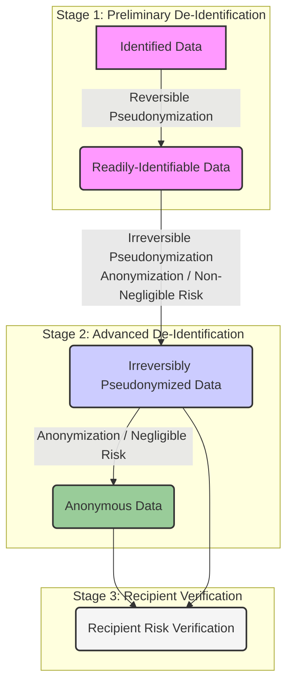

### Overview of process
Projects that need de-identification should follow these steps to define the de-identification process that is appropriate for the project’s intended uses of the de-identified data. This process should be adapted to specific regulatory and legal contexts, such as HIPAA, GDPR, or PIPL.

1. **Analyze the Context**: Clearly define the purpose for collecting the data, who the data recipients will be, and map the end-to-end data flow. This initial analysis frames the entire de-identification strategy.
2. **Data Assessment**: Thoroughly evaluate the data content, including its type, sensitivity, and properties. This step includes attack modeling to understand potential threats and vulnerabilities.
3. **Determine De-identification Goals**: Establish specific, measurable objectives for the de-identification process. This involves deciding which data elements to remove, transform, or retain, ensuring the output remains fit for its intended purpose while balancing privacy risk.
4. **Assess Re-identification Risk**: Conduct both qualitative and quantitative evaluations to measure the risk of data subjects being re-identified. This assessment informs the level of mitigation required.
5. **Design Risk Mitigation and Controls**: Develop a comprehensive mitigation strategy. This includes the technical design of the de-identification process (e.g., algorithms, multi-stage architecture) and the implementation of security policies like access control and data encryption.
6. **Implementation and Validation**: Implement the designed process, which may involve configuring tools or developing new software. The implementation must be rigorously validated with test data to ensure it functions as expected before operational use.
7. **Governance, Monitoring, and Review**: Establish a governance framework with clear roles and responsibilities. Continuously monitor the process in operation, audit for compliance, and periodically review the strategy to adapt to evolving threats and technologies.

### Analyze the context
The dataset's context refers to the environment in which the data is stored and transferred. To understand the complete situation, it's essential to analyze the purpose of data collection, the data recipients, and the data flow.

#### Purpose of collecting data
The intended uses of the data determine the extent of de-identification and the acceptable level of risk. The purpose must be clearly and formally documented. This documentation should justify each data element that is needed, which in turn determines what data is preserved (pass-through), what data is removed (redacted), and what data is transformed (e.g., generalized or perturbed).

#### Data recipients
Data recipients are the individuals, groups, or organizations who will use the de-identified data. It is crucial to identify and document all data recipients to understand the data sharing context and associated risks. This analysis should include:

- **Organizational Information**: The formal names of the recipient organizations.
- **Recipient Profiles**: The roles and responsibilities of individuals who will access the data.
- **Relationship to Custodian**: The relationship between the data custodian and the recipients (e.g., internal department, external research partner), as this affects the required contractual and security controls.
- **Background Knowledge**: An assessment of the recipients' background knowledge, which could be used in re-identification attempts.

#### Data flow
Describe the end-to-end data flow, from original source to final recipients. A clear data flow diagram helps identify risks at each stage. Key components to analyze include:

- **Data Source**: Where the data originates. Document the source's profile and any existing agreements regarding de-identification.
- **Data Environments**: The physical or virtual locations where data is stored, processed, and transferred. Each environment (e.g., landing zone, processing zone, analysis zone) has its own risk profile based on its infrastructure, access controls, and governance.
- **Multi-stage Requirements**: Identify if the data flow requires de-identification to occur at multiple points, for instance, initial redaction at the source and further pseudonymization by a central team.
- **Regulatory Constraints**: Analyze any domain-specific policies or legal requirements that apply to the data flow, especially concerning cross-border data transfers.

### Data assessment
A thorough assessment of the data itself is a prerequisite for designing an effective de-identification strategy.

#### Data content
The scope of data collection should be limited to the minimum necessary to achieve the defined purpose. Certain data types are inherently more challenging and time-consuming to de-identify and should be given special attention:

- **Longitudinal data**: Data collected over time for the same subjects.
- **Free text data**: Unstructured text like clinical notes or comments.
- **Binary data**: Proprietary or complex formats, such as device logs.
- **Imaging data**: DICOM or other image formats that can contain embedded identifiers.
- **Unstructured/Semi-structured data**: Data without a predefined model, like JSON or XML files.

##### Data subject
Describe the characteristics of the data subjects to understand the population and assess re-identification risk. Key characteristics include:

- Age range
- Geographical areas
- Gender distribution
- Medical conditions or other inclusion/exclusion criteria for the dataset.

Also, determine if the data subjects belong to a vulnerable population or if the data is subject to special sensitivity rules (e.g., behavioral health data).

##### Data type
Identify all distinct types of data being collected (e.g., structured records, images, free-text files). It is critical to be exhaustive and capture auxiliary information where identifiers might be hidden, such as:

- File names and directory paths.
- Metadata embedded in files.
- Linked documents, such as case report forms associated with images.

##### Data attribute type
For each data attribute, perform a classification to understand its potential for re-identification. This is a critical step that informs the entire risk assessment and mitigation design. Attributes are typically classified as:

- **Direct Identifiers (DI)**: Attributes that directly identify an individual (e.g., Name, Social Security Number, Email Address). Their presence implies a 100% re-identification risk. Identification involves checking against standard lists (like the 18 HIPAA identifiers) and using rule-based or expert analysis to find them in less obvious places.
- **Quasi-Identifiers / Indirect Identifiers (QI)**: Attributes that, in combination, can identify an individual (e.g., Date of Birth, ZIP Code, Gender). QIs are typically knowable, distinguishable, and stable over time.
- **Sensitive Attributes (SA)**: Attributes that are not identifying on their own but contain private and sensitive information about an individual (e.g., diagnosis, salary). The goal is often to prevent the linkage of these attributes to an individual.
- **Non-Identifiers (NI)**: Attributes that are not related to a specific individual and cannot be used for re-identification (e.g., device technical parameters, anonymized survey responses).

##### Dataset properties
The properties of the dataset as a whole can influence re-identification risk:

- **Age of data**: Older data may be harder to re-identify from due to changes in individual traits.
- **Number of data subjects**: Larger datasets may present different risks than smaller ones and can be subject to different regulatory scrutiny.
- **Volume of dataset**: The size of the data impacts storage, processing, and transmission methods.
- **Data quality**: Errors and inconsistencies in the data can sometimes offer a degree of protection, though the goal is generally high-quality data for utility.

#### Attack modeling
This involves thinking like an adversary to understand the threats that the de-identification process must protect against.

##### Select data sharing model
The way data is shared determines the level of control and the potential for attack. Common models include:
- **Completely Public Sharing (Release and Forget)**: Data is released publicly with no restrictions. This model carries the highest risk and requires the most stringent de-identification.
- **Controlled Public Sharing (Data Use Agreement)**: Data is shared with specific recipients under a contractual agreement that restricts its use, prohibits re-identification attempts, and forbids further sharing.
- **Enclave Public Sharing (Enclave Model)**: Data is not released directly. Instead, recipients are given access within a secure physical or virtual environment where their queries and actions can be monitored and controlled.

##### Determine attack type
Based on the adversary's goals, attacks can be categorized as:

- **Identity Attack**: Linking a record in the dataset to a specific, known individual. This can be modeled based on the attacker's knowledge:
    - **Prosecutor Risk**: The attacker knows a specific individual is in the dataset.
    - **Journalist Risk**: The attacker does not know if a specific individual is in the dataset but wants to find out.
    - **Marketer Risk**: The attacker attempts to re-identify as many individuals as possible in the dataset.
- **Membership Attack**: Determining whether a specific individual is present in the dataset.
- **Attribute Attack**: Inferring a sensitive attribute about an individual, even if their specific record is not identified.

##### Identify data privacy model
Formal privacy models provide a mathematical framework for measuring and controlling privacy risk. The choice of model is a foundational design decision. Two common models are:

- **k-Anonymity**: Ensures that any individual in the dataset cannot be distinguished from at least k-1 other individuals based on their quasi-identifiers.
- **Differential Privacy**: Adds a carefully calibrated amount of noise to data or query results, ensuring that the presence or absence of any single individual in the dataset has a negligible effect on the output.

### Determine de-identification goals
Goals should balance privacy protection with data utility.

#### General goals
- **Prevent Identification**: Remove or transform direct and indirect identifiers to prevent attackers from re-identifying individuals.
- **Control Risk**: Control re-identification risk to an acceptable level, based on the data sharing model and intended use.
- **Preserve Utility**: Ensure the de-identified data remains as useful as possible for its intended purpose.

#### Determine specific goals
Translate the general goals into concrete, measurable targets for the specific project. To achieve this, a requirements document should be created, addressing the following questions:

- **Project Scope and Data Needs**:
    -   What data must be retained to satisfy the primary needs of the project?
    -   What are the legal sensitivities that apply? Is the data subject to special rules, such as for behavioral health?
- **Risk and Re-identification**:
    -   What is the acceptable level of privacy risk? This may vary by use case (e.g., a tumor board review may accept higher risk than a public data release).
    -   What are the specific threats that need to be protected against?
    -   Is there a need to re-identify the original patient? If so, what elements are needed for this purpose?
- **Project and Data Details**:
    -   What general types of entities are being de-identified (e.g., Patients, Providers, Facilities)?
    -   Are there additional project requirements beyond raw data, such as administrative tracking data?
    -   Is there a need to maintain clinical time threading? If so, what is the allowable level of error (e.g., time-shifted, fuzzy dates)?
    -   How accurate must the remaining data elements be? Is it desirable for the data to show no evidence of de-identification?
- **Define Acceptable Risk Thresholds**: Set a maximum acceptable re-identification risk level. This threshold is a quantitative measure that defines the boundary between `Irreversibly Pseudonymized Data` and `Anonymous Data`. There is no universal threshold; the appropriate value must be determined by analyzing two key factors: the data sharing model and the potential impact of a privacy invasion.

    - **Factor 1: Data Sharing Model (Scenario)**: The context in which data is shared directly influences the likelihood of a re-identification attempt.
        - **Public Release**: Data is available to anyone without restriction. This scenario assumes a high possibility of attack, requiring the most conservative risk thresholds. For public releases, the risk should be measured as the **maximum risk**, meaning no single individual or group can exceed the threshold.
        - **Non-Public Release**: Data is shared with specific, trusted recipients under a contractual data sharing agreement. This lowers the possibility of a malicious attack. For non-public releases, the risk can be measured as the **average risk**, provided there are also safeguards against high-risk outlier groups.

    - **Factor 2: Potential Impact of Re-identification**: The potential harm that could result from re-identification is the second key factor. A dataset containing highly sensitive information requires a more conservative threshold than one with low sensitivity. To assess the potential impact, consider factors such as the sensitivity of the information, the scope and level of detail, the potential for tangible harm (e.g., financial loss, discrimination, reputational damage), and whether individuals consented to this specific secondary use of their data.

    - **Benchmark Risk Thresholds**: Based on these factors, the following table, adapted from international standards like [(ISO/IEC 27559, 2022)](references.html#ISOIEC27559), provides benchmark thresholds. It is crucial to document the rationale for selecting a specific threshold.

| Scenario | Possibility of Attack & Potential Impact | Risk Threshold |
| :--- | :--- | :--- |
| **Public** | High possibility of attack, low impact | Max 0.1 |
| | High possibility of attack, medium impact | Max 0.075 |
| | High possibility of attack, high impact | Max 0.05 |
| **Non-public** | Low-med possibility of attack, low-medium impact | Avg 0.1 |
| | Medium possibility of attack, medium impact | Avg 0.075 |
| | Medium-high possibility of attack, medium-high impact| Avg 0.05 |

These benchmarks provide a structured framework for decision-making. For specific, high-stakes scenarios like the public release of clinical trial data, regulatory bodies have set their own standards. For example, the [European Medicines Agency (EMA)](references.html#EMA_POLICY_0070) and [Health Canada](references.html#TRIALS_JOURNAL_2020) have established a risk threshold of **0.09**. This aligns with the principles for a public, high-impact release, demonstrating a real-world application of a conservative risk threshold to protect patient privacy.

### Assess re-identification risk
Risk assessment can be both qualitative and quantitative.

#### qualitative evaluation
A qualitative evaluation provides an initial classification of the dataset's identifiability level. This assessment is based on the types of identifiers present in the data after initial transformations and determines if a full quantitative evaluation is necessary. The classification aligns with the levels of identifiability defined in this handbook.

1.  **Check for Direct Identifiers**:
    -   If the dataset contains any direct identifiers (e.g., name, email, SSN), it is classified as **Identified Data**. This data is not de-identified and carries the highest level of risk. The evaluation stops here.

2.  **Assess Pseudonymization Method**:
    -   If direct identifiers have been replaced with pseudonyms but the data controller maintains a linking key (a known, systematic way to re-link), the dataset is classified as **Readily-Identifiable Data**. The evaluation stops here.

3.  **Evaluate for Indirect Identifiers**:
    -   If all direct identifiers have been addressed through irreversible pseudonymization or suppression (for example, in aggregated statistical data), the final qualitative step is to check for the presence of indirect (quasi) identifiers.
        -   If the dataset contains **no indirect identifiers**, it can be qualitatively classified as **Anonymous Data**, as there is no information left to single out individuals. The risk is considered negligible.
        -   If the dataset **does contain indirect identifiers**, a qualitative assessment is insufficient. A full **quantitative evaluation is required** to measure the re-identification risk accurately.

#### quantitative evaluation
When a qualitative evaluation determines that a dataset contains indirect (quasi) identifiers, a quantitative evaluation is required to determine its final classification. This process uses objective, statistical methods to calculate a precise overall re-identification risk score. This score is then compared against the project's acceptable risk threshold to determine if the data can be considered Anonymous or must be treated as Irreversibly Pseudonymized.

Following the standard risk model described in [(ISO/IEC 27559, 2022)](references.html#ISOIEC27559), identifiability can be conceptualized as the product of the probability of identification given a specific threat and the probability of that threat being realized. That is:

\[P(\text{identification}) = P(\text{identification} | \text{threat}) \times P(\text{threat})\]

This model provides a valuable framework for understanding the two key components of re-identification risk:

-   **Data Risk**: The risk inherent in the data itself, corresponding to \(P(\text{identification} | \text{threat})\).
-   **Context Risk**: The risk inherent in the data sharing environment, corresponding to \(P(\text{threat})\).

While this formula provides the conceptual basis, its practical application differs significantly between the primary privacy models:

-   For **k-anonymity**, this model is applied directly. A quantitative risk score is calculated where the overall risk (R) is the product of the data risk (\(R_d\)) and context risk (\(R_c\)).
-   For **Differential Privacy**, the model is applied conceptually. The goal is not to calculate a final probability. Instead, differential privacy provides a proactive guarantee that bounds the data risk to a chosen level (\(\epsilon\)), and the context risk informs how strict that level needs to be.

The following sections detail how to assess these risks for each model.

##### Calculating data risk
Data risk (\(R_d\)) is the probability of re-identification based on the properties of the dataset itself. The specific method for calculating it depends directly on the formal privacy model being used.

***For k-Anonymity and related models:***

When using k-anonymity, data risk is calculated by analyzing the size of the "equivalence classes" (groups of records with identical quasi-identifiers). Common metrics include:

- **Re-identification risk of a single record ($\theta_{j}$)**: for a record in an equivalence class of size $f_{j}$, the risk is $\theta_{j} = 1/f_{j}$.
- **Maximum probability of re-identification (\(R_{d,b}\))**: The highest risk in the dataset, \(R_{d,b}\) = \(\max_{j \in J}\theta_{j}\). This is a conservative metric used for high-risk sharing models (e.g., public release).
- **Average probability of re-identification (\(R_{d,c}\))**: The average risk across all equivalence classes, \(R_{d,c}\) = \(\frac{1}{|J|}\sum_{j \in J}^{}\theta_{j}\). This may be appropriate for more controlled sharing models.

The foundational methods for these calculations are detailed in [(Sweeney, 2002)](references.html#SWEENEY_K_ANON). The selected metric (\(R_{d,b}\) or \(R_{d,c}\)) becomes the value for \(R_d\) used in the overall risk calculation.

***For Differential Privacy:***

Differential Privacy (DP) takes a different approach. Instead of calculating a post-hoc re-identification risk, DP provides a proactive mathematical guarantee of privacy, quantified by the privacy loss parameter, epsilon (\(\epsilon\)).

- **Privacy Guarantee (\(\epsilon\))**: Epsilon measures the maximum privacy "leakage" allowed when a query is performed on the data. A smaller \(\epsilon\) provides stronger privacy.
- **Risk Management**: Under the DP model, risk is not calculated as a probability but is managed by setting an appropriate \(\epsilon\) value. The choice of \(\epsilon\) (the "privacy budget") is the primary means of controlling privacy risk. For example, a project might set a strict \(\epsilon\) of 0.1 for highly sensitive data, or a more lenient \(\epsilon\) of 1.0 for less sensitive use cases. The definitive guide to the theory and application of \(\epsilon\) can be found in [(Dwork & Roth, 2014)](references.html#DWORK_ROTH_DP_BOOK).

While methods exist to relate \(\epsilon\) to a probabilistic re-identification risk, they are complex and model-dependent. For the purposes of this handbook, the primary method for managing data risk under DP is the selection and enforcement of the privacy budget (\(\epsilon\)).

##### Calculating context risk
Context risk (\(R_c\)) assesses the likelihood of a re-identification attempt based on the data sharing environment. Its application differs depending on the chosen privacy model.

***For k-Anonymity and related models:***

The goal is to calculate a specific probability for \(R_c\), which is then used in the overall risk formula (\(R = R_d \times R_c\)). This probability is estimated as the maximum of three component threats:

\[ R_c = \max(T1, T2, T3) \]

Where:
- **T1**: Probability of a deliberate attack attempt.
- **T2**: Probability of an inadvertent attempt (e.g., accidental discovery).
- **T3**: Probability of a data breach.

For public data releases, \(R_c\) is typically assumed to be 1 (100%), reflecting the high likelihood of an attack attempt. For controlled models, these probabilities are estimated based on the security controls, contractual obligations, and the nature of the data recipients. For detailed methodologies on estimating these probabilities, see guidance from sources like [(IPC_ONTARIO, 2016)](references.html#IPC_ONTARIO) and [(El Emam, 2013)](references.html#EL_EMAM_GUIDE).

***For Differential Privacy:***

Context risk is not used to calculate a final number for multiplication. Instead, the assessment of the context directly **informs the selection of the privacy budget (\(\epsilon\))**. The same threat components (T1, T2, T3) are evaluated to justify the choice of \(\epsilon\).

- A **high-risk context** (high T1, T2, or T3), such as a public release, mandates the use of a very small, strict \(\epsilon\) to ensure strong privacy guarantees.
- A **low-risk context**, such as a secure enclave for trusted researchers (low T1, T2, and T3), may justify the use of a larger, more lenient \(\epsilon\) that preserves greater data utility.

The output of the context risk assessment in a DP model is a documented rationale for the chosen \(\epsilon\) value, linking it directly to the environmental and sharing risks.

##### Calculating overall risk
The final step is to determine the overall re-identification risk by combining the data risk and context risk, though the method differs by privacy model.

***For k-Anonymity and related models:***

The overall risk is the product of the data risk (the chosen metric, e.g., \(R_{d,b}\)) and the context risk (\(R_c\)). This final value is then compared against the project's acceptable risk threshold.

\[ R = R_d \times R_c \]

For example, if the maximum data risk (\(R_{d,b}\)) is 0.1 and the context risk for a controlled sharing environment (\(R_c\)) is estimated at 0.5, the overall risk would be \(0.1 \times 0.5 = 0.05\). This value would need to be below the project's defined threshold.

***For Differential Privacy:***

With Differential Privacy, the overall risk is not a calculated product. Instead, the context risk (\(R_c\)) directly influences the selection of the privacy budget (\(\epsilon\)).

- In a high-risk context (e.g., public release, where \(R_c\) is high), a very small \(\epsilon\) (a strict budget) must be chosen.
- In a lower-risk context (e.g., a secure enclave with trusted researchers, where \(R_c\) is low), a larger \(\epsilon\) (a more lenient budget) may be justifiable.

The project must document the rationale for how the data sharing context and potential harms informed the choice of \(\epsilon\). The "pass/fail" criterion is whether the implemented system can enforce this chosen \(\epsilon\) for all data queries.

### Risk mitigation
This phase involves designing and applying controls to reduce the identified risks to an acceptable level.

#### Multi-stage de-identification design

De-identification is often not a single action but a multi-stage process, especially in complex environments like healthcare. A multi-stage design is necessary to accommodate the practical limitations of data sources and to apply the appropriate level of expertise and technology at each step. While a two-stage process is a common example, a true multi-stage architecture can involve several specialized steps.

##### Justification for a Multi-Stage Approach

A multi-stage approach is often essential for several practical and technical reasons:

- **Limited Expertise at the Source**: Data is often generated in operational environments, such as a hospital clinic, where staff (e.g., doctors, technicians) are experts in their domain but not in data privacy. They cannot be expected to make complex de-identification decisions for all types of identifiers [(Shahid, 2022)](references.html#Shahid_2022).
- **Technical Constraints of Source Systems**: Medical devices and clinical systems (e.g., ultrasound machines, PACS) are designed for clinical care, not advanced data processing. They typically lack the computing power or specialized features required for complex tasks like redacting free-text narratives, removing burnt-in annotations from pixel data, or performing quantitative risk analysis [(Shahid, 2022)](references.html#Shahid_2022).
- **Specialized Processing Needs**: Different types of data require different tools and expertise. For instance, redacting identifiers from free-text clinical notes requires Natural Language Processing (NLP) tools, while removing burnt-in PII from images requires sophisticated image processing capabilities. It is often impractical to house all these capabilities in a single system or stage.
- **Separation of Duties and Risk Management**: A phased approach allows for a clear separation of responsibilities. Initial, basic de-identification can happen at the source to remove the most obvious identifiers, making the data safer for transfer. Subsequent, more rigorous de-identification can then be performed in a centralized, secure environment by specialized teams or automated tools.

This flexible approach allows an organization to create a de-identification pipeline. The process can start at the source and then hand off the partially-processed data to subsequent stages, each designed to handle a specific challenge—such as text, imaging, or structured data—before a final risk assessment is performed.

##### The De-Identification Process as a State Transition

The multi-stage de-identification process can be visualized as a series of state transitions, where data moves from a higher level of identifiability to a lower one. Each transition is achieved by applying specific de-identification techniques, as defined in the [Concepts chapter](concepts.html#Identifiability).

A three-stage model provides a comprehensive example of this workflow:

This diagram illustrates a typical workflow:

1.  **Stage 1 (Preliminary De-identification)**: Occurs at the source system (e.g., a hospital). The focus is on basic, often reversible, transformations to remove direct identifiers and make the data safe for internal transfer. The outcome is typically `Readily-Identifiable Data`.
2.  **Stage 2 (Advanced De-identification)**: Takes place in a controlled, centralized environment managed by a dedicated team with privacy expertise. Here, advanced techniques (e.g., NLP for text, pixel scrubbing for images, quantitative analysis) are applied to transform the data into `Irreversibly Pseudonymized` or fully `Anonymous` states.
3.  **Stage 3 (Recipient Verification)**: The data is transferred to the data recipient's environment. As a best practice, the recipient should conduct their own risk assessment to verify that the data meets the agreed-upon privacy level before use. This confirms the effectiveness of the de-identification process and manages shared responsibilities.

Beyond this three-stage example, a more granular, multi-stage process might dedicate separate sub-stages within the Advanced phase to handling specific data types, such as a dedicated NLP pipeline for free text or an image processing stage for pixel data, before a final, holistic risk assessment is performed.

##### Design Considerations

When designing a multi-stage process, the following factors must be considered:

- **Data Availability**: Is the entire dataset available upfront, or will data be de-identified as it arrives in a stream? Full dataset knowledge allows for more precise transformations, which is often a characteristic of a centralized processing stage.
- **Intermediaries**: Are intermediary organizations required for legal or process reasons, such as in regulated clinical trials? This naturally creates a multi-stage architecture where different parties perform distinct steps.

##### Pseudonym Requirements

- **Reversibility**: Determine if the pseudonymization needs to be reversible (enabling authorized re-identification) or irreversible. This decision is critical and often defines the boundary between stages.
    - **Reversible Pseudonymization (Stage 1)**: If re-identification is required (e.g., for clinical trials), a secure mapping table or a decryptable key must be maintained separately and under strict access controls. This produces **Readily-Identifiable Data**.
    - **Irreversible Pseudonymization (Stage 2+)**: If re-identification is not required, use a one-way cryptographic hash (e.g., SHA-512 with a secret, un-stored salt) to generate pseudonyms. This produces **Irreversibly Pseudonymized Data** or, if combined with other techniques, can lead to **Anonymous Data**.
- **Algorithm Selection**: Choose a strong, industry-standard cryptographic algorithm for generating pseudonyms.
- **Trait Changes**: The design should accommodate changes to patient traits over time (e.g., name changes) to ensure consistent pseudonymization.
- **De-duplication**: Ensure that data de-duplication occurs before pseudonymization to avoid assigning multiple pseudonyms to the same individual.
- **Data Utility**: How accurate must the remaining data be? Is it acceptable for the data to show evidence of de-identification, or must it appear pristine?

##### Semantic Considerations

- **Interoperability**: If the data must conform to a standard, redaction or transformation must produce valid values. For example, redacting a mandatory element requires substituting a valid, agreed-upon placeholder.
- **Code System Threats**: Be aware that the use of rare or facility-specific codes can inadvertently identify the data source.

##### Resistance to Re-identification

The design must demonstrate how the chosen techniques will make the data resistant to re-identification. This is often measured by the expected percentage of participants who could be re-identified using established methods, and is a primary goal of later-stage analysis.

**Element-by-Element De-identification Design**

One key element of the design is a listing of how each possible data element in the input data set will be processed. It is not possible to create a single universally appropriate table. Examples like these can act as a starting point for purpose-specific designs.

The [DICOM standard](references.html#DICOM) provides initial starting point tables for commonplace de-identification requirements for imaging results in the DICOM format. These are in [PS 3.15 Annex E](references.html#DICOM-part-15-annex-e), especially Table E.1-1. The DICOM standard is freely available for use, and permission is granted for public and private use of extracts. It is provided in Word format to simplify such use. Note that the DICOM standard identifies private attributes that are claimed to lack personal information; other treatment of private attributes must be part of the design process.

There are also project and other examples available, such as the Biosurveillance Use Case Minimum Data Elements Specification, that can serve as a reference.

#### Process Identifiers
This section describes generic methods for transforming direct and indirect (quasi-)identifiers present in collected personal data. The focus is on reducing linkability and inference risk while preserving required utility for the intended use.

**Generic method: transforming direct identifiers**
- Goal: remove or replace values that directly identify a person while preserving needed data coherence.
- Options:
    - Masking/removal: delete or replace with placeholders when linkage is not required.
    - Pseudonymization (recoverable): generate pseudonyms independent of the original values (e.g., random IDs) and maintain a protected linking table for approved re-identification.
    - Pseudonymization (cryptographic): derive pseudonyms from the original values using strong encryption or keyed hashing (e.g., HMAC). Enforce key management (separation, rotation, access control). Apply canonicalization of inputs (e.g., trim, lowercase, normalize formats) to ensure deterministic, consistent pseudonyms.
- Controls:
    - Keep linking tables and cryptographic material in a secure vault; never co-locate with released data.
    - Define a reversibility policy (authorized re-identification) and audit its execution.
    - Validate that transformations maintain longitudinal consistency where required.

**Generic method: transforming indirect/quasi-identifiers**
- Goal: reduce linkability and inference risk arising from attributes that can identify individuals in combination.
- Categorical attributes:
    - Generalization: map fine-grained codes to broader categories using defined hierarchies (e.g., diagnosis roll-ups).
    - Suppression: remove rare values or rare combinations that create outliers.
    - Permutation: reorder values across records to preserve distributions without record-level truthfulness.
    - Blanking and imputing: blank sensitive values and replace with statistically plausible substitutes (ranging from simple to model-based multiple imputation).
- Numeric attributes:
    - Top/bottom coding: cap extreme values into open-ended categories (e.g., age 90+).
    - Microaggregation: group records into clusters (k≥3) and replace continuous values with cluster averages to balance utility and privacy.
    - Generalize small counts: merge sparse categories to increase group sizes and reduce uniqueness.
    - Noise addition: add calibrated random noise to continuous values while preserving key statistical properties.
- Temporal data:
    - Date shifting: apply a consistent per-person shift to preserve intervals.
    - Coarsening: reduce precision (e.g., year or month only) or convert to age and bin (e.g., 5-year bands).
    - Time coarsening/bins: round times (e.g., to hour) or bucket into periods (morning/afternoon/night) when exact times increase risk.

**Design and governance checklist**
- Inventory identifiers (direct and quasi-) and document per-element transformations and constraints.
- Align choices to the threat model, intended use, and required data utility.
- Implement key/secret handling and mapping-table protections; segregate duties and monitor access.
- Validate outcomes: quantify risk reduction (e.g., k-anonymity metrics, small-cell checks) and verify consistency constraints.
- Document rationale and residual risks; keep processes auditable and repeatable.

See the Techniques chapter for detailed examples and considerations: [De-Identifying Identifiers](techniques.html#de-identifying-identifiers).

#### Security & Privacy Policies
Technical de-identification must be supported by strong operational and security policies.

##### Access control
Implement the principle of least privilege, ensuring that personnel only have access to the data necessary to perform their roles. This should be governed by the organization's Human Resource Security Policy.

##### Secrets management
Secrets used in the de-identification process must be managed securely. This includes:
- Passwords for encrypted data
- Salt values for hashing algorithms
- Random seed values for date shifting or other perturbations
- Patient-pseudonym mapping tables

Use a secure vault or password manager and strictly limit access to these secrets.

##### Secure data transfer
Data must be protected in transit. Use secure, approved methods for transferring data, such as:
- Encrypted transfer over a secure network (e.g., SFTP, HTTPS).
- Use of hardware-encrypted storage devices for physical transfers, with passwords shared separately.

##### Data encryption
Data must be protected at rest. Use strong, industry-standard encryption algorithms like AES-256 to encrypt datasets before storage or transfer.

##### Data disposal
Unsecure data disposal can lead to breaches. Follow a formal data disposal policy, using tools that perform a secure, multi-pass wipe (e.g., DoD-level wipe) to permanently erase data from media before it is decommissioned.

### Implementation
IHE has profiles, such as the imaging teaching files profile, for some of the common de-identification situations. DICOM has identified some common intended use requirements and defined de-identification profiles for these situations. Other organizations have published their de-identification profiles. When developing project-specific de-identification profiles, these can be a good starting point.

This document does not cover the implementation of processes, procedures, software, or staffing of the de-identification system. There are already established methodologies for project management, safety risk analysis, etc. These are also applicable to the deployment of de-identification processes, and there is usually no need to invent new, unfamiliar processes for the organization.

### Governance
A strong governance framework is essential for ensuring that the de-identification process is effective, compliant, and maintained over time.

#### General principles
The de-identification program should be founded on principles of accountability, fairness, and transparency, in alignment with the organization's overall data governance and privacy policies.

#### Role responsibilities and people management
Clearly define roles and responsibilities to ensure accountability. Key roles often include:
- **Policy Manager**: A team (often including privacy, legal, and IT experts) responsible for setting the de-identification policies and standards.
- **Executor**: A dedicated, independent team responsible for carrying out the de-identification process.
- **Supervisor**: A role (often held by a Privacy Officer) responsible for auditing and ensuring compliance with the policies.

All personnel involved must receive appropriate training on data handling and their specific responsibilities.

#### Validate and approve

##### Design Validation
The design should be validated before it is fully implemented. Validation should focus on confirming that identified project risks are either reduced or identified as protection requirements. This must include risks related to overall project objectives, risks to individual patient privacy, and risks of non-compliance with applicable policy. The validation review may need to include stakeholders such as an Institutional Review Board (IRB).

The design validation phase consists of three steps:
1.  **Reviewing the input data** to manually confirm that the field-level algorithm selections are appropriate and all input data elements are addressed. This often involves manually examining a random selection of input data records.
2.  **Reviewing a prototype of the post-processed data**, which may be manually created or adapted.
3.  **Validating that the results will meet the project requirements**.

A best practice is to identify a small subset of the project data (or a very similar dataset) for this review. You can write test scripts or manually process this data using the anticipated algorithms and then provide the processed data to the end-user to confirm it meets their expectations. As should be apparent, the more data that can be removed, the easier the validation phase and subsequent steps become, and the lower the risks.

##### Implementation Validation
After the process is implemented, it must be validated with real data in the operational environment. This validation is part of any healthcare system deployment and existing processes should apply.

De-identification adds one extra element: an operational validation using a subset of real data should be performed. This is very similar to the initial design validation but uses the operational system processes, staff, and software.

#### Monitor and audit
De-identification is not a one-time activity. The environment is a continuously moving target, as re-identification algorithms improve and new public datasets become available that could be linked. Computer and storage capabilities increase rapidly; for example, genetic data that was once too costly to use for identification is now usable because the cost of storage and computing has plummeted. Previously private information is increasingly available for sale, and you can now track a person’s location from cell phone records to match a person’s ID to healthcare provider visits.

One famous example of this is the analysis by Latanya Sweeney from CMU, who used just three data points (Date of Birth, current ZIP Code, and Sex) to re-identify a high percentage of individuals in a dataset. An example of the impact of changing technology is the evaluation of risks from the unrestricted publication of raw genetic data by Erlich and Narayanan.

Therefore, the process must be continuously monitored and periodically audited. A re-evaluation of risk should be triggered by any significant change in the data context or on a regular schedule.

#### Documentation and Record Keeping
Maintain thorough documentation of the entire process for accountability, auditing, and compliance. Essential records include:
- The initial service request and data use case description.
- The full Re-identification Risk Assessment Report.
- The element-by-element de-identification design specification.
- Scripts and configuration parameters used for the transformation.
- Records of all data transfers, access, and disposal.
- Validation and approval reports.

#### Security Incident management
Follow the organization's established security incident management policy to respond to any suspected or actual data breach or privacy incident.
