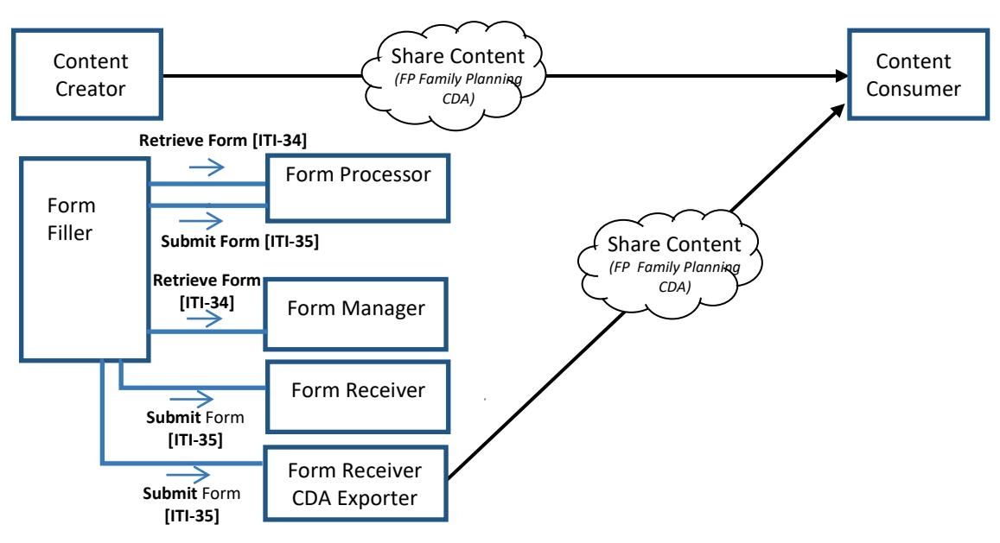
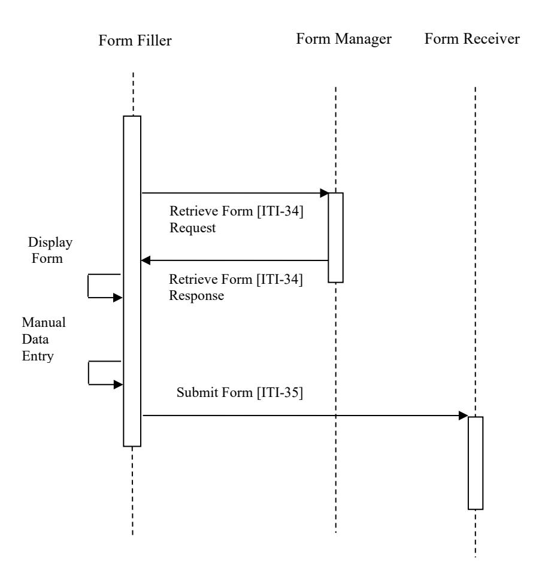
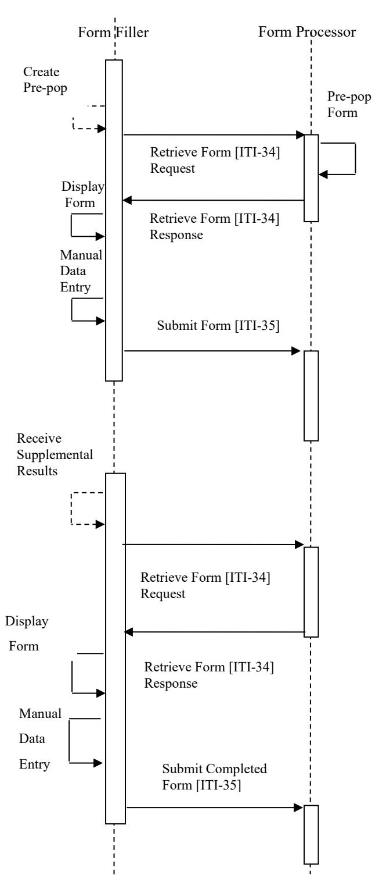
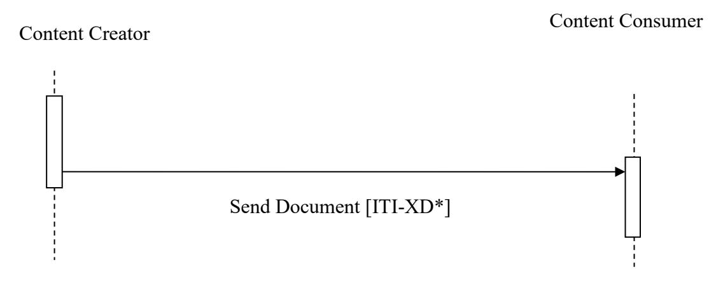
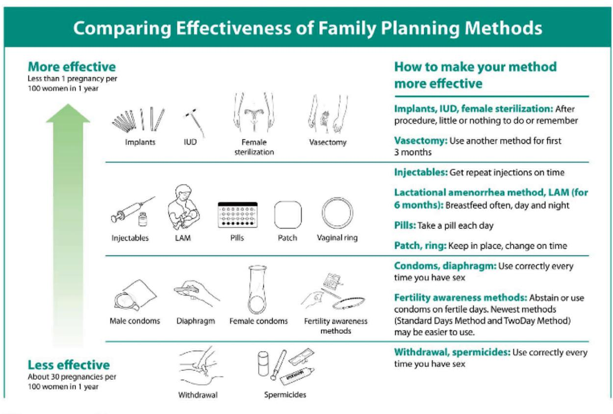

# **Integrating the Healthcare Enterprise**

# 5 **IHE Quality, Research, and Public Health Technical Framework Supplement**

10 **Family Planning Version 2 (FPv2)**

# 15 **Rev. 1.4 – Trial Implementation**

20 Date: December 29, 2021

Author: QRPH Technical Committee

Email: qrph@ihe.net

**Please verify you have the most recent version of this document.** See [here](https://www.ihe.net/resources/technical_frameworks/) for Trial 25 Implementation and Final Text versions and [here](https://www.ihe.net/resources/public_comment/) for Public Comment versions.

# **Foreword**

This is a supplement to the IHE Quality, Research and Public Health (QRPH) Technical 30 Framework. Each supplement undergoes a process of public comment and trial implementation before being incorporated into the volumes of the Technical Frameworks.

This supplement is published on December 29, 2021 for trial implementation and may be available for testing at subsequent IHE Connectathons. The supplement may be amended based on the results of testing. Following successful testing it will be incorporated into the QRPH 35 Technical Framework. Comments are invited and may be submitted at [QRPH Public Comments.](http://www.ihe.net/QRPH_Public_Comments)

"Boxed" instructions like the sample below indicate to the Volume Editor how to integrate the relevant section(s) into the relevant Technical Framework volume.

#### *Amend Section X.X by the following:*

Where the amendment adds text, make the added text **bold underline**. Where the amendment 40 removes text, make the removed text **bold strikethrough**. When entire new sections are added, introduce with editor's instructions to "add new text" or similar, which for readability are not bolded or underlined.

General information about IHE can be found at [IHE.](http://www.ihe.net/)

45 Information about the IHE Quality, Research and Public Health domain can be found at [IHE](https://www.ihe.net/ihe_domains/)  [Domains.](https://www.ihe.net/ihe_domains/)

Information about the organization of IHE Technical Frameworks and Supplements and the process used to create them can be found at [Profiles](https://www.ihe.net/resources/profiles/) and [IHE Process.](https://www.ihe.net/about_ihe/ihe_process/)

The current version of the IHE Quality, Research and Public Health Technical Framework can 50 be found at [Quality, Research and Public Health Technical Framework.](https://www.ihe.net/resources/technical_frameworks/#qrph)

# CONTENTS

| 55 | Introduction to this Supplement                            |    |
|----|------------------------------------------------------------|----|
|    | Open Issues and Questions                                  |    |
|    | Closed Issues                                              |    |
|    | IHE Technical Frameworks General Introduction              |    |
|    | 9 Copyright Licenses                                       |    |
| 60 | 10 Trademark                                               |    |
|    | IHE Technical Frameworks General Introduction Appendices   |    |
|    | Appendix A – Actors                                        |    |
|    | Appendix B – Transactions                                  | 12 |
|    | Appendix D – Glossary                                      | 12 |
| 65 | Volume 1 - Profiles                                        |    |
|    | Copyright Licenses                                         | 15 |
|    | X Family Planning version 2 (FPv2) Profile                 | 15 |
|    | X.1 FPv2 Actors, Transactions, and Content Modules         | 15 |
|    | X.1.1 Actor Descriptions and Actor Profile Requirements    |    |
| 70 | X.1.1.1 Form Filler                                        |    |
|    | X.1.1.2 Form Manager                                       | 18 |
|    | X.1.1.3 Form Receiver                                      | 18 |
|    | X.1.1.4 Form Processor                                     | 18 |
|    | X.1.1.5 Content Creator                                    | 19 |
| 75 | X.1.1.6 Content Consumer                                   | 19 |
|    | X.1.1.7 Form Receiver CDA Exporter                         | 19 |
|    | X.2 FPv2 Actor Options                                     |    |
|    | X.2.1 Summary Document Pre-Pop Option                      | 20 |
|    | X.3 FPv2 Required Actor Groupings                          |    |
| 80 | X.4 FPv2 Overview                                          |    |
|    | X.4.1 Concepts                                             |    |
|    | X.4.2 Use Cases                                            |    |
|    | X.4.2.1 Use Case #1: FP Manual Data Entry                  |    |
|    | X.4.2.1.1 Use Case Description                             |    |
| 85 | X.4.2.1.2 Processing Steps                                 |    |
|    | X.4.2.1.2.1 Pre-conditions                                 |    |
|    | X.4.2.1.2.2 Main Flow                                      |    |
|    | X.4.2.1.2.3 Post-conditions                                |    |
|    | X.4.2.2 Use Case #2: FP with Pre-pop Option                |    |
| 90 | X.4.2.2 Use Case Description                               |    |
| 70 | X.4.2.2.1 Use Case Description  X.4.2.2.2 Processing Steps |    |
|    | X.4.2.2.2.1 Pre-conditions                                 |    |
|    | X.4.2.2.2 Main Flow                                        |    |
|    | X.4.2.2.2 Walli Flow X.4.2.2.3 Post-conditions             |    |
|    | 11.7.4.4.4.J 1 USL VUIIUIIIS                               | 47 |

| 95  | X.4.2.3 Use Case #3: FP with Pre-pop Option with Supplemental Data                                                                                                                                                                                                                                                                                                                                                                                                                                                                                                                                                                                                                                                                                                                                                                                                                                                                                                                                                                                                                                                                                                                                                                                                                                                                                                                                                                                                                                                                                                                                                                                                                                                                                                                                                                                                                                                                                                                                                                                                                                                             | 25 |
|-----|--------------------------------------------------------------------------------------------------------------------------------------------------------------------------------------------------------------------------------------------------------------------------------------------------------------------------------------------------------------------------------------------------------------------------------------------------------------------------------------------------------------------------------------------------------------------------------------------------------------------------------------------------------------------------------------------------------------------------------------------------------------------------------------------------------------------------------------------------------------------------------------------------------------------------------------------------------------------------------------------------------------------------------------------------------------------------------------------------------------------------------------------------------------------------------------------------------------------------------------------------------------------------------------------------------------------------------------------------------------------------------------------------------------------------------------------------------------------------------------------------------------------------------------------------------------------------------------------------------------------------------------------------------------------------------------------------------------------------------------------------------------------------------------------------------------------------------------------------------------------------------------------------------------------------------------------------------------------------------------------------------------------------------------------------------------------------------------------------------------------------------|----|
|     | X.4.2.3.1 Use Case Description                                                                                                                                                                                                                                                                                                                                                                                                                                                                                                                                                                                                                                                                                                                                                                                                                                                                                                                                                                                                                                                                                                                                                                                                                                                                                                                                                                                                                                                                                                                                                                                                                                                                                                                                                                                                                                                                                                                                                                                                                                                                                                 |    |
|     | X.4.2.3.2 Processing Steps                                                                                                                                                                                                                                                                                                                                                                                                                                                                                                                                                                                                                                                                                                                                                                                                                                                                                                                                                                                                                                                                                                                                                                                                                                                                                                                                                                                                                                                                                                                                                                                                                                                                                                                                                                                                                                                                                                                                                                                                                                                                                                     |    |
|     | X.4.2.3.2.1 Pre-conditions                                                                                                                                                                                                                                                                                                                                                                                                                                                                                                                                                                                                                                                                                                                                                                                                                                                                                                                                                                                                                                                                                                                                                                                                                                                                                                                                                                                                                                                                                                                                                                                                                                                                                                                                                                                                                                                                                                                                                                                                                                                                                                     |    |
|     | X.4.2.3.2.2 Main Flow                                                                                                                                                                                                                                                                                                                                                                                                                                                                                                                                                                                                                                                                                                                                                                                                                                                                                                                                                                                                                                                                                                                                                                                                                                                                                                                                                                                                                                                                                                                                                                                                                                                                                                                                                                                                                                                                                                                                                                                                                                                                                                          | 26 |
| 100 | X.4.2.3.2.3 Post-conditions                                                                                                                                                                                                                                                                                                                                                                                                                                                                                                                                                                                                                                                                                                                                                                                                                                                                                                                                                                                                                                                                                                                                                                                                                                                                                                                                                                                                                                                                                                                                                                                                                                                                                                                                                                                                                                                                                                                                                                                                                                                                                                    |    |
|     | X.4.2.4 Use Case #4: Forms Data Capture with Document Submission                                                                                                                                                                                                                                                                                                                                                                                                                                                                                                                                                                                                                                                                                                                                                                                                                                                                                                                                                                                                                                                                                                                                                                                                                                                                                                                                                                                                                                                                                                                                                                                                                                                                                                                                                                                                                                                                                                                                                                                                                                                               |    |
|     | X.4.2.4.1 Use Case Description                                                                                                                                                                                                                                                                                                                                                                                                                                                                                                                                                                                                                                                                                                                                                                                                                                                                                                                                                                                                                                                                                                                                                                                                                                                                                                                                                                                                                                                                                                                                                                                                                                                                                                                                                                                                                                                                                                                                                                                                                                                                                                 | 28 |
|     | X.4.2.4.2 Processing Steps                                                                                                                                                                                                                                                                                                                                                                                                                                                                                                                                                                                                                                                                                                                                                                                                                                                                                                                                                                                                                                                                                                                                                                                                                                                                                                                                                                                                                                                                                                                                                                                                                                                                                                                                                                                                                                                                                                                                                                                                                                                                                                     | 28 |
|     | X.4.2.4.2.1 Pre-conditions                                                                                                                                                                                                                                                                                                                                                                                                                                                                                                                                                                                                                                                                                                                                                                                                                                                                                                                                                                                                                                                                                                                                                                                                                                                                                                                                                                                                                                                                                                                                                                                                                                                                                                                                                                                                                                                                                                                                                                                                                                                                                                     | 28 |
| 105 | X.4.2.4.2.2 Main Flow                                                                                                                                                                                                                                                                                                                                                                                                                                                                                                                                                                                                                                                                                                                                                                                                                                                                                                                                                                                                                                                                                                                                                                                                                                                                                                                                                                                                                                                                                                                                                                                                                                                                                                                                                                                                                                                                                                                                                                                                                                                                                                          | 28 |
|     | X.4.2.4.2.3 Post-conditions                                                                                                                                                                                                                                                                                                                                                                                                                                                                                                                                                                                                                                                                                                                                                                                                                                                                                                                                                                                                                                                                                                                                                                                                                                                                                                                                                                                                                                                                                                                                                                                                                                                                                                                                                                                                                                                                                                                                                                                                                                                                                                    |    |
|     | X.4.2.5 Use Case #5: EHR FP Document Submission                                                                                                                                                                                                                                                                                                                                                                                                                                                                                                                                                                                                                                                                                                                                                                                                                                                                                                                                                                                                                                                                                                                                                                                                                                                                                                                                                                                                                                                                                                                                                                                                                                                                                                                                                                                                                                                                                                                                                                                                                                                                                | 29 |
|     | X.4.2.5.1 Use Case Description                                                                                                                                                                                                                                                                                                                                                                                                                                                                                                                                                                                                                                                                                                                                                                                                                                                                                                                                                                                                                                                                                                                                                                                                                                                                                                                                                                                                                                                                                                                                                                                                                                                                                                                                                                                                                                                                                                                                                                                                                                                                                                 | 29 |
|     | X.4.2.5.2 Processing Steps                                                                                                                                                                                                                                                                                                                                                                                                                                                                                                                                                                                                                                                                                                                                                                                                                                                                                                                                                                                                                                                                                                                                                                                                                                                                                                                                                                                                                                                                                                                                                                                                                                                                                                                                                                                                                                                                                                                                                                                                                                                                                                     |    |
| 110 | X.4.2.5.2.1 Pre-conditions                                                                                                                                                                                                                                                                                                                                                                                                                                                                                                                                                                                                                                                                                                                                                                                                                                                                                                                                                                                                                                                                                                                                                                                                                                                                                                                                                                                                                                                                                                                                                                                                                                                                                                                                                                                                                                                                                                                                                                                                                                                                                                     |    |
|     | X.4.2.5.2.2 Main Flow                                                                                                                                                                                                                                                                                                                                                                                                                                                                                                                                                                                                                                                                                                                                                                                                                                                                                                                                                                                                                                                                                                                                                                                                                                                                                                                                                                                                                                                                                                                                                                                                                                                                                                                                                                                                                                                                                                                                                                                                                                                                                                          | 30 |
|     | X.4.2.5.2.3 Post-conditions                                                                                                                                                                                                                                                                                                                                                                                                                                                                                                                                                                                                                                                                                                                                                                                                                                                                                                                                                                                                                                                                                                                                                                                                                                                                                                                                                                                                                                                                                                                                                                                                                                                                                                                                                                                                                                                                                                                                                                                                                                                                                                    | 30 |
|     | X.5 FPv2 Security Considerations                                                                                                                                                                                                                                                                                                                                                                                                                                                                                                                                                                                                                                                                                                                                                                                                                                                                                                                                                                                                                                                                                                                                                                                                                                                                                                                                                                                                                                                                                                                                                                                                                                                                                                                                                                                                                                                                                                                                                                                                                                                                                               |    |
|     | X.5.1 Security Audit Considerations – Retrieve Form [ITI-34]                                                                                                                                                                                                                                                                                                                                                                                                                                                                                                                                                                                                                                                                                                                                                                                                                                                                                                                                                                                                                                                                                                                                                                                                                                                                                                                                                                                                                                                                                                                                                                                                                                                                                                                                                                                                                                                                                                                                                                                                                                                                   |    |
| 115 | X.5.2 Security Audit Considerations – Submit Form [ITI-35] audit messages                                                                                                                                                                                                                                                                                                                                                                                                                                                                                                                                                                                                                                                                                                                                                                                                                                                                                                                                                                                                                                                                                                                                                                                                                                                                                                                                                                                                                                                                                                                                                                                                                                                                                                                                                                                                                                                                                                                                                                                                                                                      |    |
|     | X.6 FPv2 Cross Profile Considerations                                                                                                                                                                                                                                                                                                                                                                                                                                                                                                                                                                                                                                                                                                                                                                                                                                                                                                                                                                                                                                                                                                                                                                                                                                                                                                                                                                                                                                                                                                                                                                                                                                                                                                                                                                                                                                                                                                                                                                                                                                                                                          |    |
|     | X.6.1 XDS.b, XDM, or XDR – Cross Enterprise Document Sharing. B, Cross Enterprise Document Sharing.                                                                                                                                                                                                                                                                                                                                                                                                                                                                                                                                                                                                                                                                                                                                                                                                                                                                                                                                                                                                                                                                                                                                                                                                                                                                                                                                                                                                                                                                                                                                                                                                                                                                                                                                                                                                                                                                                                                                                                                                                            |    |
|     | Document Media Interchange, or Cross Enterprise Document Reliable Interchange                                                                                                                                                                                                                                                                                                                                                                                                                                                                                                                                                                                                                                                                                                                                                                                                                                                                                                                                                                                                                                                                                                                                                                                                                                                                                                                                                                                                                                                                                                                                                                                                                                                                                                                                                                                                                                                                                                                                                                                                                                                  |    |
|     | X.7 Data elements                                                                                                                                                                                                                                                                                                                                                                                                                                                                                                                                                                                                                                                                                                                                                                                                                                                                                                                                                                                                                                                                                                                                                                                                                                                                                                                                                                                                                                                                                                                                                                                                                                                                                                                                                                                                                                                                                                                                                                                                                                                                                                              |    |
| 120 | Appendices to Volume 1                                                                                                                                                                                                                                                                                                                                                                                                                                                                                                                                                                                                                                                                                                                                                                                                                                                                                                                                                                                                                                                                                                                                                                                                                                                                                                                                                                                                                                                                                                                                                                                                                                                                                                                                                                                                                                                                                                                                                                                                                                                                                                         |    |
| 120 | Appendix A – Data Elements                                                                                                                                                                                                                                                                                                                                                                                                                                                                                                                                                                                                                                                                                                                                                                                                                                                                                                                                                                                                                                                                                                                                                                                                                                                                                                                                                                                                                                                                                                                                                                                                                                                                                                                                                                                                                                                                                                                                                                                                                                                                                                     |    |
|     | Volume 2 – Transactions                                                                                                                                                                                                                                                                                                                                                                                                                                                                                                                                                                                                                                                                                                                                                                                                                                                                                                                                                                                                                                                                                                                                                                                                                                                                                                                                                                                                                                                                                                                                                                                                                                                                                                                                                                                                                                                                                                                                                                                                                                                                                                        |    |
|     | Appendices to Volume 2                                                                                                                                                                                                                                                                                                                                                                                                                                                                                                                                                                                                                                                                                                                                                                                                                                                                                                                                                                                                                                                                                                                                                                                                                                                                                                                                                                                                                                                                                                                                                                                                                                                                                                                                                                                                                                                                                                                                                                                                                                                                                                         |    |
|     | Volume 2 Namespace Additions                                                                                                                                                                                                                                                                                                                                                                                                                                                                                                                                                                                                                                                                                                                                                                                                                                                                                                                                                                                                                                                                                                                                                                                                                                                                                                                                                                                                                                                                                                                                                                                                                                                                                                                                                                                                                                                                                                                                                                                                                                                                                                   |    |
| 125 | Volume 3 – Content Modules                                                                                                                                                                                                                                                                                                                                                                                                                                                                                                                                                                                                                                                                                                                                                                                                                                                                                                                                                                                                                                                                                                                                                                                                                                                                                                                                                                                                                                                                                                                                                                                                                                                                                                                                                                                                                                                                                                                                                                                                                                                                                                     |    |
| 123 | 5 Namespaces and Vocabularies                                                                                                                                                                                                                                                                                                                                                                                                                                                                                                                                                                                                                                                                                                                                                                                                                                                                                                                                                                                                                                                                                                                                                                                                                                                                                                                                                                                                                                                                                                                                                                                                                                                                                                                                                                                                                                                                                                                                                                                                                                                                                                  |    |
|     | 6 Content Modules                                                                                                                                                                                                                                                                                                                                                                                                                                                                                                                                                                                                                                                                                                                                                                                                                                                                                                                                                                                                                                                                                                                                                                                                                                                                                                                                                                                                                                                                                                                                                                                                                                                                                                                                                                                                                                                                                                                                                                                                                                                                                                              |    |
|     | 6.3.1 CDA Document Content Modules                                                                                                                                                                                                                                                                                                                                                                                                                                                                                                                                                                                                                                                                                                                                                                                                                                                                                                                                                                                                                                                                                                                                                                                                                                                                                                                                                                                                                                                                                                                                                                                                                                                                                                                                                                                                                                                                                                                                                                                                                                                                                             |    |
|     | 6.3.1.D1 Family Planning version 2 Document Content Module                                                                                                                                                                                                                                                                                                                                                                                                                                                                                                                                                                                                                                                                                                                                                                                                                                                                                                                                                                                                                                                                                                                                                                                                                                                                                                                                                                                                                                                                                                                                                                                                                                                                                                                                                                                                                                                                                                                                                                                                                                                                     |    |
| 130 | 6.3.1.D1 Faining Flaining Version 2 Document Content Wodule                                                                                                                                                                                                                                                                                                                                                                                                                                                                                                                                                                                                                                                                                                                                                                                                                                                                                                                                                                                                                                                                                                                                                                                                                                                                                                                                                                                                                                                                                                                                                                                                                                                                                                                                                                                                                                                                                                                                                                                                                                                                    |    |
| 130 | 6.3.1.D1.2 Parent Template                                                                                                                                                                                                                                                                                                                                                                                                                                                                                                                                                                                                                                                                                                                                                                                                                                                                                                                                                                                                                                                                                                                                                                                                                                                                                                                                                                                                                                                                                                                                                                                                                                                                                                                                                                                                                                                                                                                                                                                                                                                                                                     |    |
|     | 6.3.1.D1.2 Parent Template 6.3.1.D1.3 Referenced Standards 6.3.1.D1.3 Referenced Standards 6.3.1.D1.3 Referenced Standards 6.3.1.D1.3 Referenced Standards 6.3.1.D1.3 Referenced Standards 6.3.1.D1.3 Referenced Standards 6.3.1.D1.3 Referenced Standards 6.3.1.D1.3 Referenced Standards 6.3.1.D1.3 Referenced Standards 6.3.1.D1.3 Referenced Standards 6.3.1.D1.3 Referenced Standards 6.3.1.D1.3 Referenced Standards 6.3.1.D1.3 Referenced Standards 6.3.1.D1.3 Referenced Standards 6.3.1.D1.3 Referenced Standards 6.3.1.D1.3 Referenced Standards 6.3.1.D1.3 Referenced Standards 6.3.1.D1.3 Referenced Standards 6.3.1.D1.3 Referenced Standards 6.3.1.D1.3 Referenced Standards 6.3.1.D1.3 Referenced Standards 6.3.1.D1.3 Referenced Standards 6.3.1.D1.3 Referenced Standards 6.3.1.D1.3 Referenced Standards 6.3.1.D1.3 Referenced Standards 6.3.1.D1.3 Referenced Standards 6.3.1.D1.3 Referenced Standards 6.3.1.D1.3 Referenced Standards 6.3.1.D1.3 Referenced Standards 6.3.1.D1.3 Referenced Standards 6.3.1.D1.3 Referenced Standards 6.3.1.D1.3 Referenced Standards 6.3.1.D1.3 Referenced Standards 6.3.1.D1.3 Referenced Standards 6.3.1.D1.3 Referenced Standards 6.3.1.D1.3 Referenced Standards 6.3.1.D1.3 Referenced Standards 6.3.1.D1.3 Referenced Standards 6.3.1.D1.3 Referenced Standards 6.3.1.D1.3 Referenced Standards 6.3.1.D1.3 Referenced Standards 6.3.1.D1.3 Referenced Standards 6.3.1.D1.3 Referenced Standards 6.3.1.D1.3 Referenced Standards 6.3.1.D1.3 Referenced Standards 6.3.1.D1.3 Referenced Standards 6.3.1.D1.3 Referenced Standards 6.3.1.D1.3 Referenced Standards 6.3.1.D1.3 Referenced Standards 6.3.1.D1.3 Referenced Standards 6.3.1.D1.3 Referenced Standards 6.3.1.D1.3 Referenced Standards 6.3.1.D1.3 Referenced Standards 6.3.1.D1.3 Referenced Standards 6.3.1.D1.3 Referenced Standards 6.3.1.D1.3 Referenced Standards 6.3.1.D1.3 Referenced Standards 6.3.1.D1.3 Referenced Standards 6.3.1.D1.3 Referenced Standards 6.3.1.D1.3 Referenced Standards 6.3.1.D1.3 Referenced Standards 6.3.1.D1.3 Referenced Standards 6.3.1.D1.3 Referenced Standards 6.3 |    |
|     |                                                                                                                                                                                                                                                                                                                                                                                                                                                                                                                                                                                                                                                                                                                                                                                                                                                                                                                                                                                                                                                                                                                                                                                                                                                                                                                                                                                                                                                                                                                                                                                                                                                                                                                                                                                                                                                                                                                                                                                                                                                                                                                                |    |
|     | 6.3.1.D1.4 Data Element Requirement Mappings to CDA                                                                                                                                                                                                                                                                                                                                                                                                                                                                                                                                                                                                                                                                                                                                                                                                                                                                                                                                                                                                                                                                                                                                                                                                                                                                                                                                                                                                                                                                                                                                                                                                                                                                                                                                                                                                                                                                                                                                                                                                                                                                            | 40 |
| 125 | 6.3.1.D1.5 Family Planning version 2 (FPv2) Document Content Module                                                                                                                                                                                                                                                                                                                                                                                                                                                                                                                                                                                                                                                                                                                                                                                                                                                                                                                                                                                                                                                                                                                                                                                                                                                                                                                                                                                                                                                                                                                                                                                                                                                                                                                                                                                                                                                                                                                                                                                                                                                            | 47 |
| 135 | Specification                                                                                                                                                                                                                                                                                                                                                                                                                                                                                                                                                                                                                                                                                                                                                                                                                                                                                                                                                                                                                                                                                                                                                                                                                                                                                                                                                                                                                                                                                                                                                                                                                                                                                                                                                                                                                                                                                                                                                                                                                                                                                                                  |    |
|     | 6.3.1.D1.6 FPv2 Conformance and Example                                                                                                                                                                                                                                                                                                                                                                                                                                                                                                                                                                                                                                                                                                                                                                                                                                                                                                                                                                                                                                                                                                                                                                                                                                                                                                                                                                                                                                                                                                                                                                                                                                                                                                                                                                                                                                                                                                                                                                                                                                                                                        |    |
|     | 6.3.2 CDA Header Content Modules                                                                                                                                                                                                                                                                                                                                                                                                                                                                                                                                                                                                                                                                                                                                                                                                                                                                                                                                                                                                                                                                                                                                                                                                                                                                                                                                                                                                                                                                                                                                                                                                                                                                                                                                                                                                                                                                                                                                                                                                                                                                                               | 50 |

|     | 6.3.2.H Family Planning version 2 Header Content Module                             | 50 |
|-----|----------------------------------------------------------------------------------------|----|
|     | 6.3.2.H.1 Clinical Provider Role Vocabulary Constraint                              | 51 |
| 140 | 6.3.2.H.2 Gender Vocabulary Constraint                                              | 51 |
|     | 6.3.2.H.3 Ethnicity Vocabulary Constraint                                           | 51 |
|     | 6.3.2.H.4 Race Vocabulary Constraint                                                | 51 |
|     | 6.3.2.H.5 Language of Communication Vocabulary Constraint                           | 51 |
|     | 6.3.3 CDA Section Content Modules                                                      | 51 |
| 145 | 6.3.3.10.S1 Coded Social History – Family Planning version 2 Section             | 52 |
|     | 6.3.3.10.S1.1 Social History Observation Constraints                                   | 52 |
|     | 6.3.3.10.S2 Coded Vital Signs – Family Planning version 2 Section                | 54 |
|     | 6.3.3.10.S2.1 Vital Signs Observation Constraints                                      | 54 |
|     | 6.3.3.10.S3 Pregnancy History – Family Planning version 2 Section                   | 56 |
| 150 | 6.3.3.10.S3.1 Pregnancy Observation Constraints                                        | 56 |
|     | 6.3.3.10.S3.2 Pregnancy Status Observation Constraints                                 | 57 |
|     | 6.3.3.10.S4 Pregnancy Status Review – Family Planning version 2 Section             | 57 |
|     | 6.3.3.10.S4.1 Pregnancy Status Review Observation Constraints                          | 58 |
|     | 6.3.3.10.S5 Coded Results– Family Planning version 2 Section                        | 60 |
| 155 | 6.3.3.10.S5.1 Coded Results Constraints                                                | 60 |
|     | 6.3.3.10.S6 Procedures and Interventions– Family Planning version 2 Section      | 63 |
|     | 6.3.3.10.S6.1 Procedures and Interventions Section Additional Constraints              | 63 |
|     | 6.3.3.10.S7 Coded Event Outcomes – Family Planning version 2 Section                | 64 |
|     | 6.3.3.10.S7.1 Observation Constraints                                                  | 64 |
| 160 | 6.3.4 CDA Entry Content Modules                                                        | 65 |
|     | 6.3.4.E1 Pregnancy Status Observation – Family Planning version 2 Entry Content     |    |
|     | Module                                                                                 | 65 |
|     | 6.3.4.E1.1 Pregnancy Status Finding Constraints                                        | 66 |
|     | 6.3.4.E2 Contraceptive Method Observation – Family Planning version 2 Entry Content |    |
| 165 | Module                                                                                 | 66 |
|     | 6.3.4.E2.1 Reason for No Contraceptive Observation Constraints                      | 67 |
|     | 6.4 Section not applicable                                                          | 67 |
|     | 6.5 FPv2 Value Sets and Concept Domains                                                | 67 |
|     | 6.5.1 UV_ClinicalProviderRole                                                       | 68 |
| 170 | 6.5.2 UV_Ethnicity                                                                  | 69 |
|     | 6.5.3 UV_Race                                                                       | 69 |
|     | 6.5.4 UV_InsuranceCoverage                                                          | 69 |
|     | 6.5.5 UV_CurrentPregnancyStatus                                                        | 69 |
|     | 6.5.6 UV_PregnancyIntention                                                            | 69 |
| 175 | 6.5.7 UV_ContraceptiveMethod                                                        | 70 |
|     | 6.5.8 UV_ReasonForNoContraceptive                                                   | 70 |
|     | 6.5.9 UV_ProvisioningMethod                                                         | 71 |
|     | 6.5.10 UV_NeedForContraception                                                      | 71 |
|     | 6.5.11 UV_CervicalCancerTests                                                          | 72 |
| 180 | 6.5.12 UV_HPVTests                                                                     | 72 |
|     |                                                                                        |    |

|     | 6.5.13 UV_ChlamydiaTests                                                | 73 |
|-----|-------------------------------------------------------------------------|----|
|     | 6.5.14 UV_GonorrheaTests                                                | 75 |
|     | 6.5.15 UV_HIVTests                                                      | 77 |
|     | 6.5.16 UV_SyphilisTests                                                 | 77 |
| 185 | Appendices to Volume 3                                                  | 80 |
|     | Volume 3 Namespace Additions                                         | 80 |
|     | Volume 4 – National Extensions                                       | 81 |
|     | 4 National Extensions                                                   | 82 |
|     | 4.I National Extensions for US Realm                                    | 82 |
| 190 | 4.I.1 Comment Submission                                             | 82 |
|     | 4.I.2 Family Planning version 2 (FPv2)                                  | 83 |
|     | 4.I.2.1 FPv2 Additional Content Module Specifications                | 83 |
|     | 4.I.2.2 Family Planning Header Additional Constraints                | 84 |
|     | 4.I.2.2.1 Clinical Provider ID Additional Constraints                   | 84 |
| 195 | 4.I.2.2.2 Language of Communication Additional Constraints              | 84 |
|     | 4.I.2.3 Coded Social History - Family Planning version 2 Section     | 84 |
|     | 4.I.2.3.1 Smoking Status Observation Additional Constraints             | 84 |
|     | 4.I.2.3.2 Household Income Observation Additional Constraints           | 85 |
|     | 4.I.2.4 Coded Vital Signs - Family Planning version 2 Section        | 85 |
| 200 | 4.I.2.4.1 Vital Signs Observation Additional Constraints                | 85 |
|     | 4.I.2.5 Payers - Family Planning version 2 Section                | 86 |
|     | 4.I.2.5.1 Insurance Type Observation Additional Constraints             | 86 |
|     | 4.I.2.5.2 Visit Payer Additional Constraints                            | 87 |
|     | 4.I.3 FP Value Set Binding for US Realm Concept Domains                 | 87 |
| 205 | 4.I.3.1 US_SmokingStatus (2.16.840.1.113883.11.20.9.38)                 | 87 |
|     | 4.I.3.2 US_InsuranceCoverage (2.16.840.1.113883.3.221.5)                | 87 |
|     | 4.I.3.3 US_Payers (2.16.840.1.114222.4.11.3591)                      | 88 |
|     | Appendices to Volume 4                                                  | 89 |
|     | Appendix A – De-Identification for Family Planning                | 89 |
| 210 | Open Issues and Questions                                            | 89 |
|     | Closed Issues                                                           | 89 |
|     | 4.R2 De-Identification for Family Planning data                         | 90 |
|     | 4.R2.1 Algorithms for the De-Identification of Family Planning data  | 90 |
|     | 4.R2.1.1 Facility Identifier Mapping Table                              | 93 |
| 215 | 4.R2.1.2 Clinical Provider ID Mapping Table                          | 93 |
|     | 4.R2.1.3 Patient Identifier ID Mapping Table                            | 93 |
|     | 4.R2.1.4 Visit Date                                                  | 94 |
|     | 4.R2.1.5 Administrative Sex                                          | 94 |
|     | 4.R2.1.6 Limited English Proficiency (Language)                         | 94 |
| 220 | 4.R2.1.7 Race                                                        | 94 |
|     | 4.R2.2 Example of De-Identified Family Planning Data                 | 95 |
|     |                                                                         |    |

# **Introduction to this Supplement**

225 This supplement is written for trial implementation. It is written as an addition to the Quality, Research and Public Health Technical Framework.

This supplement also references and draws upon the following documents. The reader should review these documents as needed:

- 230 1. [IT Infrastructure Technical Framework,](https://www.ihe.net/resources/technical_frameworks/#IT) especially in reference to Retrieve Form for Data Capture (RFD).
- 2. Gavin L, Moskosky S, Carter M, Curtis K, Glass E, Godfrey E, Marcell A, Mautone-Smith N, Pazol K, Tepper N, Zapata L. Providing Quality Family Planning Services: Recommendations of CDC and the U.S. Office of Population Affairs. MMWR Recomm 235 Rep. 2014 Apr 25;63(RR-04):1-54. PMID: 24759690.
  - 3. American College of Obstetricians and Gynecologists. Guidelines for Women's Health Care: A Resource Manual. Washington, DC: American College of Obstetricians and Gynecologists; 2007.
- 4. Bellanca HK, Hunter MS. ONE KEY QUESTION®: preventive reproductive health is 240 part of high quality primary care. Contraception. 2013 Jul;88(1):3-6. PubMed PMID: 23773527.
- 5. Division of Reproductive Health, National Center for Chronic Disease Prevention and Health Promotion, Centers for Disease Control and Prevention (CDC). U.S. Selected Practice Recommendations for Contraceptive Use, 2013: adapted from the World Health 245 Organization selected practice recommendations for contraceptive use, 2nd edition. MMWR Recomm Rep. 2013 Jun 21;62(RR-05):1–60. PMID: 23784109
  - 6. Institute of Medicine (U.S.). Clinical preventive services for women: closing the gaps. Washington, D.C.: National Academies Press; 2011.
- 7. Johnson K, Posner SF, Biermann J, Cordero JF, Atrash HK, Parker CS, Boulet S, Curtis 250 MG, CDC/ATSDR Preconception Care Work Group, Select Panel on Preconception Care. Recommendations to improve preconception health and health care--United States. A report of the CDC/ATSDR Preconception Care Work Group and the Select Panel on Preconception Care. MMWR Recomm Rep. 2006 Apr 21;55(RR-6):1–23. PMID: 16617292.
- 255 8. World Health Organization Department of Reproductive Health and Research (WHO/RHR) and Johns Hopkins Bloomberg School of Public Health Center for Communication Programs (CCP), Knowledge for Health Project. Family Planning: A Global Handbook for Providers (2011 update). Baltimore and Geneva: CCP and WHO, 2011.

- 260 Contraception is a major preventive health service that is not fully integrated nor consistently captured within many electronic medical record (EMR) systems. Pregnancy intention and contraceptive method are essential health indicators for women and men and for primary and specialty care clinicians, healthcare administrators, academic researchers, non-profit advocacy organizations, and local, jurisdictional, and federal public health authorities. A variety of gaps 265 currently exist in the healthcare setting if pregnancy intention and contraceptive method fields do not exist in the EMR system and are not explicitly addressed in the clinical setting or captured for practice- and clinician-level performance metrics. The absence of standardized data capture, reporting, monitoring, and evaluation of family planning services to public health authorities is often a burden to already stretched practices with multiple, diverse reporting obligations. This 270 lack of integration requires substantial backend work to extract and export meaningful data. Additionally, many data elements important to family planning providers are critical to other clinical domains (e.g., blood pressure) while others are currently used primarily in family planning settings (e.g., client's pregnancy intention), and need to be better captured in primary care to improve preconception health screenings. Standardized capture and recording of these 275 variables across multiple clinical settings and diverse medical record documentation would facilitate more efficient reporting and adherence to clinical guidelines.
- Clear specification on data elements, aligned with industry, clinical, US and international standards, is an important goal for advancement of high-quality health information technology. Contraceptive prevalence, chlamydia screening, unmet need for family planning rates are 280 examples of measures used for national statistics that would contribute to health service delivery assessment at local or institutional levels if data were available in electronic health records. The usefulness of these kinds of measures is dependent on the existence of quality data. Pregnancy intention and contraceptive use data are currently sporadically collected, if at all, especially among male clients. It is not possible to collect this data adequately through the use of billing or 285 diagnostic codes because not all methods are dispensed or prescribed (e.g., abstinence or withdrawal). Further, it is not possible to collect visit-level data with these codes because a method may be dispensed at one visit and still be in use at a subsequent visit but would not require entry of such codes at the later visit. The only way to address these challenges in data collection is through standardized clinical decision support and data capture.
- 290 The Family Planning (FP) Profile describes the content and format to be used within the prepopulation data part of the Retrieve Form Request transaction from the [RFD Profile](http://www.ihe.net/uploadedFiles/Documents/ITI/IHE_ITI_TF_Vol1.pdf) (see ITI TF-1: 17). It is expected that the Form Filler and Form Manager will implement transactions as specified in the RFD Profile, and this profile does not include any additional constraints or extensions.

# 295 **Open Issues and Questions**

1. Is the "Unavailable/Unknown" payer in the PHIN VADS PHSDC Source of Payment Typology used to indicate a lack of insurance or to indicate that insurance status is unknown? How are Medicaid SPA and waivers categorized in this typology?

- 2. Do the 5 lab results listed adequately reflect the most important results that should be 300 captured? Should some of these be optional?
- 3. There are many codes and OIDS in the profile that are currently being obtained from LOINC and SNOMED-CT, with placeholders used in the meantime. CPs will be required to update these placeholders with real values when they become available. Updated: There is one remaining code to be obtained, for HIV referral. A CP will be required to 305 update the placeholder with the real code when it becomes available.

**Closed Issues**

None

# **IHE Technical Frameworks General Introduction**

The [IHE Technical Frameworks](https://profiles.ihe.net/GeneralIntro) General Introduction is shared by all of the IHE domain 310 technical frameworks. Each technical framework volume contains links to this document where appropriate.

# **9 Copyright Licenses**

IHE technical documents refer to, and make use of, a number of standards developed and published by several standards development organizations. Please refer to the IHE Technical 315 Frameworks General Introduction, Section 9 - [Copyright Licenses](https://profiles.ihe.net/GeneralIntro/ch-9.html) for copyright license information for frequently referenced base standards. Information pertaining to the use of IHE International copyrighted materials is also available there.

# **10 Trademark**

IHE® and the IHE logo are trademarks of the Healthcare Information Management Systems 320 Society in the United States and trademarks of IHE Europe in the European Community. Please refer to the IHE Technical Frameworks General Introduction, [Section 10 -](https://profiles.ihe.net/GeneralIntro/ch-10.html) Trademark for information on their use.

# **IHE Technical Frameworks General Introduction Appendices**

- 325 The [IHE Technical Framework General Introduction Appendices](https://profiles.ihe.net/GeneralIntro/index.html) are components shared by all of the IHE domain technical frameworks. Each technical framework volume contains links to these documents where appropriate.
- *Update the following appendices to the General Introduction as indicated below. Note that these*  330 *are not appendices to this domain's Technical Framework (TF-1, TF-2, TF-3 or TF-4) but rather, they are appendices to the IHE Technical Frameworks General Introduction located [here.](https://profiles.ihe.net/GeneralIntro/index.html)*

# **[Appendix A](https://profiles.ihe.net/GeneralIntro/ch-A.html) – Actors**

335

*Add the following new or modified actors to the [IHE Technical Frameworks](https://profiles.ihe.net/GeneralIntro/ch-A.html) General [Introduction Appendix A:](https://profiles.ihe.net/GeneralIntro/ch-A.html)*

| New (or modified) Actor Name | Description                                                                                                                                                                                          |
|---------------------------------|------------------------------------------------------------------------------------------------------------------------------------------------------------------------------------------------------|
|                                 | If this is a modified actor description, add the original description and use bold underline to indicate where the amendment adds text and bold strikethrough where the amendment removes text |
| No new actors                   |                                                                                                                                                                                                      |

340

*<For the benefit of the reader, you may decide to list all actors associated with this profile. If so, add them in the table below. If you choose not to add them here, the text and table below should be deleted.>*

345 The table below lists *existing* actors that are utilized in this profile.

#### **Complete List of Existing Actors Utilized in this Profile**

| Existing Actor Name | Definition |
|---------------------|------------|
|                     |            |
|                     |            |
|                     |            |

# **[Appendix B](https://profiles.ihe.net/GeneralIntro/ch-B.html) – Transactions**

350 *Add the following new or modified transactions to the [IHE Technical Frameworks General](https://profiles.ihe.net/GeneralIntro/ch-B.html)  [Introduction Appendix B:](https://profiles.ihe.net/GeneralIntro/ch-B.html)*

| New (or modified) Transaction Name and Number                            | Definition                                                                                                                                                                                                    |
|-----------------------------------------------------------------------------|---------------------------------------------------------------------------------------------------------------------------------------------------------------------------------------------------------------|
| <verb-noun (e.g.,="" [dom-xx]}="" data="" formation="" send=""></verb-noun> | If this is a modified transaction description, add the original description and use bold underline to indicate where the amendment adds text and bold strikethrough where the amendment removes text |
| No new transactions                                                         |                                                                                                                                                                                                               |

# 355 **[Appendix D](https://profiles.ihe.net/GeneralIntro/ch-D.html) – Glossary**

*Add the following new or modified glossary terms to the [IHE Technical Frameworks General](https://profiles.ihe.net/GeneralIntro/ch-D.html)  [Introduction Appendix D:](https://profiles.ihe.net/GeneralIntro/ch-D.html)*

| New (or modified) Glossary Term                          | Definition                                                                                                                                                                                                           | Synonyms | Acronym/ Abbreviation |
|-------------------------------------------------------------|----------------------------------------------------------------------------------------------------------------------------------------------------------------------------------------------------------------------|----------|--------------------------|
| New or modified glossary term (in alphabetical order) | If this is a modified glossary term definition, add the original definition and use bold underline to indicate where the modification adds text and bold strikethrough. where the modification removes text |          |                          |

| New (or modified)    | Definition                                                                                                                                                                                                                                                                                                                                                                                                                                                                                                                                                                                                                                                                                                                                                                                                                  | Synonyms | Acronym/     |
|----------------------|-----------------------------------------------------------------------------------------------------------------------------------------------------------------------------------------------------------------------------------------------------------------------------------------------------------------------------------------------------------------------------------------------------------------------------------------------------------------------------------------------------------------------------------------------------------------------------------------------------------------------------------------------------------------------------------------------------------------------------------------------------------------------------------------------------------------------------|----------|--------------|
| Glossary Term        |                                                                                                                                                                                                                                                                                                                                                                                                                                                                                                                                                                                                                                                                                                                                                                                                                             |          | Abbreviation |
| Pregnancy Intention  | A client's plan or desire to either become pregnant or have a child in the near future or to prevent a future pregnancy. It is also important to know if a woman intends to conceive in the near future so that she can be counseled about improving her health before pregnancy, taking folic acid and avoiding toxic exposures such as alcohol, tobacco and certain medications. This variable is important because a client's desire for a future pregnancy has bearing on which contraceptive method a provider should be providing counseling on, given that some methods are long-acting or permanent. Sample questions and response options might include:                                                                                                                          |          |              |
|                      | - Would you like to become pregnant in the next year? Yes/No/Unsure/Okay either way. (One Key Question Initiative®)                                                                                                                                                                                                                                                                                                                                                                                                                                                                                                                                                                                                                                                                                                   |          |              |
|                      | - Which best describes your plans or desire to have a child? 1. I do not want to have a child, 2. I do want to have a child in the next year, 3. I do want to have a child in 1-2 years, 4. I do want to have a child in 3 or more years, 5. I am unsure about whether I want to have a child.                                                                                                                                                                                                                                                                                                                                                                                                                                                                                                               |          |              |
|                      | - Which of the following best describe your current situation? 1. Trying to get pregnant, 2. Wouldn't mind getting pregnant, 3. Wouldn't mind avoiding pregnancy, 4. Trying to avoid pregnancy, 5. Don't know (Prospective London Measurement of Unplanned Pregnancy (pLMUP))                                                                                                                                                                                                                                                                                                                                                                                                                                                                                                                                |          |              |
| Language Proficiency | Family planning users who do not speak the national dominant language as their primary language and who have a limited ability to read, write, speak or understand the dominant language and therefore require language assistance services (interpretation or translation) in order to optimize their use of health services. Include users who receive services from multilingual staff in the user's preferred language, are assisted by a competent agency or contracted interpreter, or who opt to use a family member or friend as an interpreter after refusing the provider's offer of free language assistance services. Do not include users who are visually or hearing impaired or have other disabilities unless they also have a need for language assistance service. |          |              |

| New (or modified) Glossary Term  | Definition                                                                                                                                                                                                                                                                                                                                                                                                                                                                                                                                                                                                                                                                                                                                                                                                                                                     | Synonyms | Acronym/ Abbreviation |
|-------------------------------------|----------------------------------------------------------------------------------------------------------------------------------------------------------------------------------------------------------------------------------------------------------------------------------------------------------------------------------------------------------------------------------------------------------------------------------------------------------------------------------------------------------------------------------------------------------------------------------------------------------------------------------------------------------------------------------------------------------------------------------------------------------------------------------------------------------------------------------------------------------------|----------|--------------------------|
| Tiers of effective contraception | Three tiers of effectiveness for available contraceptive methods have been established based upon efficacy of use and typical failure rates, per USAID and WHO recommendations. The tier 1 methods (such as the intrauterine device, implants, and sterilization) are rated the most highly effective because they are long-acting and independent from coitus, user motivation, or adherence and therefore have failure of rates of <1%. The lower tier methods are more highly dependent upon correct and consistent usage at every coital episode and thus susceptible to user failure with rates greater than 9%. Data elements that present contraceptive options should be ordered by these tiers. See: Trussell J. Contraceptive Efficacy. In Hatcher RA, Trussell J, Nelson AL, Cates W, Kowal D, Policar M. |          |                          |
|                                     | Contraceptive Technology: Twentieth Revised Edition. New York NY: Ardent Media, 2011.                                                                                                                                                                                                                                                                                                                                                                                                                                                                                                                                                                                                                                                                                                                                                                       |          |                          |

# **Volume 1 – Profiles**

# 365 **Copyright Licenses**

*Add the following to the IHE Technical Frameworks General Introduction Copyright section:*

There are no new copyright additions.

*Add Section X.*

370

# **X Family Planning version 2 (FPv2) Profile**

The Family Planning version 2 (FPv2) Profile provides a means to capture information needed for mandated reporting, monitoring and evaluation, and quality improvement initiatives related to family planning service delivery. This profile builds on the earlier Family Planning Profile and 375 uses [se](#page-14-4)veral different mechanisms for capturing and communicating that information, including CDA documents and the actors and transactions defined in the ITI Retrieve Form for Data Capture (RFD) Profile to capture structured data using digital forms.

FPv2 defines a specialized Family Planning version 2 (FPv2) CDA document, which can be submitted directly to a Content Consumer, or used to prepopulate an electronic form for 380 submission. FPv2 also supports prepopulation of the form using a more general Continuity of Care document (CCD). Use of the FP[v2](#page-14-4) CDA document will optimize the prepopulation of the form and minimize the need for manual data entry.

# **X.1 FPv2 Actors, Transactions, and Content Modules**

This section defines the actors, transactions, and/or content modules in this profile. General 385 definitions of actors are given in the Technical Frameworks General Introduction Appendix A at [http://ihe.net/Technical\\_Frameworks.](http://ihe.net/Technical_Frameworks/)

The FPv2 Profile defines two ways to exchange the data required for a Family Planning encounter report. First, creation of an FPv2 CDA document is supported, either directly from a Content Creator, or through transformation of forms data into CDA format. The other method is 390 through the forms based collection of data supported through the RFD transactions and prepopulation mechanisms to supplement human data entry. Using the FPv2 document for prepopulation maximizes the number of data elements that can be pre-populated (ideally, all) to minimize the amount of human data entry required.

Figure X.1-1 shows the actors directly involved and their relevant transactions between them.

**Figure X.1-1: FPv2 Actor Diagram**

Note: Examples of a Form Filler include an EMR system into which clinical site staff enters information. The Form Manager would include an information system that provides displayable forms. The Form Receiver may be an information system that accepts and re-packages the FP form data for subsequent distribution to an integrated health system or an 400 intermediary information system entity that provides aggregate reports to Public Health authorities. A Form Processor would be capable of performing the actions of the Form Manager and the Form Receiver.

Table X.1-1 lists the transactions for each actor directly involved in the FPv2 Profile. To claim compliance with this profile, an actor shall support all required transactions (labeled "R") and 405 may support the optional transactions (labeled "O").

**Table X.1-1: FPv2 Profile - Actors and Transactions**

| Actors                     | Transactions           | Optionality | Reference      |
|----------------------------|------------------------|-------------|----------------|
| Form Filler                | Retrieve Form [ITI-34] | R           | ITI TF-2: 3.34 |
|                            | Submit Form [ITI-35]   |             | ITI TF-2: 3.35 |
| Form Manager               | Retrieve Form [ITI-34] | R           | ITI TF-2: 3.34 |
| Form Receiver              | Submit Form [ITI-35]   | R           | ITI TF-2: 3.35 |
| Form Processor             | Retrieve Form [ITI-34] | R           | ITI TF-2: 3.34 |
|                            | Submit Form [ITI-35]   | R           | ITI TF-2: 3.35 |
| Form Receiver CDA Exporter | Submit Form [ITI-35]   | R           | ITI TF-2: 3:35 |
| Content Creator            | N/A                    | N/A         | N/A            |
| Content Consumer           | N/A                    | N/A         | N/A            |

Table X.1-2 lists the content module(s) defined in the FP Profile. To claim support with this profile, an actor shall support all required content modules (labeled "R") and may support optional content modules (labeled "O").

410 **Table X.1-2: FPv2 - Actors and Content Modules**

| Actors                        | Content Modules                                                          | Optionality | Reference           |
|-------------------------------|--------------------------------------------------------------------------|-------------|---------------------|
| Form Receiver CDA Exporter | Family Planning version 2 Document (1.3.6.1.4.1.19376.1.7.3.1.1.27.1) | R           | QRPH TF-3: 6.3.1.D1 |
| Form Processor                | Family Planning version 2 Document                                       | R           | QRPH TF-3: 6.3.1.D1 |
|                               | (1.3.6.1.4.1.19376.1.7.3.1.1.27.1)                                       |             |                     |
| Content Creator               | Family Planning version 2 Document                                       | R           | QRPH TF-3: 6.3.1.D1 |
|                               | (1.3.6.1.4.1.19376.1.7.3.1.1.27.1)                                       |             |                     |
| Content                       | Family Planning version 2 Document                                       | R           | QRPH TF-3: 6.3.1.D1 |
| Consumer                      | (1.3.6.1.4.1.19376.1.7.3.1.1.27.1)                                       |             |                     |

# **X.1.1 Actor Descriptions and Actor Profile Requirements**

Most requirements are documented in Content Modules (Volume 3). This section documents any additional requirements on profile's actors.

#### 415 **X.1.1.1 Form Filler**

The Form Filler is defined in the ITI RFD Profile and SHALL support the requirements defined in that profile, with the following qualifications:

The Form Filler SHALL support the XHTML Option for the Retrieve Form transaction [ITI-34] and the Submit Form transaction [ITI-35].

- 420 The Form Filler MAY support the Pre-pop Option with the Retrieve Form [ITI-34] transaction by supplying any of the following summary documents:
  - IHE PCC MS Referral Summary (1.3.6.1.4.1.19376.1.5.3.1.1.3),
  - IHE PCC Discharge Summary (1.3.6.1.4.1.19376.1.5.3.1.1.4),
  - IHE PCC XPHR (1.3.6.1.4.1.19376.1.5.3.1.1.5),
- 425 HL7 Continuity of Care Document (CCD) (2.16.840.1.113883.10.20.1.22)

In order to support the need to save a form for editing at a later time, the Form Filler SHALL be able to submit a form for the same patient multiple times, using a form instance id provided by the Form Manager to identify the appropriate form.

## **X.1.1.2 Form Manager**

430 The Form Manager is defined in the ITI RFD Profile and SHALL support the requirements defined in that profile, with the following qualifications:

The Form Manager SHALL support the XHTML Option for the Retrieve Form transaction [ITI-34].

- The system fulfilling this role SHALL accept pre-pop data in the form of content defined by any 435 of the following summary documents:
  - IHE PCC MS Referral Summary (1.3.6.1.4.1.19376.1.5.3.1.1.3),
  - IHE PCC Discharge Summary (1.3.6.1.4.1.19376.1.5.3.1.1.4),
  - IHE PCC XPHR (1.3.6.1.4.1.19376.1.5.3.1.1.5),
  - HL7 Continuity of Care Document (CCD) (2.16.840.1.113883.10.20.1.22)
- 440 and return a form that has been appropriately pre-populated based on the mapping rules specified in this document in QRPH TF-3: 3 6.3.1.D1.4 Data Element Requirement Mappings for Form Pre-Population. The Form Manager shall support ALL of these pre-pop documents.

The Form Manager SHALL supply a form instance id along with the form in response to a request. If the Form Filler retrieves a previously populated form using this instance id, the Form 445 Manager shall supply the previously populated content.

#### **X.1.1.3 Form Receiver**

The Form Receiver is defined in the ITI RFD Profile and SHALL support the requirements defined in that profile with the following qualifications:

The Form Manger SHALL support XHTML Option for the Submit Form transaction [ITI-35].

450 No further requirements are placed on the Form Receiver within the scope of this profile.

#### **X.1.1.4 Form Processor**

The Form Processor is defined in the ITI RFD Profile and SHALL support the requirements defined in that profile with the following qualifications:

The Form Filler SHALL support the XHTML Option for the Retrieve Form transaction [ITI-34] 455 and the Submit Form transaction [ITI-35].

The system fulfilling this role SHALL accept pre-pop data in the form of content defined by any of the following summary documents:

- IHE PCC XDS-MS Referral Summary (1.3.6.1.4.1.19376.1.5.3.1.1.3),
- IHE PCC Discharge Summary (1.3.6.1.4.1.19376.1.5.3.1.1.4),
- 460 IHE PCC XPHR (1.3.6.1.4.1.19376.1.5.3.1.1.5),

- HL7 Continuity of Care Document (CCD) (2.16.840.1.113883.10.20.1.22)
- and return a form that has been appropriately pre-populated based on the mapping rules specified in this document (QRPH TF-3: 6.3.1.D1.4 Data Element Requirement Mappings for Form Pre-Population).
- 465 To facilitate completion of partially saved form data, the Form Processor SHALL support the ability to return previously submitted form data and metadata using a provided form instance id, and return the form containing previously submitted data.

#### **X.1.1.5 Content Creator**

The Content Creator SHALL be able to create a valid CDA document which conforms to the 470 Family Planning version 2 Document template (1.3.6.1.4.1.19376.1.7.3.1.1.27.1). This document is defined in QRPH TF-3:6.3.1.D1.

## **X.1.1.6 Content Consumer**

The Content Consumer SHALL implement the Discrete Data Import Option when consuming the Family Planning Document.

## 475 **X.1.1.7 Form Receiver CDA Exporter**

The Form Receiver CDA Exporter receives data submitted through the Submit Form [ITI-35] transaction, transforms that data to create a CDA document, and shares that CDA document with a Content Consumer. For FP, this transform produces a Family Planning version 2 Document (1.3.6.1.4.1.19376.1.7.3.1.1.27.1) as defined in QRPH TF-3: 6.3.1.D1. Specification of the 480 transformation rules from the FP Form elements to the CDA content is defined in QRPH TF-3:6.3.1.D1.4.

# **X.2 FPv2 Actor Options**

Options that may be selected for each actor in this profile, if any, are listed in the Table X.2-1.

| Actor                      | Option Name              | Reference     |
|----------------------------|--------------------------|---------------|
| Form Filler                | Summary Document Pre-pop | Section X.2.1 |
| Form Manager               | None                     |               |
| Form Receiver              | None                     |               |
| Form Processor             | None                     |               |
| Form Receiver CDA Exporter |                          |               |
| Content Creator            |                          |               |
| Content Consumer           | Discrete Data Import     |               |

**Table X.2-1: FP - Actors and Options**

## 485 **X.2.1 Summary Document Pre-Pop Option**

This option enables Form Fillers to provide medical summary pre-pop data to the Form Manager. Use of the Summary Document Pre-Pop Option is strongly encouraged. A Form Filler that supports the Summary Document Pre-Pop Option SHALL populate the value of the pre-pop Data parameter in the Retrieve Form Request (see ITI TF-2: 3.34.4.1) with a well-formed xml 490 document. The document SHALL be one of:

- IHE PCC XDS-MS Referral Summary (1.3.6.1.4.1.19376.1.5.3.1.1.3)
- IHE PCC XDS-MS Discharge Summary (1.3.6.1.4.1.19376.1.5.3.1.1.4)
- IHE PCC XPHR (1.3.6.1.4.1.19376.1.5.3.1.1.5)
- HL7 Continuity of Care Document (CCD) (2.16.840.1.113883.10.20.1.22)
- 495 If the Form Filler supports the Summary Document Pre-Pop Option, the value of the pre-pop parameter SHALL be a well-formed xml document as defined for the above document types.

# **X.3 FPv2 Required Actor Groupings**

There are no required groupings with actors.

# **X.4 FPv2 Overview**

- 500 Family Planning services provide individuals and couples with the information and means to exercise personal choice in determining the number, spacing, and timing of births, when desired, and access to means of pregnancy prevention when children are not desired. These services include contraceptive counseling and contraceptive methods to prevent pregnancy, pregnancy testing and counseling, preconception health counseling and services, basic infertility 505 services to achieve pregnancy, sexually transmitted infection screening, diagnosis, and treatment, and related preventive health services. These services are designed to provide women and men with the highest standards of reproductive health care over the entire life course and, for women and couples who desire pregnancy, with the opportunity to have safe pregnancies, births, and healthy infants. *(World Health Organization, US DHHS Title X)*
- 510 Pregnancy intention and contraceptive method are also essential health indicators for health care providers and administrators, academic researchers, non-profit advocacy organizations, and governmental entities. Standardized capture and recording of these methods across multiple clinical settings and diverse medical record documentation would facilitate more efficient reporting and adherence to clinical guidelines. If a woman is not asked whether she wants to 515 become pregnant in the next year, and her contraceptive needs are not addressed, she may leave the visit with no method or one that does not fit her individual needs or circumstance. The clinician has missed an important clinical assessment of other health factors, and the client may return a short time later with an unintended pregnancy. Unintended pregnancies are at higher risk for poor health outcomes for both the mother and child. A different woman who desires
- 520 pregnancy, but whose pregnancy intentions are not addressed, may not receive vital

preconception information on smoking cessation, folic acid use, or STI (Sexually Transmitted Infection) screening. Men also may report to clinics seeking STI screening. This is an opportunity to conduct STI education, such as the risks *chlamydia trachomatis* (CT) poses to women to ensure future healthy pregnancies. Alternatively, men in whose reproductive intention 525 is unaddressed, may have undiagnosed low fertility and counseling would raise the possibility of diagnostic assessment and intervention options.

Health centers are currently challenged to accurately capture and record family planning data. Costs of the current inefficiencies are difficult to estimate due to the range of systems in use and variability within clinic settings. The vast majority of healthcare facilities would incur a range of 530 costs associated with designing and implementing documentation of family planning services in their EMR systems. Adding custom fields may cause problems whenever the health center upgrades to a new version of the software; these problems include additional time-consuming testing, functionality issues, the need to update reports, and the need to recreate the field and corresponding difficulties using historical data. Another solution deployed has been to create 535 dummy codes for contraception that are not standard across a network of health care providers, requires additional staff training and time, and prevents this vital data from being stored in the EMR alongside relevant clinical information.

EMR systems may not provide a method to capture pregnancy intention as structured data, thus a clinician may not discuss or record the client's pregnancy plans or consider whether the 540 contraceptive method aligns with the client's desires. Non-discrete data capture also generates confusion and interrupts workflow for clinical providers, resulting in a time-consuming attempt to enter information or simply skipping the assessment or documentation of contraceptive needs of a client. Creating a standardized Family Planning Profile ensures that these important data are collected among reproductive-age clients in a systematic, structured, and more easily-extractable 545 way. The ability to use EMR data to more accurately measure these variables enables better estimates of the benefits of family planning services, the cost of unplanned pregnancies, and assurance that compliant, high-quality services are delivered with accountability. Improving the quality of standard data capture in this content domain helps accomplish the goal of using health information technology infrastructure to accomplish quality improvement.

550 Transactions and content for aggregate reports are out of scope for this profile, but are illustrative of the potential uses and data requirements needed for reporting. Future developments of this specification will describe Form Receiver Options to transmit messages and medical summaries to an Information Recipient.

#### **X.4.1 Concepts**

555 The Family Planning version 2 (FPv2) Profile will define structured data capture in forms to facilitate interoperable exchange of information important for program reporting requirements, measurement of clinical quality, and monitoring and evaluation of family planning services.

Similar Public Health interoperability challenges have been addressed using the IHE IT Infrastructure (ITI) Retrieve Form for Data Capture (RFD) Profile when the solution to 560 information needs of myriad stakeholders with diverse information systems infrastructure is a

standards-based, content-specific mechanism for structured data capture. The RFD Profile can be used with a wide variety of EMRs currently in use. The form data would be gathered for every clinical encounter and thus unique to the patient–date event. Lab results, except for those that can be conducted in the clinic and HIV supplemental tests, are excluded. This form data can 565 eventually contribute to important social, behavioral, and medication information to Medical Summaries and Continuity of Care Documents, using CDA constructs, delivered to patients and other providers. This IHE profile will support better alignment between EMRs and Public Health monitoring and evaluation programs by specifying the content and transactions to be used to capture and communicate Family Planning service and care data.

## 570 **X.4.2 Use Cases**

A client presents for a family planning visit. The clinician documents in the EMR the family planning services provided and basic screening tests required to deliver high-quality care. The EMR also manages the relevant client demographics supporting monitoring and evaluation (e.g., sex, age, ethnicity, race, payer). The clinic can also proactively triage and evaluate clinical 575 performance metrics related to family planning services, (e.g., percentage of women of childbearing age in the patient panel receiving family planning services) if these data elements are incorporated into a reporting and performance measurement system that interoperates with clinics' EMRs. At the conclusion of the visit, the Family Planning information is filed electronically with the population affairs office.

# 580 **X.4.2.1 Use Case #1: FP Manual Data Entry**

# **X.4.2.1.1 Use Case Description**

A client presents to a health center and receives services consistent with a family planning encounter but the health center has an EMR system that cannot create a Summary Document for pre-pop. Staff would select the FP form, it would display as if the form were native to the EMR 585 system, and staff would manually enter all data elements.

#### **X.4.2.1.2 Processing Steps**

# **X.4.2.1.2.1 Pre-conditions**

The Form Filler has no access to family planning data elements and other clinical and demographic data needed to populate and construct a Summary Document.

#### 590 **X.4.2.1.2.2 Main Flow**

The Form Filler requests the family planning form.

The Form Manager provides the form, along with a form instance id.

The Form Filler presents the form for manual completion of the form.

The Form Filler submits the form.

595 The Form Receiver receives the submitted data.

## **X.4.2.1.2.3 Post-conditions**

The data are made available to monitor data and clinical quality, and for evaluation purposes.

**Figure X.4.2.1.2.3-1: Process Flow Diagram for Manual Data Entry**

# 600 **X.4.2.2 Use Case #2: FP with Pre-pop Option**

#### **X.4.2.2.1 Use Case Description**

The provider EMR renders the Family Planning form providing a document from the pre-pop Family Planning document for Pre-population by the Form Manager. The provider completes the form, verifies the accuracy of all information, and submits the form.

## 605 **X.4.2.2.2 Processing Steps**

#### **X.4.2.2.2.1 Pre-conditions**

The Form Filler has the capability to produce a Family Planning Document. The Form Manager has the capability to return all data elements.

#### **X.4.2.2.2.2 Main Flow**

610 The Form Filler requests the Family Planning form and includes the Summary Document for Pre-pop in the request.

The Form Manager provides a partially completed form for the current visit with pre-populated data elements described in QRPH TF-3: 6.3.1.D1.4 along with a form instance id.

The user confirms that encounter data are correct as rendered by the Form Filler and adds any 615 missing data.

The Form Filler submits the form.

The Form Receiver receives the submitted data.

# **X.4.2.2.2.3 Post-conditions**

The data are made available for quality improvement measures.

Manual Data Entry Retrieve Form [ITI-34] Response Display Form Retrieve Form [ITI-34] Request Form Filler Form Manager Form Receiver Submit Form [ITI-35] Create Pre-pop

**Figure X.4.2.2.2.3-1: Process Flow Diagram with Pre-pop Option**

#### **X.4.2.3 Use Case #3: FP with Pre-pop Option with Supplemental Data**

#### **X.4.2.3.1 Use Case Description**

A family planning client has completed their Family Planning visit, but needs some lab tests 625 performed. The provider EMR renders the Family Planning form providing a document from the Family Planning Pre-pop by the Form Processor with information completed from the visit at which the need for a referral was documented along with a form instance id. The provider verifies the accuracy of all information, adds information related to the referral process, and submits the form. When the lab results are received, the delivery site retrieves the form using the 630 form instance id, adds the new information, and finally submits the form when completed.

#### **X.4.2.3.2 Processing Steps**

#### **X.4.2.3.2.1 Pre-conditions**

The Form Filler has the capability to produce a Family Planning version 2 document. The Form Processor has the capability to return all data elements.

# 635 **X.4.2.3.2.2 Main Flow**

The Form Filler requests the Family Planning form and includes the Summary Document for Pre-pop in the request.

The Form Processor provides a partially completed form for the current visit with pre-populated data elements described in QRPH TF-3: 6.3.1.D1 along with a form instance id.

640 The user confirms that encounter data are correct as rendered by the Form Filler and adds any known missing data.

The user expects new information based on supplemental testing results that are not yet available and saves the form.

Sometime later the user receives supplemental test results. The user retrieves the form using the 645 form instance id, updates the form with the new data, and submits the completed form data.

The Form Filler submits the form.

The Form Processor receives the submitted data.

# **X.4.2.3.2.3 Post-conditions**

The data are made available for quality improvement measures.

**Figure X.4.2.3.2.3-1: Process Flow Diagram with Pre-pop Option**

#### **X.4.2.4 Use Case #4: Forms Data Capture with Document Submission**

#### **X.4.2.4.1 Use Case Description**

When the Family Planning encounter has been documented in the system, a Summary Document 655 is created with visit summary information. This summary document is provided as prepopulation data to a public health IHE ITI Retrieve Form for Data Capture (RFD) Forms Manager. The provider EMR renders the Family Planning form. The provider verifies the accuracy of all information, adds information related to the referral process, and submits the form. The RFD Form Receiver provides the content to the population health unit by way of a 660 transform to the corresponding Family Planning version 2 CDA Document.

## **X.4.2.4.2 Processing Steps**

### **X.4.2.4.2.1 Pre-conditions**

A Family Planning encounter has been documented in the EHR system.

# **X.4.2.4.2.2 Main Flow**

665 The Form Filler requests the Family Planning form and includes the Family Planning Pre-pop in the request.

The Form Manager provides a partially completed form for the current visit with pre-populated data elements described in QRPH TF-3: 6.3.1.D1.4.

The user confirms that encounter data are correct as rendered by the Form Filler and adds any 670 missing data.

The Form Filler submits the form.

The Form Receiver/CDA Exporter receives the submitted data.

The Form Receiver/CDA Exporter transforms the form into a Family Planning version 2 document and submits it to population health

#### 675 **X.4.2.4.2.3 Post-conditions**

The data are made available for quality improvement measures.

Manual Data Entry Retrieve Form [ITI-34] Response Display Form Retrieve Form [ITI-34] Request Form Filler Form Manager Form Receiver/ CDA Exporter Submit Form [ITI-35] Send Document [ITI-XD\*] FP CDA Pre-pop Form Content Consumer Create Prepop

**Figure X.4.2.4.2.3-1: Use Case 2 - Forms Data Capture with Document Submission**

#### 680 **X.4.2.5 Use Case #5: EHR FP Document Submission**

### **X.4.2.5.1 Use Case Description**

When the Family Planning encounter has been documented in the system, the EHR system creates the QRPH FPv2 document and sends it to population affairs.

#### **X.4.2.5.2 Processing Steps**

#### 685 **X.4.2.5.2.1 Pre-conditions**

A Family Planning encounter has been documented in the EHR system and all of the required data, including lab test results, are available. This may be at the close of the encounter, if all data

are available then, or may be at a later date when supplemental data, such as lab results, are complete.

## 690 **X.4.2.5.2.2 Main Flow**

The Content Creator sends an FPv2 document to the Content Consumer

# **X.4.2.5.2.3 Post-conditions**

The data are made available for quality improvement measures.

**Figure X.4.2.5.2.3-1: Use Case 5 - EHR FPv2 Document Submission**

# **X.5 FPv2 Security Considerations**

FPv2 includes clinical content related to the patient. As such, it is anticipated that actions that include patient information will be protected. The ITI Audit Trail and Node Authentication 700 (ATNA) Profile SHOULD be implemented by all of the actors involved in the IHE transactions specified in this profile to protect node-to-node communication and to produce an audit trail of the actions that include patient information related actions when they exchange messages, though other private security mechanisms MAY be used to secure content within enterprise managed systems.

- 705 The Form Manager relies upon the information submitted in the request and therefore MAY request the inclusion of a digital signature using the ITI Document Digital Signature (DSG) Profile to ensure the data are unaltered in transition. The Form Filler relies on the information provided in the response and MAY request a digital signature in the form response.
- If the Form Manager includes information from another source, other than the Family Planning 710 document, then Cross-Enterprise User Assertion (XUA) Profile MAY be used to support secure

assertion of the identity of the user and the location to identify the data source. If the Form Manager needs to restrict access it may do so using XUA content to assert the identity of the user and location. The Form Receiver MAY request the identity of the Form Filler and may do so using XUA content to assert the identity of the user and location.

715 In some jurisdictions, consent may be needed to provide this information to public health. For these cases, the ITI Basic Patient Privacy Consents (BPPC) Profile can be used to enable this consent management.

#### **X.5.1 Security Audit Considerations – Retrieve Form [ITI-34]**

The Retrieve Form Transaction is a PHI-Export event, as defined in ITI TF-2: Table 3.20.6-1. 720 The actors involved in the transaction SHOULD create audit data in conformance with Retrieve Form (ITI-34] audit messages as defined in QRPH Trial Implementation Supplement CRD: 5.Z.3.1 Retrieve Form [ITI-34] audit messages, in accordance with local law and/or policy in the jurisdiction where the system is implemented.

### **X.5.2 Security Audit Considerations – Submit Form [ITI-35] audit messages**

725 The Submit Form Transaction MAY be a PHI-Export event, as defined in ITI TF-2: Table 3.20.6-1. The actors involved in the transaction SHOULD create audit data in conformance with Submit Form [ITI-35] audit messages as defined in QRPH Trial Implementation Supplement CRD: 5.Z.3.2 Submit Form [ITI-35] audit messages, in accordance with local law and/or policy in the jurisdiction where the system is implemented.

# 730 **X.6 FPv2 Cross Profile Considerations**

The following informative narrative is offered as implementation guidance.

## **X.6.1 XDS.b, XDM, or XDR – Cross Enterprise Document Sharing. B, Cross Enterprise Document Media Interchange, or Cross Enterprise Document Reliable Interchange**

- 735 The use of the IHE XD\* family of transactions is encouraged to support standards-based interoperability between systems acting as Content Creator and Content Consumer. The grouping of Content Creator and Content Consumer Actors with ITI XD\* Actors is defined in the PCC Technical Framework (PCC TF-1:3.7.1). Below is a summary of recommended IHE transport transactions that MAY be utilized by systems playing the roles of Content Creator or Content 740 Consumer to support the use cases defined in this profile:
- A Document Source in XDS.b, a Portable Media Creator in XDM, or a Document Source in XDR might be grouped with the FP Content Creator. A Document Consumer in XDS.b, a Portable Media Importer in XDM, or a Document Recipient in XDR might be grouped with the FP Content Consumer. A registry/repository-based infrastructure is 745 defined by the IHE Cross Enterprise Document Sharing (XDS.b) that includes profile support that can be leveraged to facilitate retrieval of public health related information

from a document sharing infrastructure: Multi-Patient Query (MPQ), Document Metadata Subscription (DSUB).

• A media-based infrastructure is defined by the IHE Cross Enterprise Document Media 750 Interchange (XDM) Profile. A Portable Media Creator in XDM might be grouped with the FP Content Creator. A Portable Media Importer in XDM might be grouped with the FP Content Consumer.

A reliable messaging-based infrastructure is defined by the IHE Cross Enterprise Document Reliable Interchange (XDR) Profile. A Document Source in XDR might be grouped with the FP 755 Content Creator. A Document Recipient in XDR might be grouped with the FP Content Consumer.

# **X.7 Data elements**

This profile requires specific form data element content. These data elements are used to create the FPv2 CDA Document, and populate a form defined to gather the required structured data, 760 such as the OPA FPAR form. Those data elements are described in Appendix A.

# **Appendices to Volume 1**

# **Appendix A – Data Elements**

The following data elements are used in support of Family Planning services. Details regarding optionality, structures, vocabularies, and value sets are documented in QRPH TF-3: 6.3.1.D1:

| Element                              | Description                                                                                                                                        |  |
|--------------------------------------|----------------------------------------------------------------------------------------------------------------------------------------------------|--|
| Facility Identifier                  | Clinical site at which services were provided                                                                                                      |  |
| Clinical Provider Identifier         | The identifier of the most senior clinical provider that provided services at the encounter                                                     |  |
| Clinical Provider Role               | The role of the most senior clinical provider that provided services at the encounter                                                              |  |
| Visit Date                           | The date of service when the clinical family planning services were provided to the client.                                                     |  |
| Patient identifier                   | Patient's medical record number or other persistent, unique identifier within the site's tracking systems                                       |  |
| Date of Birth                        | Patient's date of birth                                                                                                                            |  |
| Administrative Sex                   | Patient's sex at birth as a standard value set                                                                                                     |  |
| Ethnicity                            | Patient's self-reported ethnicity as a standard value set                                                                                          |  |
| Race                                 | Patient's self-reported race(s) as a standard value set                                                                                            |  |
| Language of Communication            | Patient's ability to communicate in various languages in 4 domains: listening, writing, reading, or speaking.                                   |  |
| Smoking Status                       | Smoking status as a standard value set                                                                                                             |  |
| Annual Household Income              | Patient's self-report of the numeric value of the annual household income where the patient resides                                             |  |
| Household Size                       | Patient's self-report of the numeric value of the total number of persons living in the household, including the patient                        |  |
| Insurance Coverage Type              | Patient's insurance coverage status at encounter                                                                                                   |  |
| Height                               | Patient's height                                                                                                                                   |  |
| Weight                               | Patient's weight                                                                                                                                   |  |
| Systolic Blood Pressure              | Systolic bp per mmHg                                                                                                                               |  |
| Diastolic Blood Pressure             | Diastolic bp per mmHg                                                                                                                              |  |
| Pregnancy History - Parity           | The number of pregnancies reaching parity                                                                                                          |  |
| Pregnancy History – Gravidity        | They number of pregnancies, current and past, regardless of pregnancy outcome                                                                      |  |
| Current Pregnancy Status             | Pregnancy status at visit                                                                                                                          |  |
| Pregnancy Status Reporting Method | Method used to determine pregnancy status                                                                                                          |  |
| Pregnancy Test Result                | Lab Test result used to determine pregnancy                                                                                                        |  |
| Pregnancy Intention                  | Patient self-report of intention to seek pregnancy in the next year (including male client's report of seeking pregnancy with a female partner) |  |
| Sexual Activity                      | Patient self-report of being sexually active never, ever, in the past 3 months, or in the last 12 months.                                       |  |

| Element                                          | Description                                                                                                                                                                                                 |  |
|--------------------------------------------------|-------------------------------------------------------------------------------------------------------------------------------------------------------------------------------------------------------------|--|
| Need for Contraception                           | A patient's self-reported desire to discuss contraception at their visit                                                                                                                                    |  |
| Contraceptive Methods at Intake4                 | Patient report of contraceptive method(s) used at last sexual encounter                                                                                                                                     |  |
| Reason for no contraceptive method at Intake  | Reason Patient reported no contraceptive method used at intake                                                                                                                                              |  |
| Date of Last Cervical Cancer Screen           | Date of last vaginal or cervical Cancer Screen (Date of this visit if test was performed. Otherwise date of lab result from this clinic or other clinic, or self-report if test result not available) |  |
| Cervical Cancer Screen Results                   | Known Cervical Cancer Screen results, including from this visit if test was performed.                                                                                                                      |  |
| Date of Last HPV Test                            | Date of last vaginal or cervical HPV Co-test (Date of this visit if test was performed. Otherwise date of lab result from this clinic or other clinic, or self-report if test result not available)   |  |
| HPV Co-test Results                              | Known HPV Co-test results, including from this visit if test was performed.                                                                                                                                 |  |
| Date of Last CT Screen                           | Date of last Chlamydia trachomatis screen (Date of this visit if test was performed. Otherwise date of lab result from this clinic or other clinic, or self-report if test result not available)      |  |
| CT Screen Results                                | Known CT Screen results, including from this visit if test was performed. s                                                                                                                                 |  |
| Date of Last GC Screen                           | Date of last Neisseria gonorrhoeae screen (Date of this visit if test was performed. Otherwise date of lab result from this clinic or other clinic, or self-report if test result not available)      |  |
| GC Screen Results                                | Known GC Screen results, including from this visit if test was performed.                                                                                                                                   |  |
| Date of Last HIV Screen                          | Date of last HIV screen (Date of this visit if test was performed. Otherwise date of lab result from this clinic or other clinic, or self-report if test result not available)                           |  |
| HIV Screen Results                               | Known HIV Screen Results, including rapid, initial HIV screen at the current visit, and any supplemental test results intended to confirm HIV status                                                     |  |
| Date of Last Syphilis Test                       | Date of last Syphilis test (Date of this visit if test was performed. Otherwise date of lab result from this clinic or other clinic, or self-report if test result not available)                        |  |
| Syphilis Test Results                            | Known Syphilis Test Results, including from this visit if test was performed.                                                                                                                               |  |
| Contraceptive Methods at Exit4                   | Contraceptive method(s) recommended or prescribed by provider to Patient at the end of the visit, after counseling and assessment                                                                        |  |
| Reason for No Contraceptive Method at Exit    | Reason Patient has no contraceptive method used at exit                                                                                                                                                     |  |
| How was Contraceptive method provided at exit | Method the provider used to give contraceptive method to the patient at end of visit                                                                                                                        |  |
| Contraceptive Counseling Provided             | If an interaction in which provider spends time discussing the patient's choice of contraceptive method took place during the visit                                                                      |  |
| Counseling to achieve pregnancy                  | If an interaction in which provider gives services or counseling related to achieving pregnancy or addressing infertility took place during this encounter                                               |  |

4 Options for the contraceptive method data element should be displayed in order of Tiers of Effectiveness, as established by the World Health Organization (WHO) and the US Agency for International Development (USAID). It is the responsibility of the Form Manager to ensure that the form is structured such that when entering data manually, the form SHALL present contraception options in the WHO recommended order (see Figure A-1).

## IHE Quality, Research and Public Health Technical Framework Supplement – Family Planning Version 2 (FPv2)

Note: Null flavors are an option for many data elements. Null flavors include NI = No information (not reported), UNK = Unknown (proper value applicable but not known), ASKU = Asked but not known (refused to state).

**Figure A-1: Tiers of Effectiveness for Family Planning Methods**

# **Volume 2 – Transactions**

775 There are no new transactions identified by this profile.

**Appendices to Volume 2**

None

# **Volume 2 Namespace Additions**

There are no new Volume 2 Namespace additions

# **Volume 3 – Content Modules**

# **5 Namespaces and Vocabularies**

785

| codeSystem             | codeSystemName | Description                                          |
|------------------------|----------------|------------------------------------------------------|
| 2.16.840.1.113883.6.1  | LOINC          | Logical Observation Identifier Names and Codes       |
| 2.16.840.1.113883.6.96 | SNOMED-CT      | Systematized Nomenclature Of Medicine Clinical Terms |
| 2.16.840.1.113883.6.8  | UCUM           | Unified Code for Units of Measure                    |

## *Add to Section 5.1.1 IHE Format Codes*

| Profile                   | Format Code          | Media Type | Template ID                               |
|---------------------------|----------------------|------------|-------------------------------------------|
| Family Planning version 2 | urn:ihe:qrph:fp:2021 | txt/xml    | 1.3.6.1.4.1.19376.1.7.3.1.1.27.1 :2021 |

## *Add to Section 5.1.2 IHE ActCode Vocabulary*

790

| Code | Description |  |
|------|-------------|--|
| None | NA          |  |

#### *Add to Section 5.1.3 IHE RoleCode Vocabulary*

| Code | Description |  |  |
|------|-------------|--|--|
| None | NA          |  |  |

# **6 Content Modules**

# 795 **6.3.1 CDA Document Content Modules**

# **6.3.1.D1 Family Planning version 2 Document Content Module**

## **6.3.1.D1.1 Format Code**

The XDSDocumentEntry format code for this content is **urn:ihe:qrph:fp:2021.**

## **6.3.1.D1.2 Parent Template**

800 This document is a specialization of the IHE PCC Medical Document template (OID = 1.3.6.1.4.1.19376.1.5.3.1.1.1).

Note: The Medical Document includes requirements for various header elements; name, addr and telecom elements for identified persons and organizations; and basic participations record target, author, and legal authenticator.

# **6.3.1.D1.3 Referenced Standards**

805 All standards which are referenced in this document are listed below with their common abbreviation, full title, and link to the standard.

| Abbreviation               | Title                                                     | URL                                                                                           |
|----------------------------|-----------------------------------------------------------|-----------------------------------------------------------------------------------------------|
| CDAR2                      | HL7 CDA Release 2.0                                       | http://www.hl7.org/documentcenter/private/standards/cda /r2/cda_r2_normativewebedition.zip |
| C-CDA R1.1                 | HL7 Consolidated CDA Release 1.1                       | http://www.hl7.org/implement/standards/product_brief.cf m?product_id=258                   |
| IHE PCC TF Vol. 2          | IHE PCC Technical Framework, Volume 2                  | http://www.ihe.net/technical_frameworks/                                                      |
| IHE PCC Content Modules | IHE PCC Content Modules                                   | http://www.ihe.net/technical_frameworks/                                                      |
| LOINC                      | Logical Observation Identifiers, Names and Codes       | https://loinc.org/                                                                            |
| SNOMED-CT                  | Systematized Nomenclature of Medicine - Clinical Terms | http://www.ihtsdo.org/snomed-ct/                                                              |

**Table 6.3.1.D1.3-1: Referenced Standards**

#### **6.3.1.D1.4 Data Element Requirement Mappings to CDA**

810 This section specifies the mapping of data from the specified form data elements for this profile into the Family Planning (FP) summary document for the Universal Realm. This mapping SHALL be used by the Form Receiver CDA Exporter to generate the CDA document content. See Volume 4 for available realm-specific data element mappings.

#### **Table 6.3.1.D1.4-1: FPP-Data Element Mappings to CDA**

| Clinical Data Element        | Optionality | CDA-DIR in FP                                                                                                                                                                                                   | Concept Domain or Value Set                                    |
|------------------------------|-------------|-----------------------------------------------------------------------------------------------------------------------------------------------------------------------------------------------------------------|-------------------------------------------------------------------|
| Facility Identifier          | R           | ClinicalDocument/componentOf/encompassingE ncounter/location/healthcareFacility/id                                                                                                                           |                                                                   |
| Clinical Provider Identifier | R2          | ClinicalDocument/componentOf/encompassingE ncounter/responsibleParty/assignedEntity/id                                                                                                                       |                                                                   |
| Clinical Provider Role       | R           | ClinicalDocumenr/componentOf/encompassingE ncounter/responsibleParty/assignedEntity/code                                                                                                                     | UV_ClinicalProvider Role                                       |
| Visit Date                   | R           | ClinicalDocument/componentOf/encompassingE ncounter/effectiveTime                                                                                                                                            |                                                                   |
| Patient Identifier           | R           | ClinicalDocument/recordTarget/patientRole/id                                                                                                                                                                    |                                                                   |
| Date of Birth                | R           | ClinicalDocument/recordTarget/patientRole/patie nt/birthtime                                                                                                                                                 |                                                                   |
| Administrative Sex           | R           | ClinicalDocument/recordTarget/patientRole/patie nt/administrativeGenderCode                                                                                                                                  | Administrative Gender (HL7 V3) 2.16.840.1.113883.1.1 1.1 |
| Ethnicity                    | O           | ClinicalDocument/recordTarget/patientRole/patie nt/ethnicGroupCode                                                                                                                                           | UV_Ethnicity                                                      |
| Race                         | O           | ClinicalDocument/recordTarget/patientRole/patie nt/raceCode                                                                                                                                                  | UV_Race                                                           |
| Language of Communication | O           | ClinicalDocument/recordTarget/patientRole/patie nt/languageCommunication/languageCode                                                                                                                        | Language 2.16.840.1.113883.1.1 1.11526                      |
| Language Proficiency         | O           | ClinicalDocument/recordTarget/patientRole/patie nt/languageCommunication/proficiencyLevelCod e                                                                                                            | LanguangeProficiency Code 2.16.840.1.113883.5.6 1        |
| Smoking Status               | R           | ClinicalDocument/component/structuredBody/co mponent/section[templateId[@root='1.3.6.1.4.1. 19376.1.5.3.1.3.16.1']]/entry/observation[templat eId[@root='1.3.6.1.4.1.19376.1.5.3.1.4.13.4']]/v alue |                                                                   |
|                              |             | Where/code[@code='229819007'] Smoking Status, SNOMED-CT                                                                                                                                                      |                                                                   |
|                              |             | OR                                                                                                                                                                                                              |                                                                   |
|                              |             | Where/code[@code='72166-2']Smoking Status, LOINC                                                                                                                                                             |                                                                   |
| Annual Household Income      | R2          | ClinicalDocument/component/structuredBody/co mponent/section[templateId[@root='1.3.6.1.4.1. 19376.1.5.3.1.3.16.1']]/entry/observation[templat eId[@root='1.3.6.1.4.1.19376.1.5.3.1.4.13.4']]/v alue |                                                                   |
|                              |             | Where/code[@code=' 77244-2'] Annual Household Income, LOINC                                                                                                                                                  |                                                                   |

| Clinical Data Element      | Optionality | CDA-DIR in FP                                                                                                                                                                                                                                                           | Concept Domain or Value Set |
|----------------------------|-------------|-------------------------------------------------------------------------------------------------------------------------------------------------------------------------------------------------------------------------------------------------------------------------|--------------------------------|
| Household Size             | R2          | ClinicalDocument/component/structuredBody/co mponent/section[templateId[@root='1.3.6.1.4.1. 19376.1.5.3.1.3.16.1']]/entry/observation[templat eId[@root='1.3.6.1.4.1.19376.1.5.3.1.4.13.4']]/v alue Where/code[@code='86639-2'] Household Size, LOINC |                                |
| Insurance Coverage Type    | O           | ClinicalDocument/component/structuredBody/co mponent/section[templateId[@root='1.3.6.1.4.1. 19376.1.5.3.1.1.5.3.7']]/entry/act[code@code='4 8768- 6']/entryRelationship/act[templateId[@root='1.3. 6.1.4.1.19376.1.5.3.1.4.18']/code                     | UV_InsuranceTypes              |
| Height                     | R           | ClinicalDocument/component/structuredBody/co mponent/section[templateId[@root='1.3.6.1.4.1. 19376.1.5.3.1.1.5.3.2']]/entry/organizer[template Id[@root='1.3.6.1.4.1.19376.1.5.3.1.4.13.1']]/co mponent/observation/value                                    |                                |
|                            |             | Where …/code[@code= '8302-2'] Height, LOINC                                                                                                                                                                                                                          |                                |
| Weight                     | R           | ClinicalDocument/component/structuredBody/co mponent/section[templateId[@root='1.3.6.1.4.1. 19376.1.5.3.1.1.5.3.2']]/entry/organizer[template Id[@root='1.3.6.1.4.1.19376.1.5.3.1.4.13.1']]/co mponent/observation/value                                    |                                |
|                            |             | Where/code[@code= '29463-7'] Weight, LOINC                                                                                                                                                                                                                           |                                |
| Systolic Blood Pressure    | R           | ClinicalDocument/component/structuredBody/co mponent/section[templateId[@root='1.3.6.1.4.1. 19376.1.5.3.1.1.5.3.2']]/entry/organizer[template Id[@root='1.3.6.1.4.1.19376.1.5.3.1.4.13.1']]/co mponent/observation/value                                    |                                |
|                            |             | Where/code[@code= '8480-6'] Systolic Blood Pressure, LOINC                                                                                                                                                                                                           |                                |
| Diastolic Blood Pressure   | R           | ClinicalDocument/component/structuredBody/co mponent/section[templateId[@root='1.3.6.1.4.1. 19376.1.5.3.1.1.5.3.2']]/entry/organizer[template Id[@root='1.3.6.1.4.1.19376.1.5.3.1.4.13.1']]/co mponent/observation/value                                    |                                |
|                            |             | Where/code[@code= '8462-4'] Diastolic Blood Pressure, LOINC                                                                                                                                                                                                          |                                |
| Pregnancy History - Parity | O           | ClinicalDocument/component/structuredBody/co mponent/section[templateId[@root='1.3.6.1.4.1. 19376.1.5.3.1.1.5.3.4']]/entry/observation[templa teId[@root='1.3.6.1.4.1.19376.1.5.3.1.4.13.5']]/v alue                                                        |                                |
|                            |             | Where …/code[@code='11977-6'] Parity, LOINC                                                                                                                                                                                                                          |                                |

| Clinical Data Element                   | Optionality | CDA-DIR in FP                                                                                                                                                                                                                                  | Concept Domain or Value Set |
|-----------------------------------------|-------------|------------------------------------------------------------------------------------------------------------------------------------------------------------------------------------------------------------------------------------------------|--------------------------------|
| Pregnancy History – Gravidity        | O           | ClinicalDocument/component/structuredBody/co mponent/section[templateId[@root='1.3.6.1.4.1.1 9376.1.5.3.1.1.5.3.4']]/entry/observation[templat eId[@root='1.3.6.1.4.1.19376.1.5.3.1.4.13.5']]/va lue                               |                                |
|                                         |             | Where …/code[@code='11996-6'] Gravidity, LOINC                                                                                                                                                                                              |                                |
| Current Pregnancy Status                | R           | ClinicalDocument/component/structuredBody/co mponent/section[templateId[@root='1.3.6.1.4.1. 19376.1.5.3.1.1.5.3.4']]/entry/observation[templa teId[@root='1.3.6.1.4.1.19376.1.5.3.1.4.13.5']]/v alue                               | UV_PregnancyStatus             |
|                                         |             | Where …/code[@code='11449-6'] Pregnancy Status (Reported), LOINC                                                                                                                                                                            |                                |
|                                         |             | AND/OR                                                                                                                                                                                                                                         |                                |
|                                         |             | ClinicalDocument/component/structuredBody/co mponent/section[templateId[@root='1.3.6.1.4.1.1 9376.1.5.3.1.1.5.3.4']]/entry/observation[templat eId[@root='1.3.6.1.4.1.19376.1.5.3.1.4.13.5']]/va lue                               |                                |
|                                         |             | Where …/code[@code='82810-3'] Pregnancy Status (Finding), LOINC                                                                                                                                                                             |                                |
| Pregnancy Status Confirmation Result | O           | ClinicalDocument/component/structuredBody/co mponent/section[templateId[@root='1.3.6.1.4.1.1 9376.1.5.3.1.1.5.3.4']]/entry/observation[templat eId[@root='1.3.6.1.4.1.19376.1.5.3.1.4.13.5']]/en tryRelationship/observation/value |                                |
|                                         |             | Where/…//code[@code='82810-3']Pregnancy Status (Finding), LOINC                                                                                                                                                                             |                                |
|                                         |             | And Where ,,/code is one of the codes from Table 6.3.4.E1.1-1                                                                                                                                                                               |                                |
| Pregnancy Intention                     | R           | ClinicalDocument/ component/structuredBody/component/section[te mplateId[@root='1.3.6.1.4.1.19376.1.5.3.1.1.9.4 7']]/entry/organizer[templateId[@root=' 1.3.6.1.4.1.19376.1.5.3.1.4.22']]/component /observation/value          | UV_PregnancyIntenti on      |
|                                         |             | Where/code[@code='86645-9'] Pregnancy Intention, LOINC                                                                                                                                                                                      |                                |
| Need for Contraception                  | R           | ClinicalDocument/ component/structuredBody/component/section[te mplateId[@root='1.3.6.1.4.1.19376.1.5.3.1.1.9.4 7']]/entry/organizer[templateId[@root=' 1.3.6.1.4.1.19376.1.5.3.1.4.22']]/component /observation/value          | UV_NeedContracepti on       |
|                                         |             | Where/code[@code=' 98076-3] Need for Contraception, LOINC                                                                                                                                                                                   |                                |

| Clinical Data Element                              | Optionality | CDA-DIR in FP                                                                                                                                                                                                                                                       | Concept Domain                  |
|----------------------------------------------------|-------------|---------------------------------------------------------------------------------------------------------------------------------------------------------------------------------------------------------------------------------------------------------------------|---------------------------------|
|                                                    |             |                                                                                                                                                                                                                                                                     | or Value Set                    |
| Sexual Activity                                    | O           | ClinicalDocument/ component/structuredBody/component/section[te mplateId[@root='1.3.6.1.4.1.19376.1.5.3.1.1.9.4 7']]/entry/organizer[templateId[@root=' 1.3.6.1.4.1.19376.1.5.3.1.4.22']]/component /observation/value                               |                                 |
|                                                    |             | Where/code[@code='86646-7'] Ever Had Sex, LOINC                                                                                                                                                                                                                  |                                 |
|                                                    |             | OR                                                                                                                                                                                                                                                                  |                                 |
|                                                    |             | Where/code[@code='86647-5'] Sexually Active Last 3 Months, LOINC                                                                                                                                                                                                 |                                 |
|                                                    |             | OR                                                                                                                                                                                                                                                                  |                                 |
|                                                    |             | Where/code[@code='86648-3'] "Sexually Active Last 12 Months, LOINC                                                                                                                                                                                               |                                 |
| Contraceptive Methods at Intake                 | R           | ClinicalDocument/ component/structuredBody/component/section[te mplateId[@root='1.3.6.1.4.1.19376.1.5.3.1.1.9.4 7']]/entry/organizer[templateId[@root=' 1.3.6.1.4.1.19376.1.5.3.1.4.22']]/component /observation/value                               | UV_ContraceptiveMet hod      |
|                                                    |             | Where/code[@code='86649-1'] Contraceptive Method At Intake, LOINC                                                                                                                                                                                                |                                 |
| Reason for No Contraceptive Method at Intake | O           | ClinicalDocument/ component/structuredBody/component/section[te mplateId[@root='1.3.6.1.4.1.19376.1.5.3.1.1.9.4 7']]/entry/organizer[templateId[@root=' 1.3.6.1.4.1.19376.1.5.3.1.4.22']]/component /observation/entryRelationship/observation/value | UV_ReasonForNoCon traceptive |
|                                                    |             | Where///code[@code='86649-1'] Contraceptive Method At Intake, LOINC                                                                                                                                                                                              |                                 |
|                                                    |             | And Where/code[@code='86650-9'] Reason For No Contraceptive Method At Intake, LOINC                                                                                                                                                                              |                                 |
| Date of Last Cervical Cancer Screen             | R           | ClinicalDocument/ component/structuredBody/component/section[te mplateId[@root='1.3.6.1.4.1.19376.1.5.3.1.3.28' ]]/ observation/effectiveTime                                                                                                              |                                 |
|                                                    |             | Where …/code is one of the codes from the value set FPv2 Cervical Cancer Screen Tests (2.16.840.1.113762.1.4.1166.10)                                                                                                                                         |                                 |

| Clinical Data Element                        | Optionality | CDA-DIR in FP                                                                                                                                           | Concept Domain             |
|----------------------------------------------|-------------|---------------------------------------------------------------------------------------------------------------------------------------------------------|----------------------------|
|                                              |             |                                                                                                                                                         | or Value Set               |
| Cervical Cancer Screen Results            | R2          | ClinicalDocument/ component/structuredBody/component/section[te mplateId[@root='1.3.6.1.4.1.19376.1.5.3.1.3.28' ]]/ observation/value          | UV_CervicalCancerT ests |
|                                              |             | Where …/code is one of the codes from the value set FPv2 Cervical Cancer Screen Tests (2.16.840.1.113762.1.4.1166.10)                             |                            |
| Date of Last HPV Co-test                     | R           | ClinicalDocument/ component/structuredBody/component/section[te mplateId[@root='1.3.6.1.4.1.19376.1.5.3.1.3.28' ]/ observation/effectiveTime   |                            |
|                                              |             | Where …/code is one of the codes from the value set FPv2 HPV Tests (2.16.840.1.113762.1.4.1166.12)                                                |                            |
| HPV Co-test Results                          | R2          | ClinicalDocument/ component/structuredBody/component/section[te mplateId[@root='1.3.6.1.4.1.19376.1.5.3.1.3.28' ]]/ /observation/value         | UV_HPVTests                |
|                                              |             | Where …/code is one of the codes from the value set FPv2 HPV Tests (2.16.840.1.113762.1.4.1166.12)                                                |                            |
| Date of Last Chlamydia trachomatis Screen | R           | ClinicalDocument/ component/structuredBody/component/section[te mplateId[@root='1.3.6.1.4.1.19376.1.5.3.1.3.28' ]]/ /observation/effectiveTime |                            |
|                                              |             | Where …/code is one of the codes from the value set FPv2 Chlamydia Tests (2.16.840.1.113762.1.4.1166.13)                                          |                            |
| Chlamydia Trachomatis Results             | R2          | ClinicalDocument/ component/structuredBody/component/section[te mplateId[@root='1.3.6.1.4.1.19376.1.5.3.1.3.28' ]]/ observation/value          | UV_ChlamydiaTests          |
|                                              |             | Where …/code is one of the codes from the value set FPv2 Chlamydia Tests (2.16.840.1.113762.1.4.1166.13)                                          |                            |
| Date of Last Neisseria gonorrhoeae Screen | R           | ClinicalDocument/ component/structuredBody/component/section[te mplateId[@root='1.3.6.1.4.1.19376.1.5.3.1.3.28' ]] /observation/effectiveTime  |                            |
|                                              |             | Where …/code is one of the codes from the value set FPv2 Gonorrhea Tests (2.16.840.1.113762.1.4.1166.14)                                          |                            |

| Clinical Data Element                       | Optionality | CDA-DIR in FP                                                                                                                                                                                                    | Concept Domain or Value Set |  |
|---------------------------------------------|-------------|------------------------------------------------------------------------------------------------------------------------------------------------------------------------------------------------------------------|--------------------------------|--|
| Neisseria gonorrhoeae Results            | R2          | ClinicalDocument/ component/structuredBody/component/section[te mplateId[@root='1.3.6.1.4.1.19376.1.5.3.1.3.28' ]] observation/value                                                                    | UV_GonorrheaTests              |  |
|                                             |             | Where …/code is one of the codes from the value set FPv2 Gonorrhea Tests (2.16.840.1.113762.1.4.1166.14)                                                                                                   |                                |  |
| Date of Last HIV Screen                     | R           | ClinicalDocument/ component/structuredBody/component/section[te mplateId[@root='1.3.6.1.4.1.19376.1.5.3.1.3.28' ]]/ observation/effectiveTime                                                           |                                |  |
|                                             |             | Where …/code is one of the codes from the value set FPv2 HIV Tests (2.16.840.1.113762.1.4.1166.11)                                                                                                         |                                |  |
| HIV Screen Results                          | R2          | ClinicalDocument/ component/structuredBody/component/section[te mplateId[@root='1.3.6.1.4.1.19376.1.5.3.1.3.28' ]]/ observation/value                                                                   | UV_HIVTests                    |  |
|                                             |             | Where …/code is one of the codes from the value set FPv2 HIV Tests (2.16.840.1.113762.1.4.1166.11)                                                                                                         |                                |  |
| Date of Last Syphilis Screen             | R           | ClinicalDocument/ component/structuredBody/component/section[te mplateId[@root='1.3.6.1.4.1.19376.1.5.3.1.3.28' ]]/ observation/effectiveTime                                                           |                                |  |
|                                             |             | Where …/code is one of the codes from the value set FPv2 Syphilis Tests (2.16.840.1.113762.1.4.1166.117)                                                                                                   |                                |  |
| Syphilis Screen Resus                       | R2          | ClinicalDocument/ component/structuredBody/component/section[te mplateId[@root='1.3.6.1.4.1.19376.1.5.3.1.3.28' ]]/ observation/value                                                                   | UV_SyphilisTests               |  |
|                                             |             | Where …/code is one of the codes from the value set FPv2 Syphilis Tests (2.16.840.1.113762.1.4.1166.117)                                                                                                   |                                |  |
| Contraceptive Counseling Provided        | R           | ClinicalDocument/ component/structuredBody component/section[templateId[@root='1.3.6.1.4. 1.19376.1.5.3.1.1.13.2.11']]/entry/procedure/cod e[@code='86654-1'] Contraceptive Counseling, LOINC        |                                |  |
| Counseling to Achieve Pregnancy Provided | R2          | ClinicalDocument/ component/structuredBody component/section[templateId[@root='1.3.6.1.4. 1.19376.1.5.3.1.1.13.2.11']]/entry/procedure/cod e[@code='86655-8'] Counseling to Achieve Pregnancy, LOINC |                                |  |

| Clinical Data Element                            | Optionality CDA-DIR in FP |                                                                                                                                                                                                                                                                                                                                                         | Concept Domain               |  |
|--------------------------------------------------|------------------------------|---------------------------------------------------------------------------------------------------------------------------------------------------------------------------------------------------------------------------------------------------------------------------------------------------------------------------------------------------------|------------------------------|--|
|                                                  |                              |                                                                                                                                                                                                                                                                                                                                                         | or Value Set                 |  |
| Contraceptive Method at Exit                  | R                            | ClinicalDocument/ component/structuredBody/component/section[te mplateId[@root='1.3.6.1.4.1.19376.1.7.3.1.1.13. 7']]/entry/observation/value                                                                                                                                                                                                   | UV_ContraceptiveMet hod   |  |
|                                                  |                              | Where/code[@code='86651-7'] Contraceptive Method At Exit, LOINC                                                                                                                                                                                                                                                                                      |                              |  |
| Reason for No Contraceptive Method at Exit | O                            | ClinicalDocument/ component/structuredBody/component/section[te mplateId[@root='1.3.6.1.4.1.19376.1.7.3.1.1.13. 7']]/entry/observation/entryRelationship/observat ion/value Where///code[@code='86651-7'] Contraceptive Method At Exit, LOINC And Where/code[@code='86653-3'] Reason For No Contraceptive Method At Exit, LOINC | UV_ReasonNoContra ceptive |  |
| How was Contraceptive method provided at exit | O                            | ClinicalDocument/ component/structuredBody/component/section[te mplateId[@root='1.3.6.1.4.1.19376.1.7.3.1.1.13. 7']]/entry/observation/value Where/code[@code='86652-5'] How was Contraceptive Method(s) Provided At Exit, LOINC                                                                                                      | UV_ProvisioningMeth od    |  |

#### 815

## **6.3.1.D1.5 Family Planning version 2 (FPv2) Document Content Module Specification**

This section specifies the header, section, and entry content modules which comprise the Family Planning version 2 (FPv2) Document Content Module, using the Template ID 820 (1.3.6.1.4.1.19376.1.7.3.1.1.27.1) as the key identifier.

Sections that are used according to the definitions in other specifications are identified with the relevant specification document. Additional constraints on vocabulary value sets, not specifically constrained within the section template, are also identified.

**Table 6.3.1.D1.5-1: FPv2 Document Content Module Specification** 

| Template Name          | Family Planning version 2 (FPv2)                                                                                  |
|------------------------|-------------------------------------------------------------------------------------------------------------------|
| Template ID            | 1.3.6.1.4.1.19376.1.7.3.1.1.27.1                                                                                  |
| Parent Template        | Medical Document Specification 1.3.6.1.4.1.19376.1.5.3.1.1.1 (PCC)                                                |
| General Description | Document summary specification to support communication of family planning content to public health management |
| Document Code          | SHALL be 86635-0 Family Planning document (CodeSystem: 2.16.840.1.113883.6.1 LOINC)                               |

| Template Title                       | Opt and Card | Condition | Template Type | templateId                            | Constraints   |
|--------------------------------------|--------------------|-----------|------------------|---------------------------------------|---------------|
|                                      |                    |           |                  |                                       |               |
| Family Planning version 2 Content | [11]               |           | document         | 1.3.6.1.4.1.19376.1.7.3.1.1.2 7.1  |               |
| Facility Identifier                  | [11]               |           | Header           | 1.3.6.1.4.1.19376.1.5.3.1.1.1         |               |
| Clinical Provider Identifier         | [0*]               |           | Header           | 1.3.6.1.4.1.19376.1.5.3.1.1.1         |               |
| Clinical Provider Role               | [1*]               |           | Header           | 1.3.6.1.4.1.19376.1.5.3.1.1.1         | 6.3.2.H.1     |
| Visit Date                           | [11]               |           | Header           | 1.3.6.1.4.1.19376.1.5.3.1.1.1         |               |
| Patient Identifier                   | [11]               |           | Header           | 1.3.6.1.4.1.19376.1.5.3.1.1.1         |               |
| Date of Birth                        | [11]               |           | Header           | 1.3.6.1.4.1.19376.1.5.3.1.1.1         |               |
| Administrative Gender                | [11]               |           | Header           | 1.3.6.1.4.1.19376.1.5.3.1.1.1         | 6.3.2.H.2     |
| Ethnicity                            | [01]               |           | Header           | 1.3.6.1.4.1.19376.1.5.3.1.1.1         | 6.3.2.H.3     |
| Race                                 | [01]               |           | Header           | 1.3.6.1.4.1.19376.1.5.3.1.1.1         | 6.3.2.H.4     |
| Language of Communication         | [0*]               |           | Header           | 1.3.6.1.4.1.19376.1.5.3.1.1.1         | 6.3.2.H.5     |
| Coded Social History Section      | [11]               |           | Section          | 1.3.6.1.4.1.19376.1.7.3.1.3.2 4.2  | 6.3.3.10.S1   |
| Smoking Status                       | [11]               |           | Entry            | 1.3.6.1.4.1.19376.1.5.3.1.4.1 3.4  | 6.3.3.10.S1.1 |
| Annual Household Income              | [0*]               |           | Entry            | 1.3.6.1.4.1.19376.1.5.3.1.4.1 3.4  | 6.3.3.10.S1.1 |
| Household Size                       | [0*]               |           | Entry            | 1.3.6.1.4.1.19376.1.5.3.1.4.1 3.4  | 6.3.3.10.S1.1 |
| Payers Section                       | [01]               |           | Section          | 1.3.6.1.4.1.19376.1.5.3.1.1.5 .3.7 |               |
| Insurance Coverage Type              | [1*]               |           | Entry            | 1.3.6.1.4.1.19376.1.5.3.1.4.1 8    |               |
| Coded Vital Signs Section            | [11]               |           | Section          | 1.3.6.1.4.1.19376.1.5.3.1.1.5 .3.2 | 6.3.3.10.S2   |
| Height                               | [11]               |           | Entry            | 1.3.6.1.4.1.19376.1.5.3.1.4.1 3.1  | 6.3.3.10.S2.1 |

| Template Title                                     | Opt and Card | Condition | Template Type | templateId                              | Constraints   |
|----------------------------------------------------|--------------------|-----------|------------------|-----------------------------------------|---------------|
| Weight                                             | [11]               |           | Entry            | 1.3.6.1.4.1.19376.1.5.3.1.4.1 3.1    | 6.3.3.10.S2.1 |
| Systolic Blood Pressure                            | [1*]               |           | Entry            | 1.3.6.1.4.1.19376.1.5.3.1.4.1 3.1    | 6.3.3.10.S2.1 |
| Diastolic Blood Pressure                           | [1*]               |           | Entry            | 1.3.6.1.4.1.19376.1.5.3.1.4.1 3.1    | 6.3.3.10.S2.1 |
| Coded Pregnancy History Section                 | [11]               |           | Section          | 1.3.6.1.4.1.19376.1.5.3.1.1.5 .3.4   | 6.3.3.10.S3   |
| Pregnancy History – Parity                         | [01]               |           | Entry            | 1.3.6.1.4.1.19376.1.5.3.1.4.1 3.5    | 6.3.3.10.S3.1 |
| Pregnancy History – Gravidity                   | [01]               |           | Entry            | 1.3.6.1.4.1.19376.1.5.3.1.4.1 3.5    | 6.3.3.10.S3.1 |
| Current Pregnancy Status                           | [11]               |           | Entry            | 1.3.6.1.4.1.19376.1.5.3.1.4.1 3.5    | 6.3.3.10.S3.2 |
| Pregnancy Status Review Section                 | [11]               |           | Section          | 1.3.6.1.4.1.19376.1.5.3.1.1.9 .47    | 6.3.3.10.S4   |
| Pregnancy Intention                                | [11]               |           | Entry            | 1.3.6.1.4.1.19376.1.5.3.1.4.2 2.1    | 6.3.3.10.S4.1 |
| Need for Contraception                             | [1*]               |           | Entry            | 1.3.6.1.4.1.19376.1.5.3.1.4.2 2.1    | 6.3.3.10.S4.1 |
| Sexual Activity                                    | [01]               |           | Entry            | 1.3.6.1.4.1.19376.1.5.3.1.4.2 2.1    | 6.3.3.10.S4.1 |
| Contraceptive Methods at Intake                 | [1*]               |           | Entry            | 1.3.6.1.4.1.19376.1.7.3.1.4.2 7.2    | 6.3.3.10.S4.1 |
| Reason for No Contraceptive Method at Intake | [01]               |           | Entry            | 1.3.6.1.4.1.19376.1.5.3.1.4.1 3      | 6.3.3.10.S4.1 |
| Coded Results Section                              | [11]               |           | Section          | 1.3.6.1.4.1.19376.1.5.3.1.3.2 8      | 6.3.3.10.S5   |
| Cervical Cancer Screen Results                  | [1*]               |           | Entry            | 1.3.6.1.4.1.19376.1.5.3.1.4.1 3      | 6.3.3.10.S5.1 |
| HPV Co-test Results                                | [1*]               |           | Entry            | 1.3.6.1.4.1.19376.1.5.3.1.4.1 3      | 6.3.3.10.S5.1 |
| Chlamydia Trachomatis Results                   | [1*]               |           | Entry            | 1.3.6.1.4.1.19376.1.5.3.1.4.1 3      | 6.3.3.10.S5.1 |
| Neisseria gonorrhoeae Results                   | [1*]               |           | Entry            | 1.3.6.1.4.1.19376.1.5.3.1.4.1 3      | 6.3.3.10.S5.1 |
| HIV Screen Results                                 | [1*]               |           | Entry            | 1.3.6.1.4.1.19376.1.5.3.1.4.1 3      | 6.3.3.10.S5.1 |
| Syphilis Screen Results                            | [1*]               |           | Entry            | 1.3.6.1.4.1.19376.1.5.3.1.4.1 3      | 6.3.3.10.S5.1 |
| Procedures and Interventions                    | [11]               |           | Section          | 1.3.6.1.4.1.19376.1.5.3.1.1.1 3.2.11 | 6.3.3.10.S6   |

| Template Title                                   | Opt and Card | Condition | Template Type | templateId                           | Constraints   |
|--------------------------------------------------|--------------------|-----------|------------------|--------------------------------------|---------------|
| Contraceptive Counseling Provided             | [11]               |           | Entry            | 1.3.6.1.4.1.19376.1.5.3.1.4.1 9   | 6.3.3.10.S6.1 |
| Counseling to Achieve Pregnancy Provided      | [11]               |           | Entry            | 1.3.6.1.4.1.19376.1.5.3.1.4.1 9   | 6.3.3.10.S6.1 |
| Coded Event Outcomes Section                  | [11]               |           | Section          | 1.3.6.1.4.1.19376.1.7.3.1.1.1 3.7 | 6.3.3.10.S7   |
| Contraceptive Method at Exit                  | [1*]               |           | Entry            | 1.3.6.1.4.1.19376.1.7.3.1.4.2 7.2 | 6.3.3.10.S7.1 |
| Reason for No Contraceptive Method at Exit | [01]               |           | Entry            | 1.3.6.1.4.1.19376.1.5.3.1.4.1 3   | 6.3.3.10.S7.1 |
| How was Contraceptive method provided at exit | [0*]               |           | Entry            | 1.3.6.1.4.1.19376.1.5.3.1.4.1 3   | 6.3.3.10.S7.1 |

# **6.3.1.D1.6 FPv2 Conformance and Example**

CDA Release 2.0 documents that conform to the requirements of this document content module shall indicate their conformance by the inclusion of the <templateId> XML elements in the 830 header of the document.

A CDA Document may conform to more than one template. This content module inherits from the *<template name(s) and template ID(s)>* <e.g., CDA-PN, 2.16.840.1.113883.10.20.18.1, and the PCC TF Medical Document, 1.3.6.1.4.1.19376.1.5.3.1.1.1, content modules> and so must conform to the requirements of those templates as well this document specification,

835 *<templateName and templateID>* <e.g., Cardiac Imaging Report template, 1.3.6.1.4.1.19376.1.4.1.1.1>.

*Add to Section 6.3.2 Header Content Modules*

# **6.3.2 CDA Header Content Modules**

# 840 **6.3.2.H Family Planning version 2 Header Content Module**

No new Header Elements are added in this supplement. Header constraints for the FPv2 document SHALL conform to header constraints defined by the Medical Summary Specification parent template (1.3.6.1.4.1.19376.1.5.3.1.1.1) except as detailed in this section.

## **6.3.2.H.1 Clinical Provider Role Vocabulary Constraint**

845 The value for

ClinicalDocumenr/componentOf/encompassingEncounter/responsibleParty/assignedEntity/code SHALL be drawn from a value set bound to the Concept Domain UV\_ClinicalProviderRole.

## **6.3.2.H.2 Gender Vocabulary Constraint**

The value for ClinicalDocument/recordTarget/patientRole/patient/administrativeGenderCode 850 SHALL be drawn from value set 2.16.840.1.113883.1.11.1 AdministrativeGender (HL7 V3).

## **6.3.2.H.3 Ethnicity Vocabulary Constraint**

The value for ClinicalDocument/recordTarget/patientRole/patient/ethnicGroupCode SHALL be drawn from a value set bound to the Concept Domain UV\_Ethnicity.

#### **6.3.2.H.4 Race Vocabulary Constraint**

855 The value for ClinicalDocument/recordTarget/patientRole/patient/raceCode SHALL be drawn from a value set bound to the Concept Domain UV\_Race.

#### **6.3.2.H.5 Language of Communication Vocabulary Constraint**

The value for

ClinicalDocument/recordTarget/patientRole/patient/languageCommunication/languageCode 860 SHOULD be drawn from value set 2.16.840.1.114222.4.11.831 Language ISO 639-2 Alpha3.

The value for

ClinicalDocument/recordTarget/patientRole/patient/languageCommunication/proficiencyLevelC ode SHALL be drawn from value set 2.16.840.1.113883.5.61 LanguangeProficiencyCode.

#### **6.3.3 CDA Section Content Modules**

865 *Add to Section 6.3.3.10 Section Content Modules*

#### 6.3.3.10.S1 Coded Social History – Family Planning version 2 Section

Table 6.3.3.10.S1-1: Coded Social History Section

| Templ                                         | ate Name           | Coded Social History -F                                                                                                    | Coded Social History -Family Planning version 2 Section   |                           |               |  |  |  |
|-----------------------------------------------|--------------------|----------------------------------------------------------------------------------------------------------------------------|-----------------------------------------------------------|---------------------------|---------------|--|--|--|
| Tem                                           | plate ID           | 1.3.6.1.4.1.19376.1.5.3.1.3.16.1                                                                                           |                                                           |                           |               |  |  |  |
| Parent                                        | Template           | IHE Social History Sect                                                                                                    | IHE Social History Section 1.3.6.1.4.1.19376.1.5.3.1.3.16 |                           |               |  |  |  |
|                                               | eneral cription | life community life work life hobbies and risky habits. It shall include Social History                                    |                                                           |                           |               |  |  |  |
| Section Code 29762-2, LOINC, "Social History" |                    |                                                                                                                            |                                                           |                           |               |  |  |  |
| Author                                        |                    | If not the author from the encompassing context, include author. Role and entity must be specified if not inherited.       |                                                           |                           |               |  |  |  |
| Info                                          | ormant             | If not the informant from the encompassing context, include informant. Role and entity must be specified if not inherited. |                                                           |                           |               |  |  |  |
| Su                                            | ıbject             | If not the subject from the encompassing context, include subject. Role and entity must be specified if not inherited.     |                                                           |                           |               |  |  |  |
| Opt and Card                            | Condition          | Data Element or Section Name                                                                                            | Template ID                                               | Specification Document | Constraint    |  |  |  |
| Subsections                                   |                    |                                                                                                                            |                                                           |                           |               |  |  |  |
| Entries                                       |                    |                                                                                                                            |                                                           |                           |               |  |  |  |
| R [1*] Social History Observation          |                    |                                                                                                                            | 1.3.6.1.4.1.19376.1.5.3.1.4.13.4                          | IHE PCC TF-2              | 6.3.3.10.S1.1 |  |  |  |

#### **6.3.3.10.S1.1 Social History Observation Constraints**

Within the Coded Social History – Family Planning version 2 section, the Form Receiver CDA Exporter or Content Creator SHALL be able to create a Social History Observation (templateID 1.3.6.1.4.1.19376.1.5.3.1.4.13.4 [PCC TF-2])

#### reflecting the *Smoking Status*

- encoding the value in ClinicalDocument/component/structuredBody/component/section[templateId[@root='1.3 .6.1.4.1.19376.1.5.3.1.3.16.1']]/entry/observation[templateId[@root="1.3.6.1.4.1.19376.1 .5.3.1.4.13.4"]]/value
- where the value attribute indicates the number of times of the act performed, and the units represent the frequency, using the PQ data type and having a unit in the form {xxx}/d, {xxx}/wk or {xxx}/a represent the number of items per day, week or year respectively
  - o where ../code[@code=' 229819007 '] Smoking, SNOMED-CT OR ../code[@code='72166-2'] Tobacco Smoking Status, LOINC.

875

Within the Coded Social History – Family Planning version 2 section the Form Receiver CDA Exporter or Content Creator SHOULD be able to create a Social History Observation 885 (templateID 1.3.6.1.4.1.19376.1.5.3.1.4.13.4 [PCC TF-2])

#### reflecting the *Household Income*

- encoding the value in ClinicalDocument/component/structuredBody/component/section[templateId[@root='1.3 .6.1.4.1.19376.1.5.3.1.3.16.1']]/entry/observation[templateId[@root="1.3.6.1.4.1.19376.1 890 .5.3.1.4.13.4"]]/value
  - Identifying the Range or Actual number
    - o where …/code[@code=' 77244-2 '] Household income in last Y , LOINC

Within the Coded Social History – Family Planning version 2 section, the Form Receiver CDA Exporter or Content Creator SHOULD be able to create a Social History Observation 895 (templateID 1.3.6.1.4.1.19376.1.5.3.1.4.13.4 [PCC TF-2])

#### reflecting the *Household Size*

- encoding the value in ClinicalDocument/component/structuredBody/component/section[templateId[@root='1.3 .6.1.4.1.19376.1.5.3.1.3.16.1']]/entry/observation[templateId[@root="1.3.6.1.4.1.19376.1 900 .5.3.1.4.13.4"]]/value
  - Identifying the Actual number
    - o where …/code[@code=' 86639-2 '] Household size , LOINC

# 6.3.3.10.S2 Coded Vital Signs – Family Planning version 2 Section

| Templ                                                                                                                              | ate Name           | Coded Vital Signs – Far                                                                                                | Coded Vital Signs – Family Planning version 2 Section                                  |                           |               |  |  |  |
|------------------------------------------------------------------------------------------------------------------------------------|--------------------|------------------------------------------------------------------------------------------------------------------------|----------------------------------------------------------------------------------------|---------------------------|---------------|--|--|--|
| Tem                                                                                                                                | plate ID           | 1.3.6.1.4.1.19376.1.5.3.1.1.5.3.2                                                                                      |                                                                                        |                           |               |  |  |  |
| Parent                                                                                                                             | Template           | IHE Vital Signs Section                                                                                                | IHE Vital Signs Section 1.3.6.1.4.1.19376.1.5.3.1.3.25                                 |                           |               |  |  |  |
|                                                                                                                                    | eneral cription | The vital signs section c                                                                                              | The vital signs section contains coded measurement results of a patient's vital signs. |                           |               |  |  |  |
| Section                                                                                                                            | on Code            | 8716-3, LOINC, "Vital Signs"                                                                                           |                                                                                        |                           |               |  |  |  |
| Author If not the author from the encompassing context, include author. Role and entity must specified if not inherited.           |                    |                                                                                                                        |                                                                                        | y must be                 |               |  |  |  |
| Informant If not the informant from the encompassing context, include informant. Role and entity to be specified if not inherited. |                    |                                                                                                                        |                                                                                        |                           | d entity must |  |  |  |
| Su                                                                                                                                 | ıbject             | If not the subject from the encompassing context, include subject. Role and entity must be specified if not inherited. |                                                                                        |                           |               |  |  |  |
| Opt and Card                                                                                                                 | Condition          | Data Element or Section Name                                                                                        | Template ID                                                                            | Specification Document | Constraint    |  |  |  |
| Subsections                                                                                                                        |                    |                                                                                                                        |                                                                                        |                           |               |  |  |  |
| Entries                                                                                                                            |                    |                                                                                                                        |                                                                                        |                           |               |  |  |  |
| R [1*]                                                                                                                             |                    | Vital Signs Organizer 1.3.6.1.4.1.19376.1.5.3.1.4.13.1 6.3.3.10.S2.1                                                   |                                                                                        |                           |               |  |  |  |

905

920

#### 6.3.3.10.S2.1 Vital Signs Observation Constraints

Within the Coded Vital Signs – Family Planning version 2 section, the Form Receiver CDA Exporter or Content Creator SHALL be able to create a Vital Signs Organizer entry (templateID 1.3.6.1.4.1.19376.1.5.3.1.4.13.1 [PCC TF-2])

- 910 for *Height*, which SHALL be included
  - encoding the measurement date in ClinicalDocument/component/structuredBody/component/section[templateId[@root='1.3 .6.1.4.1.19376.1.5.3.1.1.5.3.2']]/entry/organizer[templateId[@root='1.3.6.1.4.1.19376.1. 5.3.1.4.13.1']]/component/observation/effectiveTime
- encoding the value in ClinicalDocument/component/structuredBody/component/section[templateId[@root='1.3 .6.1.4.1.19376.1.5.3.1.1.5.3.2']]/entry/organizer[templateId[@root='1.3.6.1.4.1.19376.1. 5.3.1.4.13.1']]/component/observation/value
  - For height measurement, this field shall be valued using UCUM codes to indicate inches ('[in\_i]') and/or feet ('[ft\_i]'); or centimeters ('cm') and/or meters ('m').
    - Where for standing heights that are measured, .../code[@code='8302-2'] Body Height, LOINC

Within the Coded Vital Signs – Family Planning version 2 section, the Form Receiver CDA Exporter or Content Creator SHALL be able to create a Vital Signs Organizer entry (templateID 925 1.3.6.1.4.1.19376.1.5.3.1.4.13.1 [PCC TF-2])

#### For *Weight,* which SHALL be included

- encoding the measurement date in ClinicalDocument/component/structuredBody/component/section[templateId[@root='1.3 .6.1.4.1.19376.1.5.3.1.1.5.3.2']]/entry/organizer[templateId[@root='1.3.6.1.4.1.19376.1. 930 5.3.1.4.13.1']]/component/observation/effectiveTime
  - encoding the value in ClinicalDocument/component/structuredBody/component/section[templateId[@root='1.3 .6.1.4.1.19376.1.5.3.1.1.5.3.2']]/entry/organizer[templateId[@root='1.3.6.1.4.1.19376.1. 5.3.1.4.13.1']]/component/observation/value
- 935 For weight measurement, this field shall be valued using UCUM codes to indicate pounds ('[lb\_av]') and/or ounces ('[oz\_av]'); or kilograms ('kg') and/or grams ('g').
  - o Where …/code[@code=' 29463-7'] Body weight

Within the Coded Vital Signs – Family Planning version 2 section, the Form Receiver CDA Exporter or Content Creator SHALL be able to create a Vital Signs Organizer entry (templateID 940 1.3.6.1.4.1.19376.1.5.3.1.4.13.1 [PCC TF-2])

#### For *Systolic Blood Pressure* which SHALL be included

- encoding the value in ClinicalDocument/component/structuredBody/component/section[templateId[@root='1.3 .6.1.4.1.19376.1.5.3.1.1.5.3.2']]/entry/organizer[templateId[@root='1.3.6.1.4.1.19376.1. 945 5.3.1.4.13.1']]/component/observation/value
  - For blood pressure measurement, this field shall be valued using UCUM codes to indicate millimeter mercury ('mm[Hg]').
    - o Where …/code[@code='8480-6'] Systolic blood pressure, LOINC
- Within the Coded Vital Signs Family Planning version 2 section, the Form Receiver CDA 950 Exporter or Content Creator SHALL be able to create a Vital Signs Organizer entry (templateID 1.3.6.1.4.1.19376.1.5.3.1.4.13.1 [PCC TF-2])

#### For *Diastolic Blood Pressure* which SHALL be included

- encoding the value in ClinicalDocument/component/structuredBody/component/section[templateId[@root='1.3 955 .6.1.4.1.19376.1.5.3.1.1.5.3.2']]/entry/organizer[templateId[@root='1.3.6.1.4.1.19376.1. 5.3.1.4.13.1']]/component/observationvalue
  - For blood pressure measurement, this field shall be valued using UCUM codes to indicate millimeter mercury ('mm[Hg]').

o Where .../code[@code='8462-4'] Diastolic blood pressure, LOINC

#### 6.3.3.10.S3 Pregnancy History – Family Planning version 2 Section 960

| Templ              | ate Name                                                                                                                        | Pregnancy History – Far                                                                                                | Pregnancy History – Family Planning version 2 Section |                           |               |  |  |  |
|--------------------|---------------------------------------------------------------------------------------------------------------------------------|------------------------------------------------------------------------------------------------------------------------|-------------------------------------------------------|---------------------------|---------------|--|--|--|
| Tem                | plate ID                                                                                                                        | 1.3.6.1.4.1.19376.1.5.3.1.1.5.3.4                                                                                      |                                                       |                           |               |  |  |  |
| Parent             | Template                                                                                                                        |                                                                                                                        |                                                       |                           |               |  |  |  |
|                    | General Description The pregnancy history section contains coded entries describing the patient history of pregnancies.         |                                                                                                                        |                                                       |                           |               |  |  |  |
| Secti              | on Code                                                                                                                         | 10162-6, LOINC, "Histo                                                                                                 | ory of Pregnancies"                                   |                           |               |  |  |  |
| A                  | uthor                                                                                                                           | If not the author from the specified if not inherited                                                                  | ne encompassing context, include at l.                | thor. Role and entity     | y must be     |  |  |  |
| Info               | Informant If not the informant from the encompassing context, include informant. Role and entity be specified if not inherited. |                                                                                                                        |                                                       |                           |               |  |  |  |
| Subject            |                                                                                                                                 | If not the subject from the encompassing context, include subject. Role and entity must be specified if not inherited. |                                                       |                           |               |  |  |  |
| Opt and Card | Condition                                                                                                                       | Data Element or Section Name                                                                                        | Template ID                                           | Specification Document | Constraint    |  |  |  |
|                    | Subsections                                                                                                                     |                                                                                                                        |                                                       |                           |               |  |  |  |
| Entries            |                                                                                                                                 |                                                                                                                        |                                                       |                           |               |  |  |  |
| R [0*]             |                                                                                                                                 | Pregnancy Observation                                                                                               | 1.3.6.1.4.1.19376.1.5.3.1.4.13.5                      |                           | 6.3.3.10.S3.1 |  |  |  |
| R[11]              |                                                                                                                                 | Pregnancy Status Observation – Family Planning version 2                                                         | 1.3.6.1.4.1.19376.1.7.3.1.4.27.1                      |                           | 6.3.3.10.S3.2 |  |  |  |

# 6.3.3.10.S3.1 Pregnancy Observation Constraints

Within the Pregnancy History – Family Planning version 2 section, the Form Receiver CDA Exporter or Content Creator SHOULD be able to create a Pregnancy Observation (templateID 1.3.6.1.4.1.19376.1.5.3.1.4.13.5 [PCC TF-2])

reflecting the *Parity* by encoding the value in

- ClinicalDocument/component/structuredBody/component/section[templateId[@root='1.3 .6.1.4.1.19376.1.5.3.1.1.5.3.4]]/entry/observation[templateId[@root='1.3.6.1.4.1.19376.1. 5.3.1.4.13.5"]]/value
- o Where .../code[@code='11977-6'] Parity, LOINC

965

Within the Pregnancy History – Family Planning version 2 section, the Form Receiver CDA Exporter or Content Creator SHOULD be able to create a Pregnancy Observation (templateID 1.3.6.1.4.1.19376.1.5.3.1.4.13.5 [PCC TF-2])

#### 975 reflecting the *Gravidity* by encoding the value in

- ClinicalDocument/component/structuredBody/component/section[templateId[@root='1.3 .6.1.4.1.19376.1.5.3.1.1.5.3.4]]/entry/observation[templateId[@root='1.3.6.1.4.1.19376.1. 5.3.1.4.13.5"]]/value
  - o Where .../code[@code='11996-6'] Gravidity, LOINC

#### 980 **6.3.3.10.S3.2 Pregnancy Status Observation Constraints**

Within the Pregnancy History – Family Planning version 2 section, the Form Receiver CDA Exporter or Content Creator SHALL be able to create a Pregnancy Status Observation – Family Planning version 2 Entry (1.3.6.1.4.1.19376.1.7.3.1.4.27.1) as described in Section 6.3.4.E1.

#### 6.3.3.10.S4 Pregnancy Status Review – Family Planning version 2 Section

| Templ                                                                                              | ate Name           | Pregnancy Status Review -                                                                                                                                                                                                                    | Pregnancy Status Review – Family Planning version 2 Section |                                    |               |  |  |  |
|----------------------------------------------------------------------------------------------------|--------------------|----------------------------------------------------------------------------------------------------------------------------------------------------------------------------------------------------------------------------------------------|-------------------------------------------------------------|------------------------------------|---------------|--|--|--|
| Tem                                                                                                | plate ID           | .3.6.1.4.1.19376.1.5.3.1.1.9.47                                                                                                                                                                                                              |                                                             |                                    |               |  |  |  |
| Parent                                                                                             | Template           |                                                                                                                                                                                                                                              |                                                             |                                    |               |  |  |  |
|                                                                                                    | eneral cription | The pregnancy status review section shall contain a description of the responses the patient gave to a set of routine questions regarding potential pregnancy in females of child-bearingage. It shall include a Pregnancy Status Organizer. |                                                             |                                    |               |  |  |  |
| Section                                                                                            | on Code            | 11449-6, LOINC, "Pregnancy Status - Reported"                                                                                                                                                                                                |                                                             |                                    |               |  |  |  |
| Aı                                                                                                 | uthor              | If not the author from the encompassing context, include author. Role and entity must be specified if not inherited.                                                                                                                         |                                                             |                                    |               |  |  |  |
| Informant If not the informant from the encompassing context, includes specified if not inherited. |                    |                                                                                                                                                                                                                                              |                                                             | de informant. Role and entity must |               |  |  |  |
| Su                                                                                                 | ıbject             | If not the subject from the encompassing context, include subject. Role and entity must be specified if not inherited.                                                                                                                       |                                                             |                                    |               |  |  |  |
| Opt and Card                                                                                 | Condition          | Data Element or Section Name                                                                                                                                                                                                              | Template ID                                                 | Specification Document          | Constraint    |  |  |  |
| Subsections                                                                                        |                    |                                                                                                                                                                                                                                              |                                                             |                                    |               |  |  |  |
| Entries                                                                                            |                    |                                                                                                                                                                                                                                              |                                                             |                                    |               |  |  |  |
| R [1*]                                                                                             |                    | Pregnancy Status Review Organizer                                                                                                                                                                                                         | 1.3.6.1.4.1.19376.1.5.3.1.4.22                              |                                    | 6.3.3.10.S4.1 |  |  |  |

#### **6.3.3.10.S4.1 Pregnancy Status Review Observation Constraints**

Within the Pregnancy Status Review – Family Planning version 2 section, the Form Receiver CDA Exporter or Content Creator SHALL be able to create a Pregnancy Status Review Organizer entry (templateID 1.3.6.1.4.1.19376.1.5.3.1.4.22 [PCC CDA Content Modules])

- 990 for *Pregnancy Intention,* which SHALL be included
  - encoding the value in ClinicalDocument/ component/structuredBody/component/section[templateId[@root='1.3.6.1.4.1.19376.1.5. 3.1.1.9.47']]/entry/organizer[templateId[@root=' 1.3.6.1.4.1.19376.1.5.3.1.4.22']]/component /observation/value
- 995 where the value SHALL be taken from the value set bound to the Concept Domain UV\_PregnancyIntention.
  - o Where …/code[@code='86645-9'] Pregnancy Intention, LOINC

Within the Pregnancy Status Review – Family Planning version 2 section, the Form Receiver CDA Exporter or Content Creator SHALL be able to create a Pregnancy Status Review 1000 Organizer entry (templateID 1.3.6.1.4.1.19376.1.5.3.1.4.22 [PCC CDA Content Modules])

for *Need for Contraception,* which SHALL be included

- encoding the value in ClinicalDocument/ component/structuredBody/component/section[templateId[@root='1.3.6.1.4.1.19376.1.5. 3.1.1.9.47']]/entry/organizer[templateId[@root=' 1005 1.3.6.1.4.1.19376.1.5.3.1.4.22']]/component /observation/value
  - where the value SHALL be taken from the value set bound to the Concept Domain UV\_NeedForContraception.
    - o Where …/code[@code=' 98076-3'] Need for Contraception, LOINC
- 1010 Within the Pregnancy Status Review Family Planning version 2 section, the Form Receiver CDA Exporter or Content Creator SHOULD be able to create the following Pregnancy Status Review Organizer entries (templateID 1.3.6.1.4.1.19376.1.5.3.1.4.22 [PCC CDA Content Modules]), at least one of which SHALL be present:

#### for *Never Sexually Active*

- 1015 encoding the value in ClinicalDocument/ component/structuredBody/component/section[templateId[@root='1.3.6.1.4.1.19376.1.5. 3.1.1.9.47']]/entry/organizer[templateId[@root=' 1.3.6.1.4.1.19376.1.5.3.1.4.22']]/component /observation/value
  - where the value SHALL be a Boolean
- 1020 o Where …/code[@code='86646-7'] Ever Had Sex, LOINC

#### for *Sexually Active last 3 months*

- encoding the value in ClinicalDocument/ component/structuredBody/component/section[templateId[@root='1.3.6.1.4.1.19376.1.5. 3.1.1.9.47']]/entry/organizer[templateId[@root=' 1025 1.3.6.1.4.1.19376.1.5.3.1.4.22']]/component /observation/value
  - where the value SHALL be a Boolean
    - o Where …/code[@code='86647-5'] Sexually Active Last 3 Months, LOINC

#### for *Sexually Active Last 12 Months*

- 1030 encoding the value in ClinicalDocument/ component/structuredBody/component/section[templateId[@root='1.3.6.1.4.1.19376.1.5. 3.1.1.9.47']]/entry/organizer[templateId[@root=' 1.3.6.1.4.1.19376.1.5.3.1.4.22']]/component /observation/value
  - where the value SHALL be a Boolean
- 1035 o Where …/code[@code='86649-1'] Sexually Active Last 12 Months, LOINC

Within the Pregnancy Status Review – Family Planning version 2 section, the Form Receiver CDA Exporter or Content Creator SHALL be able to create a Contraceptive Method Observation – Family Planning version 2 Entry (1.3.6.1.4.1.19376.1.7.3.1.4.27.2) as described in Section 6.3.4.E2 for *Contraceptive Method at Intake*

1040 • Where ClinicalDocument/ component/structuredBody/component/section[templateId[@root='1.3.6.1.4.1.19376.1.5. 3.1.1.9.47']]/entry/organizer[templateId[@root=' 1.3.6.1.4.1.19376.1.5.3.1.4.22']]/component /observation/code[@code='86649-1'] Contraceptive Method at Intake, LOINC

# 6.3.3.10.S5 Coded Results- Family Planning version 2 Section

| Templa                                                                                                          | ate Name                                                                                                                           | Coded Results – Family I                                                                                             | Coded Results – Family Planning version 2 Section                                                                                               |                           |             |  |  |  |
|-----------------------------------------------------------------------------------------------------------------|------------------------------------------------------------------------------------------------------------------------------------|----------------------------------------------------------------------------------------------------------------------|-------------------------------------------------------------------------------------------------------------------------------------------------|---------------------------|-------------|--|--|--|
| Tem                                                                                                             | plate ID                                                                                                                           | 1.3.6.1.4.1.19376.1.5.3.1.3.28                                                                                       |                                                                                                                                                 |                           |             |  |  |  |
| Parent                                                                                                          | Template                                                                                                                           | 1.3.6.1.4.1.19376.1.5.3.1.3.27                                                                                       |                                                                                                                                                 |                           |             |  |  |  |
|                                                                                                                 | neral cription                                                                                                                  |                                                                                                                      | The results section shall contain a narrative description and coded entries for the most recent results for relevant tests, as described below. |                           |             |  |  |  |
| Section                                                                                                         | on Code                                                                                                                            | 30954-2, LOINC, "Relev                                                                                               | 30954-2, LOINC, "Relevant Diagnostic Tests/Laboratory Data"                                                                                     |                           |             |  |  |  |
| Αι                                                                                                              | uthor                                                                                                                              | If not the author from the encompassing context, include author. Role and entity must be specified if not inherited. |                                                                                                                                                 |                           |             |  |  |  |
| Info                                                                                                            | Informant If not the informant from the encompassing context, include informant. Role and entity me be specified if not inherited. |                                                                                                                      |                                                                                                                                                 |                           |             |  |  |  |
| Subject If not the subject from the encompassing context, include subject. Role and specified if not inherited. |                                                                                                                                    |                                                                                                                      |                                                                                                                                                 | ubject. Role and ent      | ity must be |  |  |  |
| Opt and Card                                                                                              | Condition                                                                                                                          | Data Element or Section Name                                                                                      | Template ID                                                                                                                                     | Specification Document | Constraint  |  |  |  |
| Subsections                                                                                                     |                                                                                                                                    |                                                                                                                      |                                                                                                                                                 |                           |             |  |  |  |
| Entries                                                                                                         |                                                                                                                                    |                                                                                                                      |                                                                                                                                                 |                           |             |  |  |  |
| R [1*]                                                                                                          |                                                                                                                                    | Simple Observation 1.3.6.1.4.1.19376.1.5.3.1.4.13 6.3.3.10.S5.1                                                      |                                                                                                                                                 |                           |             |  |  |  |

#### 6.3.3.10.S5.1 Coded Results Constraints

- Within the Coded Results section, the Form Receiver CDA Exporter or Content Creator SHALL be able to create a Simple Observation (templateID 1.3.6.1.4.1.19376.1.5.3.1.4.13 [PCC TF-2]) for *Cervical Cancer Screen* 
  - encoding the date of the test in ClinicalDocument/component/structuredBody/component/section[templateId[@root=1.3. 6.1.4.1.19376.1.5.3.1.3.28]]/entry/observation/effectiveTime
- encoding the value in ClinicalDocument/component/structuredBody/component/section[templateId[@root=1.3. 6.1.4.1.19376.1.5.3.1.3.28]]/entry/observation/value
  - Where .../code SHALL be drawn from a value set bound to the Concept Domain UV\_CervicalCancerTests.
- Within the Coded Results section, the Form Receiver CDA Exporter or Content Creator SHALL be able to create a Simple Observation (templateID 1.3.6.1.4.1.19376.1.5.3.1.4.13 [PCC TF-2]) for *HPV Test Result*

• encoding the date of the test in ClinicalDocument/component/structuredBody/component/section[templateId[@root=1.3. 1065 6.1.4.1.19376.1.5.3.1.3.28]]/entry/observation/effectiveTime

- encoding the value in ClinicalDocument/component/structuredBody/component/section[templateId[@root=1.3. 6.1.4.1.19376.1.5.3.1.3.28]]/entry/observation/value
- Where …/code SHALL be drawn from a value set bound to the Concept Domain 1070 UV\_HPVTests.

Within the Coded Results section, the Form Receiver CDA Exporter or Content Creator SHALL be able to create a Simple Observation (templateID 1.3.6.1.4.1.19376.1.5.3.1.4.13 [PCC TF-2]) for *Chlamydia Test Result* 

- encoding the date of the test in 1075 ClinicalDocument/component/structuredBody/component/section[templateId[@root=1.3. 6.1.4.1.19376.1.5.3.1.3.28]]/entry/observation/effectiveTime
  - encoding the value in ClinicalDocument/component/structuredBody/component/section[templateId[@root=1.3. 6.1.4.1.19376.1.5.3.1.3.28]]/entry/observation/value
- 1080 Where …/code SHALL be drawn from a value set bound to the Concept Domain UV\_ChlamydiaTests.

Within the Coded Results section, the Form Receiver CDA Exporter or Content Creator SHALL be able to create a Simple Observation (templateID 1.3.6.1.4.1.19376.1.5.3.1.4.13 [PCC TF-2]) for *Gonorrhea Test Result*

- 1085 encoding the date of the test in ClinicalDocument/component/structuredBody/component/section[templateId[@root=1.3. 6.1.4.1.19376.1.5.3.1.3.28]]/entry/observation/effectiveTime
- encoding the value in ClinicalDocument/component/structuredBody/component/section[templateId[@root=1.3. 1090 6.1.4.1.19376.1.5.3.1.3.28]]/entry/observation/value
  - Where …/code SHALL be drawn from a value set bound to the Concept Domain UV\_GonhorrheaTests.
- Within the Coded Results section, the Form Receiver CDA Exporter or Content Creator SHALL 1095 be able to create a Simple Observation (templateID 1.3.6.1.4.1.19376.1.5.3.1.4.13 [PCC TF-2]) for *HIV Test Result*
  - encoding the date of the test in ClinicalDocument/component/structuredBody/component/section[templateId[@root=1.3. upp.1.4.1.19376.1.5.3.1.3.28]]/entry/observation/effectiveTime

IHE Quality, Research and Public Health Technical Framework Supplement – Family Planning Version 2 (FPv2)

- 1100 encoding the value in ClinicalDocument/component/structuredBody/component/section[templateId[@root=1.3. 6.1.4.1.19376.1.5.3.1.3.28]]/entry/observation/value
  - Where …/code SHALL be drawn from a value set bound to the Concept Domain UV\_HIVTests.

1105

Within the Coded Results section, the Form Receiver CDA Exporter or Content Creator SHALL be able to create a Simple Observation (templateID 1.3.6.1.4.1.19376.1.5.3.1.4.13 [PCC TF-2]) for *Syphilis Test Result*

- encoding the date of the test in 1110 ClinicalDocument/component/structuredBody/component/section[templateId[@root=1.3. 6.1.4.1.19376.1.5.3.1.3.28]]/entry/observation/effectiveTime
  - encoding the value in ClinicalDocument/component/structuredBody/component/section[templateId[@root=1.3. 6.1.4.1.19376.1.5.3.1.3.28]]/entry/observation/value
- 1115 Where …/code SHALL be drawn from a value set bound to the Concept Domain UV\_SyphilisTests.

# 6.3.3.10.S6 Procedures and Interventions – Family Planning version 2 Section

| Templ                                           | Template Name Procedures and Interventions – Family Planning version 2 Section |                                                                                                                            |             |                           |            |  |  |
|-------------------------------------------------|--------------------------------------------------------------------------------|----------------------------------------------------------------------------------------------------------------------------|-------------|---------------------------|------------|--|--|
| Template ID 1.3.6.1.4.1.19376.1.5.3.1.1.13.2.11 |                                                                                |                                                                                                                            |             |                           |            |  |  |
| Parent                                          | Template                                                                       |                                                                                                                            |             |                           |            |  |  |
| General Description                          |                                                                                | The Procedures and Interventions section shall contain a narrative description of the actions performed by a clinician.    |             |                           |            |  |  |
| Section Code                                    |                                                                                | 29554-3, LOINC, "Procedure"                                                                                                |             |                           |            |  |  |
| Author                                          |                                                                                | If not the author from the encompassing context, include author. Role and entity must be specified if not inherited.       |             |                           |            |  |  |
| Informant                                       |                                                                                | If not the informant from the encompassing context, include informant. Role and entity must be specified if not inherited. |             |                           |            |  |  |
| Subject                                         |                                                                                | If not the subject from the encompassing context, include subject. Role and entity must be specified if not inherited.     |             |                           |            |  |  |
| Opt and Card                              | Condition                                                                      | Data Element or Section Name                                                                                            | Template ID | Specification Document | Constraint |  |  |
| Subsections                                     |                                                                                |                                                                                                                            |             |                           |            |  |  |
| Entries                                         |                                                                                |                                                                                                                            |             |                           |            |  |  |
| R [1*]                                          |                                                                                | Procedures 1.3.6.1.4.1.19376.1.5.3.1.4.19 6.3.3.10.S6.1                                                                    |             |                           |            |  |  |

1120

1125

1130

#### **6.3.3.10.S6.1 Procedures and Interventions Section Additional Constraints**

Within the Procedures and Interventions section, the Form Receiver CDA Exporter or Content Creator SHALL be able to create a Procedure entry (templateID 1.3.6.1.4.1.19376.1.5.3.1.4.19 [PCC TF-2]) for each of Pregnancy Counseling, and Contraceptive Counseling procedures which SHALL be present

- Where the negation indicator
   ClinicalDocument/component/structuredBody/component/section
   [templateId[@root=1.3.6.1.4.1.19376.1.5.3.1.1.13.2.11]]/entry/procedure/negationInd
   Is present and set to True (1) to indicate the procedure did not take place, and absent if
- the procedure did take place
- And where the procedure code is recorded in ClinicalDocument/component/structuredBody/component/section [templateId[@root=1.3.6.1.4.1.19376.1.5.3.1.1.13.2.11]]/entry/procedure/code
  - o Where ../code[@code='86654-1'] Contraceptive Counseling, LOINC , or
- 0 Where ../code[@code='86655-8'] Counseling to Achieve Pregnancy, LOINC

# 6.3.3.10.S7 Coded Event Outcomes – Family Planning version 2 Section

| Templ                                                                                                                                                                                                                                                                                                                                                                                     | Template Name Coded Event Outcomes – Family Planning version 2 Section |                                                                                                                            |             |                           |            |  |  |
|-------------------------------------------------------------------------------------------------------------------------------------------------------------------------------------------------------------------------------------------------------------------------------------------------------------------------------------------------------------------------------------------|------------------------------------------------------------------------|----------------------------------------------------------------------------------------------------------------------------|-------------|---------------------------|------------|--|--|
| Tem                                                                                                                                                                                                                                                                                                                                                                                       | plate ID                                                               | 1.3.6.1.4.1.19376.1.7.3.1.1.13.7                                                                                           |             |                           |            |  |  |
| Parent                                                                                                                                                                                                                                                                                                                                                                                    | Template                                                               | 1.3.6.1.4.1.19376.1.5.3.1.1                                                                                                | .21.2.9     |                           |            |  |  |
| General Description  The Coded Event Outcome Section shall include a narrative description of the outcomes following a procedure, an intervention or a problem, and outcomes related to the labor a delivery process such as live birth or stillborn. It shall include entries for observation as described in the Simple Observation entry, or optionally as Problem Entry observations. |                                                                        |                                                                                                                            |             |                           |            |  |  |
| Section                                                                                                                                                                                                                                                                                                                                                                                   | on Code                                                                | 42545-4, LOINC, "Event Outcome"                                                                                            |             |                           |            |  |  |
| Author                                                                                                                                                                                                                                                                                                                                                                                    |                                                                        | If not the author from the encompassing context, include author. Role and entity must be specified if not inherited.       |             |                           |            |  |  |
| Informant                                                                                                                                                                                                                                                                                                                                                                                 |                                                                        | If not the informant from the encompassing context, include informant. Role and entity must be specified if not inherited. |             |                           |            |  |  |
| Subject                                                                                                                                                                                                                                                                                                                                                                                   |                                                                        | If not the subject from the encompassing context, include subject. Role and entity must be specified if not inherited.     |             |                           |            |  |  |
| Opt and Card                                                                                                                                                                                                                                                                                                                                                                        | Condition                                                              | Data Element or Section Name                                                                                            | Template ID | Specification Document | Constraint |  |  |
| Subsections                                                                                                                                                                                                                                                                                                                                                                               |                                                                        |                                                                                                                            |             |                           |            |  |  |
| Entries                                                                                                                                                                                                                                                                                                                                                                                   |                                                                        |                                                                                                                            |             |                           |            |  |  |
| R [1*]                                                                                                                                                                                                                                                                                                                                                                                    | R [1*] Simple Observation 1.3.6.1.4.1.19376.1.5.3.1.4.13 6.3.3.10.S7.1 |                                                                                                                            |             |                           |            |  |  |

#### 6.3.3.10.S7.1 Observation Constraints

- Within the Coded Events Outcomes section, the Form Receiver CDA Exporter or Content Creator SHALL be able to create a Contraceptive Method Observation Family Planning version 2 Entry (1.3.6.1.4.1.19376.1.7.3.1.4.27.2) as described in Section 6.3.4.E2 for *Contraceptive Method at Exit* 
  - Where ClinicalDocument/
    component/structuredBody/component/section[templateId[@root='1.3.6.1.4.1.19376.1.5.
    3.1.1.9.47']]/entry/organizer[templateId[@root='
    1.3.6.1.4.1.19376.1.5.3.1.4.22']]/component/observation/code[@code='86651-7']
    Contraceptive Method at Exit, LOINC
- Within the Coded Event Outcomes section the Form Receiver CDA Exporter or Content Creator SHALL be able to create a Simple Observation (templateID 1.3.6.1.4.1.19376.1.5.3.1.4.13 [PCC TF-2]) for *Method of Contraceptive Provisioning* 
  - encoding the value in ClinicalDocument/component/structuredBody/component/section[templateId[@root=1.3.

6.1.4.1.19376.1.7.3.1.1.13.7]]/entry/ organizer[templateId[@root=' 1.3.6.1.4.1.19376.1.5.3.1.4.22']]/component/observation/value

- Where the value SHALL be taken from the value set bound to the Concept Domain UV\_ProvisioningMethod
  - o Where .../code[@code='86652-5'] How was Contraceptive Provided at Exit, LOINC.

### 1160 **6.3.4 CDA Entry Content Modules**

1155

Add to Section 6.3.4.E Entry Content Modules

# 6.3.4.E1 Pregnancy Status Observation – Family Planning version 2 Entry Content Module

# 1165 Table 6.3.4.E1-1: Current Pregnancy Status Observation – Family Planning version 2 Entry

| Template Name       |                  |                        | Current Pregnancy S                     | Current Pregnancy Status Observation – Family Planning version 2                                                                                     |             |                    |                                           |                          |
|---------------------|------------------|------------------------|-----------------------------------------|------------------------------------------------------------------------------------------------------------------------------------------------------|-------------|--------------------|-------------------------------------------|--------------------------|
| Template ID         |                  |                        | 1.3.6.1.4.1.19376.1.                    | 1.3.6.1.4.1.19376.1.7.3.1.4.27.1                                                                                                                     |             |                    |                                           |                          |
| Parent Template     |                  |                        | Pregnancy Status 1.3                    | Pregnancy Status 1.3.6.1.4.1.19376.1.5.1.4.13.4 [PCC TF-2]                                                                                           |             |                    |                                           |                          |
| General Description |                  |                        |                                         | This is an observation for recording whether or not the patient is currently pregnant, and the method by which this pregnancy status was determined. |             |                    |                                           |                          |
| Class/Mood          |                  | Code                   |                                         | Data Type                                                                                                                                         | Value       |                    |                                           |                          |
|                     |                  | 11449-6 I (Reported | LOINC, "Pregnancy Status")"             | Pregnancy Status                                                                                                                                     |             |                    |                                           |                          |
| OBS                 | OBS              |                        |                                         |                                                                                                                                                      | CE          | UV_PregnancyStatus |                                           |                          |
|                     |                  | 82810-3 I (Finding) | LOINC, "Pregnancy Status                | C, "Pregnancy Status                                                                                                                                 |             |                    |                                           |                          |
| Opt and Card  | ind entryRelatio |                        | Description                             |                                                                                                                                                      | Template ID |                    | Specification Document                 | Vocabulary Constraint |
| [01] 5   |                  |                        | Pregnancy Status Finding Observation | 1.3.6.1.4.1.19376.1.5.3.1.4. 13                                                                                                                   |             | PCC-TF-2           | 6.3.4.E1.1 Pregnancy Status Finding |                          |

&lt;sup>5 If the Observation is a finding (82810-3 "Pregnancy Status (Finding)" this entry relationship SHALL be present and SHALL contain the lab result used to confirm the pregnancy status.

#### **6.3.4.E1.1 Pregnancy Status Finding Constraints**

The Pregnancy Status Finding recorded in the entry relationship for the Pregnancy Status SHALL be present for any Pregnancy Status with LOINC code 82810-3 and SHALL consist of a 1170 Simple Observation recording the laboratory finding used to confirm the patient's pregnancy status. This observation SHOULD come from the list of codes below.

**Table 6.3.4.E1.1-1: Pregnancy Tests**

| LOINC CODE | Description                                                  | Type | Units or Vocabulary |
|------------|--------------------------------------------------------------|------|---------------------|
| 2106-3     | Choriogonadotropin (pregnancy test) in Urine              | BL   | N/A                 |
| 2118-8     | Choriogonadotropin (pregnancy test) in Serum or Plasma | BL   | N/A                 |
| 190880-1   | Choriogonadotropin in Serum or Plasma                     | INT  | Units/Value         |
| 21198-7    | Choriogonadotropin beta subunit in Serum or Plasma        | INT  | Units/Volume        |
| 2110-5     | Choriogonadotropin beta subunit in Serum or Plasma        | BL   | N/A                 |
| 80385-8    | Choriogonadotropin in Serum by Rapid immunoassay       | BL   | N/A                 |

## **6.3.4.E2 Contraceptive Method Observation – Family Planning version 2 Entry** 1175 **Content Module**

**Table 6.3.4.E1.1-2: Contraceptive Method Observation – Family Planning version 2 Entry**

| Template Name       |                                                                                                              | Contraceptive Method Observation – Family Planning version 2                                                                                     |              |                        |  |
|---------------------|--------------------------------------------------------------------------------------------------------------|--------------------------------------------------------------------------------------------------------------------------------------------------|--------------|------------------------|--|
| Template ID         |                                                                                                              | 1.3.6.1.4.1.19376.1.7.3.1.4.27.2                                                                                                                 |              |                        |  |
| Parent Template     |                                                                                                              | Pregnancy Status Review Organizer Entry 1.3.6.1.4.1.19376.1.5.3.1.4.22                                                                           |              |                        |  |
| General Description |                                                                                                              | This is an observation for recording what type of contraceptive is in use by a patient, and the reason for not using a contraceptive, if not. |              |                        |  |
| Class/Mood          | Code                                                                                                         |                                                                                                                                                  | Data Type | Value                  |  |
| OBS                 | 86649-1 LOINC, "Contraceptive Method at Intake" OR 86651-7 LOINC, "Contraceptive Method at Exit" |                                                                                                                                                  | CE           | UV_ContraceptiveMethod |  |

IHE Quality, Research and Public Health Technical Framework Supplement – Family Planning Version 2 (FPv2)

| Opt and Card | entryRelation ship | Description                                   | Template ID                        | Specification Document | Vocabulary Constraint                               |
|--------------------|-----------------------|-----------------------------------------------|------------------------------------|---------------------------|--------------------------------------------------------|
| [01] 6             | RSON                  | Reason for No Contraceptive Observation | 1.3.6.1.4.1.19376.1.5.3.1. 4.13 |                           | 6.3.4.E2.1 Reason for No Contraceptive Method |

#### **6.3.4.E2.1 Reason for No Contraceptive Observation Constraints**

- The Reason for No Contraceptive Observation recorded in the entry relationship for the
  Contraceptive Method Observation SHALL be present for any Contraceptive Method
  Observation indicating no contraceptive is being used and SHALL consist of a Simple
  Observation recording the reason no contraceptive is being used. The value for this observation
  SHALL be taken from the value set bound to the Concept Domain
  UV\_ReasonForNoContraceptive.
- If the Contraceptive Method Observation Code is 86649-1 LOINC, Contraceptive Method at Intake then the Reason for No Contraceptive Observation Code SHALL be 86650-9 LOINC, Reason for no contraceptive method at intake.
  - If the Contraceptive Method Observation Code is 86651-7 LOINC, Contraceptive Method at Exit then the Reason for No Contraceptive Observation Code SHALL be 86653-3 LOINC,
- Reason for no contraceptive method at Exit.

# 6.4 Section not applicable

This heading is not currently used in a CDA document but remains for numbering consistency

Add to Sections 6.5 Value Sets

# 1195 **6.5 FPv2 Value Sets and Concept Domains**

| UV Concept Domains and Value Sets |  |  |
|-----------------------------------|--|--|
| Header                            |  |  |
| UV_ClinicalProviderRole           |  |  |
| UV_Ethnicity                      |  |  |
| UV_Race                           |  |  |

&lt;sup>6 If the value for the Contraceptive Method indicates that there is no contraceptive method being used, the Reason for No Contraceptive Observation SHALL be present and SHALL.

| UV Concept Domains and Value Sets |  |  |
|-----------------------------------|--|--|
| Payer Section                     |  |  |
| UV_InsuranceType                  |  |  |
| Coded Social History Section      |  |  |
| Smoking Status                    |  |  |
| Pregnancy History                 |  |  |
| UV_CurrentPregnancyStatus         |  |  |
| Pregnancy Status Review Section   |  |  |
| UV_PregnancyIntention             |  |  |
| UV_SexualActivity                 |  |  |
| UV_ContraceptiveType              |  |  |
| UV_ReasonForNoContraceptive       |  |  |
| UV_ProvisioningMethod             |  |  |
| UV_NeedForContraception           |  |  |
| Coded Results                     |  |  |
| UV_CervicalCancerTests            |  |  |
| UV_HPVTests                       |  |  |
| UV_ChlamydiaTests                 |  |  |
| UV_GonorrheaTests                 |  |  |
| UV_HIVTests                       |  |  |
| UV_SyphilisTests                  |  |  |

# **6.5.1 UV\_ClinicalProviderRole**

This Concept Domain holds a list of coded results for the Role of the Provider in the encounter. 1200 The Default Binding for this Concept Domain is to be bound to the value set (2.16.840.1.113762.1.4.1166.24) US\_ClinicalProviderRole (see Table 6.5.1-1).

**Table 6.5.1-1: US\_ClinicalProviderRole Value Set**

| Concept                 | SNOMED Code |
|-------------------------|-------------|
| Medical Doctor          | 112247003   |
| Registered Nurse        | 224535009   |
| Registered Midwife      | 309453006   |
| Nurse Practitioner      | 224571005   |
| Physician Assistant     | 449161006   |
| Healthcare Professional | 223366009   |

#### **6.5.2 UV\_Ethnicity**

1205 This Concept Domain holds a list of coded values for the Ethnicity of a person. The Default Binding for this Concept Domain is to be bound to the value set [2.16.840.1.113883.1.11.15836](http://www.hl7.org/documentcenter/public_temp_16B10F51-1C23-BA17-0CE8F36FFBDD5D66/standards/vocabulary/vocabulary_tables/infrastructure/vocabulary/vs_Ethnicity.html)  [Ethnicity.](http://www.hl7.org/documentcenter/public_temp_16B10F51-1C23-BA17-0CE8F36FFBDD5D66/standards/vocabulary/vocabulary_tables/infrastructure/vocabulary/vs_Ethnicity.html)

#### **6.5.3 UV\_Race**

This Concept Domain holds a list of coded values for the Race of a person. The Default Binding 1210 for this Concept Domain is to be bound to the value set [2.16.840.1.113883.1.11.14914 Race.](https://phinvads.cdc.gov/vads/ViewValueSet.action?oid=2.16.840.1.113883.1.11.14914)

# **6.5.4 UV\_InsuranceCoverage**

This Concept Domain holds a list of coded values for type of insurance coverage provided by a payer. The Default Binding for this Concept Domain is to be bound to the value set [2.16.840.1.113883.3.88.12.3221.5.2 Health Insurance Type](https://ushik.ahrq.gov/ViewItemDetails?system=mu&itemKey=113601000)

# 1215 **6.5.5 UV\_CurrentPregnancyStatus**

This Concept Domain contains a list of coded values describing the current pregnancy status of a patient. The Default Binding for this Concept Domain is to be bound to the value set (2.16.840.1.113762.1.4.1166.1) US\_PregnancyStatus (see Table 6.5.5-1).

**Table 6.5.5-1: US\_PregnancyStatus Value Set**

| Concept Name                                      | SNOMED-CT Code |
|---------------------------------------------------|----------------|
| Pregnant                                          | 77386006       |
| Not Pregnant                                      | 60001007       |
| Not Pregnant – Delivered within the last 2 months | SNOMED-1       |

1220

## **6.5.6 UV\_PregnancyIntention**

This Concept Domain contains a list of coded values describing the patient's intentions towards becoming pregnant in the next year. The Default Binding for this Concept Domain is to be bound to the value set (2.16.840.1.113762.1.4.1166.22) US\_PregnancyIntention (see Table 6.5.6-1).

1225 **Table 6.5.6-1: US\_PregnancyIntention Value Set**

| Concept Name                          | SNOMED Code     |
|---------------------------------------|-----------------|
| Wants to become pregnant              | 454411000124108 |
| No desire to become pregnant          | 454401000124105 |
| Not sure of desire to become pregnant | 454381000124105 |
| Ambivalent about becoming pregnant    | 454391000124108 |

#### **6.5.7 UV\_ContraceptiveMethod**

This Concept Domain contains a list of coded values describing types of contraceptive. The Default Binding for this Concept Domain is to be bound to the value set 1230 (2.16.840.1.113762.1.4.1166.17) US\_ContraceptiveMethod (see Table 6.5.7-1).

**Table 6.5.7-1: US\_ContraceptiveMethod Value Set**

| Concept Name                                                | SNOMED Code     |
|-------------------------------------------------------------|-----------------|
| No contraceptive precautions                                | 169450001       |
| Progestogen only oral contraceptive                         | 169467008       |
| Withdrawal contraception                                    | 169513000       |
| Uses contraceptive sponge                                   | 169530003       |
| Vasectomy                                                   | 22523008        |
| Uses a female condom                                        | 228479001       |
| Combined oral contraceptive - use                           | 268458002       |
| Sheath contraception                                        | 268461001       |
| Depot contraception                                         | 268464009       |
| Spermicidal contraception                                   | 268466006       |
| Emergency contraception                                     | 275813002       |
| Intrauterine device contraception                           | 312081001       |
| Transdermal contraception                                   | 413116005       |
| Subcutaneous contraceptive implant present                  | 428987008       |
| Uses copper intrauterine device contraception               | 448962006       |
| Uses hormone releasing intrauterine device contraception | 449038007       |
| Uses vaginal hormone releasing ring                         | 450850003       |
| Uses contraceptive diaphragm                                | 450851004       |
| Contraception using lactation amenorrhea method          | 454441000124107 |
| Declines to state contraceptive method                      | 454451000124109 |
| Male relying on female contraception                        | 455491000124102 |
| Contraception based on fertility awareness                  | 455501000124105 |
| Female sterilization                                        | 60890002        |

### **6.5.8 UV\_ReasonForNoContraceptive**

This Concept Domain contains a list of coded values describing the patient's reason for not using 1235 a contraceptive method. The Default Binding for this Concept Domain is to be bound to the value set (2.16.840.1.113762.1.4.1166.18) US\_ReasonForNoContraceptive (see Table 6.5.8-1).

**Table 6.5.8-1: US\_ReasonForNoContraceptive Value Set**

| Concept Name                          | SNOMED Code     |  |
|---------------------------------------|-----------------|--|
| Abstinence                            | 454731000124108 |  |
| Other                                 | 74964007        |  |
| Sterile for non-contraceptive reasons | 15296000        |  |
| Seeking pregnancy                     | 454411000124108 |  |
| Same sex partner                      | 454361000124100 |  |

## **6.5.9 UV\_ProvisioningMethod**

1240 This Concept Domain contains a list of coded values describing how contraceptives are provisioned. The Default Binding for this Concept Domain is to be bound to the value set (2.16.840.1.113762.1.4.1166.21) US\_ProvisioningMethod (see Table 6.5.9-1).

**Table 6.5.9-1: US\_ProvisioningMethod Value Set**

| Concept Name                | SNOMED Code |
|-----------------------------|-------------|
| Patient encounter procedure | 308335008   |
| Referral to health worker   | 281100006   |
| Prescription                | 16076005    |

# 1245 **6.5.10 UV\_NeedForContraception**

This Concept Domain contains a list of coded values describing the patient's self-identified need for contraception. The Default Binding for this Concept Domain is to be bound to the value set (1.3.6.1.4.1.12009.10.1.4808) US\_NeedForContraception (see Table 6.5.10-1).

**Table 6.5.10-1: US\_NeedForContraception Value Set**

| Concept Name                                                      | Code      |
|-------------------------------------------------------------------|-----------|
| Yes, I want to talk about contraception                           | LA33-6    |
| No – I'm here for something else                                  | LA32389-1 |
| No – This question does not apply to me/I prefer not to answer | LA32390-9 |
| No – I'm already using contraception                              | LA32393-3 |
| No – I'm unsure or don't want to use contraception             | LA32391-7 |
| No – I'm hoping to become pregnant in the near future          | LA32392-5 |

#### **6.5.11 UV\_CervicalCancerTests**

This Concept Domain contains a list of coded values for tests used to detect Cervical Cancer. The Default Binding for this Concept Domain is to be bound to the value set (2.16.840.1.113762.1.4.1166.10) US\_CervicalCancerTests (see Table 6.5.11-1).

1255 **Table 6.5.11-1: US\_CervicalCancerTests Value Set**

| Concept                                                                                                  | LOINC CODE |
|----------------------------------------------------------------------------------------------------------|------------|
| Microscopic observation [Identifier] in Cervix by Cyto stain                                             | 10524-7    |
| Microscopic observation [Identifier] in Cervix by Cyto stain.thin prep                                   | 18500-9    |
| Microscopic observation [Identifier] in Cervical or vaginal smear or scraping by Cyto stain           | 19765-7    |
| Microscopic observation [Identifier] in Cervical or vaginal smear or scraping by Cyto stain Narrative | 19766-5    |
| Cytology study comment Cervical or vaginal smear or scraping Cyto stain                                  | 19774-9    |
| Cytology Cervical or vaginal smear or scraping study                                                     | 33717-0    |
| Cytology report of Cervical or vaginal smear or scraping Cyto stain.thin prep                            | 47527-7    |
| Cytology report of Cervical or vaginal smear or scraping Cyto stain                                      | 47528-5    |
| General categories [Interpretation] of Cervical or vaginal smear or scraping by Cyto stain            | 19762-4    |
| Statement of adequacy [Interpretation] of Cervical or vaginal smear or scraping by Cyto stain         | 19764-0    |

# **6.5.12 UV\_HPVTests**

This Concept Domain contains a list of coded values for tests to be used to detect HPV. The Default Binding for this Concept Domain is to be bound to the value set 1260 (2.16.840.1.113762.1.4.1166.12) US\_HPVTests (see Table 6.5.12-1).

**Table 6.5.12-1: US\_HPVTests Value Set**

| Concept                                                                                                   | LOINC CODE |
|-----------------------------------------------------------------------------------------------------------|------------|
| Human papilloma virus 16+18+31+33+35+39+45+51+52+56+58+66 DNA [Presence] in Tissue by DNA probe        | 73959-9    |
| Human papilloma virus rRNA [Presence] in Unspecified specimen by Probe and target amplification method | 6516-9     |
| Human papilloma virus identified in Cervix                                                                | 11083-3    |
| Human papilloma virus 16+18 Ag [Presence] in Cervix                                                       | 14503-7    |
| Human papilloma virus 16+18 Ag [Presence] in Vaginal fluid                                                | 14504-5    |
| Human papilloma virus 16+18 Ag [Presence] in Urethra                                                      | 14506-0    |
| Human papilloma virus 16+18 Ag [Presence] in Genital specimen                                             | 12223-4    |

| Concept                                                                                                                                            | LOINC CODE |
|----------------------------------------------------------------------------------------------------------------------------------------------------|------------|
| Human papilloma virus 6+11+16+18+31+33+35+39+42+43+44+45+51+52+56+58+59+68 DNA [Presence] in Cervix by Probe and signal amplification method | 38372-9    |
| Human papilloma virus rRNA [Presence] in Genital specimen by Probe and target amplification method                                              | 6514-4     |
| Human papilloma virus 16+18 Ag [Presence] in Unspecified specimen                                                                                  | 17400-3    |
| Human papilloma virus 16+18+31+33+35+45+51+52+56 DNA [Presence] in Cervix by DNA probe                                                          | 21440-3    |
| Human papilloma virus DNA [Presence] in Cervix by DNA probe                                                                                        | 44550-2    |
| Human papilloma virus 16+18+31+33+35+39+45+51+52+56+58+59+68 DNA [Presence] in Cervix by Probe and signal amplification method                  | 30167-1    |
| Human papilloma virus 16+18+31+33+35+39+45+51+52+56+58+59+66+68 DNA [Presence] in Cervix by Probe and signal amplification method               | 59420-0    |
| Human papilloma virus 16+18+31+33+35+39+45+51+52+56+58+59+68 DNA [Presence] in Unspecified specimen by Probe and target amplification method    | 49896-4    |
| Human papilloma virus E6+E7 mRNA [Presence] in Cervix by Probe and target amplification method                                                  | 69002-4    |

# **6.5.13 UV\_ChlamydiaTests**

This Concept Domain contains a list of coded values for tests to be used to detect Chlamydia. 1265 The Default Binding for this Concept Domain is to be bound to the value set (2.16.840.1.113762.1.4.1166.50) US\_ChlamydiaTests (see Table 6.5.13-1).

**Table 6.5.13-1: US\_ChlamydiaTests Value Set**

| Concept                                                                                                      | LOINC CODE |
|--------------------------------------------------------------------------------------------------------------|------------|
| Chlamydia trachomatis DNA [Presence] in Urine by Probe and target amplification method                       | 6357-8     |
| Chlamydia trachomatis DNA [Presence] in Genital specimen by Probe and target amplification method         | 6356-0     |
| Chlamydia trachomatis rRNA [Presence] in Vaginal fluid by Probe and target amplification method           | 53926-2    |
| Chlamydia trachomatis rRNA [Presence] in Urethra by Probe and target amplification method                    | 53925-4    |
| Chlamydia trachomatis rRNA [Presence] in Cervix by Probe and target amplification method                     | 50387-0    |
| Chlamydia trachomatis rRNA [Presence] in Unspecified specimen by DNA probe                                   | 4993-2     |
| Chlamydia trachomatis DNA [Units/volume] in Unspecified specimen by Probe and target amplification method | 49096-1    |
| Chlamydia trachomatis DNA [Identifier] in Unspecified specimen by Probe and target amplification method   | 47212-6    |
| Chlamydia trachomatis L2 DNA [Presence] in Unspecified specimen by Probe and target amplification method  | 47211-8    |
| Chlamydia trachomatis DNA [Presence] in Vaginal fluid by Probe and target amplification method            | 45084-1    |

| Concept                                                                                                      | LOINC CODE |
|--------------------------------------------------------------------------------------------------------------|------------|
| Chlamydia trachomatis rRNA [Presence] in Vaginal fluid by DNA probe                                          | 45080-9    |
| Chlamydia trachomatis rRNA [Presence] in Cervix by DNA probe                                                 | 45078-3    |
| Chlamydia trachomatis DNA [Presence] in Unspecified specimen by Probe and signal amplification method     | 43404-3    |
| Chlamydia trachomatis rRNA [Presence] in Unspecified specimen by Probe and target amplification method    | 43304-5    |
| Chlamydia trachomatis rRNA [Presence] in Urine by Probe and target amplification method                      | 42931-6    |
| Chlamydia trachomatis rRNA [Presence] in Genital fluid by DNA probe                                          | 23838-6    |
| Chlamydia trachomatis DNA [Presence] in Unspecified specimen by Probe and target amplification method     | 21613-5    |
| Chlamydia trachomatis rRNA [Presence] in Urethra by DNA probe                                                | 21192-0    |
| Chlamydia trachomatis DNA [Presence] in Urethra by Probe and target amplification method                     | 21191-2    |
| Chlamydia trachomatis DNA [Presence] in Cervix by Probe and target amplification method                      | 21190-4    |
| Chlamydia trachomatis DNA [Presence] in Cervical mucus by Probe and target amplification method           | 21189-6    |
| Chlamydia trachomatis rRNA [Presence] in Urine by DNA probe                                                  | 16601-7    |
| Chlamydia trachomatis rRNA [Presence] in Genital specimen by DNA probe                                       | 16600-9    |
| Chlamydia sp DNA [Presence] in Unspecified specimen by Probe & target amplification method                   | 35729-3    |
| Chlamydia trachomatis DNA [Presence] in Urine by Probe and target amplification method                       | 6357-8     |
| Chlamydia trachomatis DNA [Presence] in Genital specimen by Probe and target amplification method         | 6356-0     |
| Chlamydia trachomatis rRNA [Presence] in Vaginal fluid by Probe and target amplification method           | 53926-2    |
| Chlamydia trachomatis rRNA [Presence] in Urethra by Probe and target amplification method                    | 53925-4    |
| Chlamydia trachomatis rRNA [Presence] in Cervix by Probe and target amplification method                     | 50387-0    |
| Chlamydia trachomatis rRNA [Presence] in Unspecified specimen by DNA probe                                   | 4993-2     |
| Chlamydia trachomatis DNA [Units/volume] in Unspecified specimen by Probe and target amplification method | 49096-1    |
| Chlamydia trachomatis DNA [Identifier] in Unspecified specimen by Probe and target amplification method   | 47212-6    |
| Chlamydia trachomatis L2 DNA [Presence] in Unspecified specimen by Probe and target amplification method  | 47211-8    |
| Chlamydia trachomatis DNA [Presence] in Vaginal fluid by Probe and target amplification method            | 45084-1    |
| Chlamydia trachomatis rRNA [Presence] in Vaginal fluid by DNA probe                                          | 45080-9    |
| Chlamydia trachomatis rRNA [Presence] in Cervix by DNA probe                                                 | 45078-3    |
| Chlamydia trachomatis DNA [Presence] in Unspecified specimen by Probe and signal amplification method     | 43404-3    |
| Chlamydia trachomatis rRNA [Presence] in Unspecified specimen by Probe and target amplification method    | 43304-5    |
| Chlamydia trachomatis rRNA [Presence] in Urine by Probe and target amplification method                      | 42931-6    |
|                                                                                                              | 23838-6    |

| Concept                                                                                                                          | LOINC CODE |
|----------------------------------------------------------------------------------------------------------------------------------|------------|
| Chlamydia trachomatis DNA [Presence] in Unspecified specimen by Probe and target amplification method                         | 21613-5    |
| Chlamydia trachomatis rRNA [Presence] in Urethra by DNA probe                                                                    | 21192-0    |
| Chlamydia trachomatis DNA [Presence] in Urethra by Probe and target amplification method                                         | 21191-2    |
| Chlamydia trachomatis DNA [Presence] in Cervix by Probe and target amplification method                                          | 21190-4    |
| Chlamydia trachomatis DNA [Presence] in Cervical mucus by Probe and target amplification method                               | 21189-6    |
| Chlamydia trachomatis rRNA [Presence] in Urine by DNA probe                                                                      | 16601-7    |
| Chlamydia trachomatis rRNA [Presence] in Genital specimen by DNA probe                                                           | 16600-9    |
| Chlamydia sp DNA [Presence] in Unspecified specimen by Probe & target amplification method                                       | 35729-3    |
| Chlamydia trachomatis+Neisseria gonorrhoeae rRNA [Presence] in Unspecified specimen by DNA probe                              | 45076-7    |
| Chlamydia trachomatis+Neisseria gonorrhoeae rRNA [Presence] in Urine by DNA probe                                                | 45074-2    |
| Chlamydia trachomatis+Neisseria gonorrhoeae rRNA [Presence] in Vaginal fluid by DNA probe                                        | 45070-0    |
| Chlamydia trachomatis+Neisseria gonorrhoeae rRNA [Presence] in Genital specimen by DNA probe                                  | 45069-2    |
| Chlamydia trachomatis+Neisseria gonorrhoeae DNA [Presence] in Cervix by Probe and target amplification method                 | 45068-4    |
| Chlamydia trachomatis+Neisseria gonorrhoeae rRNA [Presence] in Cervix by DNA probe                                               | 45067-6    |
| Chlamydia trachomatis+Neisseria gonorrhoeae DNA [Presence] in Genital specimen by Probe and target amplification method       | 44807-6    |
| Chlamydia trachomatis+Neisseria gonorrhoeae DNA [Presence] in Urine by Probe and target amplification method                  | 44806-8    |
| Chlamydia trachomatis+Neisseria gonorrhoeae DNA [Presence] in Unspecified specimen by Probe and signal amplification method   | 43406-8    |
| Chlamydia trachomatis+Neisseria gonorrhoeae DNA [Identifier] in Unspecified specimen by Probe and target amplification method | 36903-3    |
| Chlamydia trachomatis+Neisseria gonorrhoeae DNA [Presence] in Unspecified specimen by Probe and target amplification method   | 36902-5    |

#### **6.5.14 UV\_GonorrheaTests**

1270 This Concept Domain contains a list of coded values for tests to be used to detect Gonorrhea. The Default Binding for this Concept Domain is to be bound to the value set (2.16.840.1.113762.1.4.1166.51) US\_GonorrheaTests (see Table 6.5.14-1).

**Table 6.5.14-1: US\_GonorrheaTests Value Set**

| Concept                                                                               | LOINC CODE |
|---------------------------------------------------------------------------------------|------------|
| Neisseria gonorrhoeae [Presence] in Unspecified specimen by Organism specific culture | 698-1      |
| Neisseria gonorrhoeae [Presence] in Vaginal fluid by Organism specific culture        | 693-2      |
| Neisseria gonorrhoeae [Presence] in Genital lochia by Organism specific culture       | 692-4      |

| Concept                                                                                                                          | LOINC CODE |
|----------------------------------------------------------------------------------------------------------------------------------|------------|
| Neisseria gonorrhoeae [Presence] in Genital specimen by Organism specific culture                                                | 691-6      |
| Neisseria gonorrhoeae [Presence] in Cervix by Organism specific culture                                                          | 688-2      |
| Neisseria gonorrhoeae Ag [Presence] in Genital specimen by Immunoassay                                                           | 6487-3     |
| Neisseria gonorrhoeae rRNA [Presence] in Urethra by Probe and target amplification method                                        | 53927-0    |
| Neisseria gonorrhoeae rRNA [Presence] in Vaginal fluid by Probe and target amplification method                                  | 53879-3    |
| Neisseria gonorrhoeae rRNA [Presence] in Cervix by Probe and target amplification method                                         | 50388-8    |
| Neisseria gonorrhoeae rRNA [Presence] in Unspecified specimen by DNA probe                                                       | 5028-6     |
| Neisseria gonorrhoeae DNA [Presence] in Genital specimen by Probe and target amplification method                             | 47387-6    |
| Neisseria gonorrhoeae DNA [Presence] in Unspecified specimen by Probe and signal amplification method                         | 43403-5    |
| Neisseria gonorrhoeae rRNA [Presence] in Unspecified specimen by Probe and target amplification method                        | 43305-2    |
| Neisseria gonorrhoeae DNA [Presence] in Vaginal fluid by Probe and target amplification method                                   | 32705-6    |
| Neisseria gonorrhoeae rRNA [Presence] in Urethra by DNA probe                                                                    | 32199-2    |
| Neisseria gonorrhoeae rRNA [Presence] in Cervix by DNA probe                                                                     | 32198-4    |
| Neisseria gonorrhoeae DNA [Presence] in Unspecified specimen by Probe and target amplification method                         | 24111-7    |
| Neisseria gonorrhoeae DNA [Presence] in Urine by Probe and target amplification method                                           | 21416-3    |
| Neisseria gonorrhoeae DNA [Presence] in Urethra by Probe and target amplification method                                         | 21415-5    |
| Neisseria gonorrhoeae DNA [Presence] in Cervical mucus by Probe and target amplification method                               | 21414-8    |
| Chlamydia trachomatis+Neisseria gonorrhoeae rRNA [Presence] in Unspecified specimen by DNA probe                              | 45076-7    |
| Chlamydia trachomatis+Neisseria gonorrhoeae rRNA [Presence] in Urine by DNA probe                                                | 45074-2    |
| Chlamydia trachomatis+Neisseria gonorrhoeae rRNA [Presence] in Vaginal fluid by DNA probe                                        | 45070-0    |
| Chlamydia trachomatis+Neisseria gonorrhoeae rRNA [Presence] in Genital specimen by DNA probe                                  | 45069-2    |
| Chlamydia trachomatis+Neisseria gonorrhoeae DNA [Presence] in Cervix by Probe and target amplification method                 | 45068-4    |
| Chlamydia trachomatis+Neisseria gonorrhoeae rRNA [Presence] in Cervix by DNA probe                                               | 45067-6    |
| Chlamydia trachomatis+Neisseria gonorrhoeae DNA [Presence] in Genital specimen by Probe and target amplification method       | 44807-6    |
| Chlamydia trachomatis+Neisseria gonorrhoeae DNA [Presence] in Urine by Probe and target amplification method                  | 44806-8    |
| Chlamydia trachomatis+Neisseria gonorrhoeae DNA [Presence] in Unspecified specimen by Probe and signal amplification method   | 43406-8    |
| Chlamydia trachomatis+Neisseria gonorrhoeae DNA [Identifier] in Unspecified specimen by Probe and target amplification method | 36903-3    |
| Chlamydia trachomatis+Neisseria gonorrhoeae DNA [Presence] in Unspecified specimen by Probe and target amplification method   | 36902-5    |

## 1275 **6.5.15 UV\_HIVTests**

This Concept Domain contains a list of coded values for tests to be used to detect HIV. The Default Binding for this Concept Domain is to be bound to the value set (2.16.840.1.113762.1.4.1166.11) US\_HIVTests (see Table 6.5.15-1).

**Table 6.5.15-1: US\_HIVTests Value Set**

| Concept                                                                                                                   | LOINC CODE |
|---------------------------------------------------------------------------------------------------------------------------|------------|
| HIV 1+2 Ab [Presence] in Serum or Plasma by Immunoassay                                                                   | 31201-7    |
| HIV 1 RNA [Log #/volume] in Serum or Plasma by Probe & target amplification method detection limit = 1.7 log copies/mL | 48510-2    |
| HIV 1 RNA [#/volume] in Serum or Plasma by Probe & target amplification method detection limit = 50 copies/mL          | 48511-0    |
| HIV 1 RNA [Presence] in Unspecified specimen by Probe & target amplification method                                       | 5018-7     |
| HIV 1 Ab [Presence] in Serum by Immunoblot (IB)                                                                           | 5221-7     |
| HIV 2 Ab [Presence] in Serum by Immunoassay                                                                               | 30361-0    |
| HIV 1 Ab [Presence] in Serum, Plasma or Blood by Rapid immunoassay                                                        | 68961-2    |

1280

# **6.5.16 UV\_SyphilisTests**

This Concept Domain contains a list of coded values for tests to be used to detect Syphilis. The Default Binding for this Concept Domain is to be bound to the value set (2.16.840.1.113762.1.4.1166.117) US\_SyphilisTests (see Table 6.5.16-1).

**Table 6.5.16-1: US\_SyphilisTests Value Set**

| Concept                                                                       | LOINC Code |
|-------------------------------------------------------------------------------|------------|
| Reagin Ab [Titer] in Serum                                                    | 11084-1    |
| Reagin Ab [Presence] in Specimen by VDRL                                      | 14904-7    |
| Reagin Ab [Presence] in Serum by RPR                                          | 20507-0    |
| Reagin Ab [Units/volume] in Serum or Plasma by RPR                            | 20508-8    |
| Reagin Ab [Presence] in Serum                                                 | 22461-8    |
| Reagin Ab [Units/volume] in Serum                                             | 22462-6    |
| Reagin Ab [Presence] in Specimen                                              | 22464-2    |
| Reagin Ab [Titer] in Serum by RPR                                             | 31147-2    |
| Reagin Ab [Titer] in Specimen by VDRL                                         | 47235-7    |
| Reagin Ab [Titer] in Specimen                                                 | 47476-7    |
| Reagin Ab [Titer] in Serum by VDRL                                            | 50690-7    |
| Reagin Ab [Units/volume] in Serum by VDRL                                     | 5291-0     |
| Reagin Ab [Presence] in Serum by VDRL                                         | 5292-8     |
| Reagin and Treponema pallidum IgG and IgM [Interpretation] in Serum or Plasma | 73752-8    |
| Treponema pallidum Ab [Units/volume] in Serum                                 | 11597-2    |
| Treponema pallidum Ab [Units/volume] in Blood by Immunofluorescence           | 13288-6    |

| Concept                                                                                 | LOINC Code |
|-----------------------------------------------------------------------------------------|------------|
| Treponema pallidum Ab [Presence] in Serum by Immobilization                             | 17723-8    |
| Treponema pallidum Ab [Units/volume] in Serum by Immunofluorescence                     | 17724-6    |
| Treponema pallidum Ab [Units/volume] in Serum by Latex agglutination                    | 17725-3    |
| Treponema pallidum IgG Ab [Presence] in Serum by Immunofluorescence                     | 17726-1    |
| Treponema pallidum IgG Ab [Units/volume] in Serum by Immunofluorescence                 | 17727-9    |
| Treponema pallidum IgM Ab [Units/volume] in Serum by Immunofluorescence                 | 17728-7    |
| Treponema pallidum IgM Ab [Presence] in Serum by Immunofluorescence                     | 17729-5    |
| Treponema pallidum Ab [Units/volume] in Blood                                           | 22585-4    |
| Treponema pallidum Ab [Presence] in Serum                                               | 22587-0    |
| Treponema pallidum Ab [Titer] in Serum                                                  | 22590-4    |
| Treponema pallidum IgG Ab [Units/volume] in Serum                                       | 22592-0    |
| Treponema pallidum IgM Ab [Units/volume] in Serum                                       | 22594-6    |
| Treponema pallidum Ab [Presence] in Serum by Immunoassay                                | 24110-9    |
| Treponema pallidum Ab [Presence] in Serum by Agglutination                              | 24312-1    |
| Treponema pallidum Ab [Titer] in Serum by Hemagglutination                              | 26009-1    |
| Treponema pallidum [Presence] in Specimen by Immunofluorescence                         | 29310-0    |
| Treponema pallidum IgG+IgM Ab [Presence] in Serum                                       | 34147-9    |
| Treponema pallidum Ab [Titer] in Serum by Immunofluorescence                            | 34382-2    |
| Treponema pallidum Ab [Units/volume] in Body fluid by Hemagglutination                  | 39015-3    |
| Treponema pallidum IgG Ab [Presence] in Serum by Immunoblot                             | 40679-3    |
| Treponema pallidum IgM Ab [Presence] in Serum by Immunoblot                             | 40680-1    |
| Treponema pallidum Ab [Units/volume] in Specimen                                        | 41122-3    |
| Treponema pallidum DNA [Presence] in Specimen by NAA with probe detection               | 41163-7    |
| Treponema pallidum IgG+IgM Ab [Presence] in Serum by Immunoassay                        | 47236-5    |
| Treponema pallidum IgM Ab [Presence] in Serum by Immunoassay                            | 47237-3    |
| Treponema pallidum IgG Ab [Presence] in Serum by Immunoassay                            | 47238-1    |
| Treponema pallidum Ab [Units/volume] in Body fluid                                      | 47511-1    |
| Treponema pallidum IgG Ab [Units/volume] in Serum by Immunoassay                        | 51838-1    |
| Treponema pallidum IgM Ab [Units/volume] in Serum by Immunoassay                        | 51839-9    |
| Treponema pallidum DNA [Presence] in Blood by NAA with probe detection                  | 53605-2    |
| Treponema pallidum Ab [Units/volume] in Serum by Immobilization                         | 5392-6     |
| Treponema pallidum Ab [Presence] in Serum by Immunofluorescence                         | 5393-4     |
| Treponema pallidum Ab [Titer] in Serum by Latex agglutination                           | 5394-2     |
| Treponema pallidum Ab [Presence] in Serum by Immunoblot                                 | 57032-5    |
| Treponema pallidum Ab [Units/volume] in Serum by Immunoassay                            | 63464-2    |
| Treponema pallidum IgG Ab [Presence] in Serum                                           | 6561-5     |
| Treponema pallidum IgM Ab [Presence] in Serum                                           | 6562-3     |
| Treponema pallidum Ab [Titer] in Serum or Plasma by Agglutination                       | 71793-4    |
| Treponema pallidum polA gene [Presence] in Genital specimen by NAA with probe detection | 76766-5    |

IHE Quality, Research and Public Health Technical Framework Supplement – Family Planning Version 2 (FPv2)

| Concept                                                                           | LOINC Code |  |
|-----------------------------------------------------------------------------------|------------|--|
| Treponema pallidum Ab [Presence] in Serum by Hemagglutination                     | 8041-6     |  |
| Treponema pallidum DNA [Presence] in Genital specimen by NAA with probe detection | 91846-6    |  |

# 1285 **Appendices to Volume 3**

None

# **Volume 3 Namespace Additions**

*Add the following terms to the IHE Namespace:*

1290 None

# **Volume 4 – National Extensions**

*Add appropriate Country section* 

# **4 National Extensions**

# **4.I National Extensions for US Realm**

1300 The national extensions documented in this section shall be used in conjunction with the Family Planning (FP) Profile. See QRPH TF-1: X and QRPH TF-3: 6.3.1.D1.

The Title X Family Planning program, administered by the United States Department of Health and Human Services (DHHS) Office of Population Affairs (OPA), is the only federal program solely dedicated to the provision of contraceptive services and related preventive health services 1305 in the United States. The purpose of a family planning encounter is to provide family planning and related preventive health services to female and male clients who want to avoid unintended pregnancies or achieve intended pregnancies. Currently key performance and utilization data on approximately 5 million clients seen in 4,200 family planning clinical settings annually are assessed through a siloed, aggregate reporting system with a long time lag. Reporting sites also 1310 use a variety of paper and electronic methods to maintain data and then submit performance and utilization reports. OPA would like to move to an encounter-level reporting system with closer to real-time data submission that can improve the networks' ability to monitor data submissions and data quality and can improve the quality of family planning services through standard assessment and performance metric feedback. There are also method effectiveness measures that are being 1315 pilot tested for eventual submission to the National Quality Forum for consideration as an NQFendorsed health quality outcome measure. Data capture about some FP methods and services currently exists in IHE profiles related to post-partum events, but quality data regarding contraceptive methods, STI screening, and pregnancy intention are applicable to a wider patient population.

1320 Finally, OPA is interested in standardizing the way in which pregnancy intention, current contraceptive use, and other variables required for the Family Planning Annual Report (FPAR) is entered into and pulled directly from EMR and Electronic Practice Management (EPM) systems in use by the clinics who receive Title X funding. We envision that the future FPAR system, managed by an intermediary health information technology and services provider, will therefore 1325 need to be an exchange system requiring interoperability with the multitude of EMR and EPM systems in use in a diverse, national network.

This section includes extensions and restrictions to effectively support the regional practice of healthcare in the United States.

#### **4.I.1 Comment Submission**

1330 This national extension document was authored under the sponsorship and supervision of Title X, who welcome comments on this document. Comments should be directed to:

US Department of Health and Human Services

Office of Population Affairs

Emily Dekkar

1335 1101 Wootton Parkway, Suite 700 Rockville, MD 20852 <mailto:emily.dekkar@hhs.gov>

# **4.I.2 Family Planning version 2 (FPv2)**

All requirements of the Family Planning Profile in the US Realm are as specified in QRPH TF-1: 1340 X and QRPH TF-3: 6.3.1.D1 with the exception of those listed below. Due to the anticipated excess burden of reporting negative HIV screening results in areas of low prevalence, only positive tests are required reporting in the Title X Family Planning Annual Report.

## **4.I.2.1 FPv2 Additional Content Module Specifications**

**Table 4.I.2.1-1: FPv2 Document Content Module Specification** 

| Template Title                          | Opt and Card | Condition | Template Type | templateId                            | Vocabulary Constraints |
|-----------------------------------------|--------------------|-----------|------------------|---------------------------------------|---------------------------|
| Family Planning version 2 Content    | R[11]              |           | document         | 1.3.6.1.4.1.19376.1.7.3. 1.1.27.2  |                           |
| Clinical Provider Identifier (NPI)   | [11]               |           | Header           | 1.3.6.1.4.1.19376.1.5.3. 1.1.1     | 4.I.2.2.1                 |
| Clinical Provider Identifier (Other) | [0*]               |           | Header           | 1.3.6.1.4.1.19376.1.5.3. 1.1.1     | 4.I.2.2.1                 |
| Ethnicity                               | [11]               |           | Header           | 1.3.6.1.4.1.19376.1.5.3. 1.1.1     |                           |
| Race                                    | [1*]               |           | Header           | 1.3.6.1.4.1.19376.1.5.3. 1.1.1     |                           |
| Language of Communication               | [11]               |           | Header           | 1.3.6.1.4.1.19376.1.5.3. 1.1.1     | 4.I.2.2.2                 |
| Language Proficiency                    | [11]               |           | Header           | 1.3.6.1.4.1.19376.1.5.3. 1.1.1     |                           |
| Coded Social History Section            | [11]               |           | Section          | 1.3.6.1.4.1.19376.1.7.3. 1.3.24.2  | 4.I.2.3                   |
| Smoking Status                          | [11]               |           | Entry            | 1.3.6.1.4.1.19376.1.5.3. 1.4.13.4  | 4.I.2.3.1                 |
| Household Income                        | [11]               |           | Entry            | 1.3.6.1.4.1.19376.1.5.3. 1.4.13.4  | 4.I.2.3.2                 |
| Coded Vital Signs Section               | [11]               |           | Section          | 1.3.6.1.4.1.19376.1.5.3. 1.1.5.3.2 | 4.I.2.4                   |
| Systolic Blood Pressure                 | [1*]               |           | Entry            | 1.3.6.1.4.1.19376.1.5.3. 1.4.13.1  | 4.I.2.4.1                 |
| Diastolic Blood Pressure                | [1*]               |           | Entry            | 1.3.6.1.4.1.19376.1.5.3. 1.4.13.1  | 4.1.2.4.1                 |
| Payers Section                          | [11]               |           | Section          | 1.3.6.1.4.1.19376.1.5.3. 1.1.5.3.7 | 4.I.2.5                   |

| Template Title          | Opt and Card | Condition | Template Type | templateId                         | Vocabulary Constraints |
|-------------------------|--------------------|-----------|------------------|------------------------------------|---------------------------|
| Insurance Coverage Type | [1*]               |           | Entry            | 1.3.6.1.4.1.19376.1.5.3. 1.4.18 | 4.I.2.5.1                 |
| Visit Payer             | [1*]               |           | Entry            | 1.3.6.1.4.1.19376.1.5.3. 1.4.18 | 4.I.2.5.2                 |

1345

## **4.I.2.2 Family Planning Header Additional Constraints**

# **4.I.2.2.1 Clinical Provider ID Additional Constraints**

For the purposes of Family Planning reporting in the US Realm, one of the values recorded for the Clinical Provider Identifier in

1350 ClinicalDocument/componentOf/encompassingEncounter/responsibleParty/assignedEntity/id SHALL be the National Provider Identifier (NPI). Other identifiers may also be recorded if available.

## **4.I.2.2.2 Language of Communication Additional Constraints**

For the purposes of Family Planning reporting in the US Realm, the value recorded for the 1355 Language of Communication in ClinicalDocument/recordTarget/patientRole/patient/languageCommunication/languageCode SHALL be set to "en-US'.

#### **4.I.2.3 Coded Social History - Family Planning version 2 Section**

# **4.I.2.3.1 Smoking Status Observation Additional Constraints**

1360 Within the Coded Social History section, the Form Receiver CDA Exporter or Content Creator SHALL be able to create an entry conformant with the Consolidated CDA Smoking Status Observation (templateID 2.16.840.1.113883.10.20.22.4.78 [C-CDA R1.1])

reflecting the *Smoking Status* in

• encoding the value in 1365 ClinicalDocument/component/structuredBody/component/section[templateId[@root='1.3 .6.1.4.1.19376.1.5.3.1.3.16.1']]/entry/observation[templateId[@root="2.16.840.1.113883. 10.20.22.4.78"]]/value/code and the code SHALL be selected from the value set 2.16.840.1.113883.11.20.9.38 Smoking Status specified in Section 4.R1.3.1 US\_SmokingStatus.

## 1370 **4.I.2.3.2 Household Income Observation Additional Constraints**

Within the Coded Social History – Family Planning version 2 section, the Form Receiver CDA Exporter or Content Creator SHALL be able to create a Social History Observation (templateID 1.3.6.1.4.1.19376.1.5.3.1.4.13.4 [PCC TF-2])

#### reflecting the *Household Income*

- 1375 encoding the value in ClinicalDocument/component/structuredBody/component/section[templateId[@root='1.3 .6.1.4.1.19376.1.5.3.1.3.16.1']]/entry/observation[templateId[@root="1.3.6.1.4.1.19376.1 .5.3.1.4.13.4"]]/value
  - Identifying the Actual number
- 1380 o where …/code[@code=' 63586-2'] Annual family income nRate PhenX , LOINC

# **4.I.2.4 Coded Vital Signs - Family Planning version 2 Section**

# **4.I.2.4.1 Vital Signs Observation Additional Constraints**

Where more than one reading is available for diastolic and systolic blood pressure, enter only the 1385 most clinically relevant one. If unsure, use the lowest reading.

# 4.I.2.5 Payers - Family Planning version 2 Section

| Templ              | Template Name Payers – Family Planning version 2 Section                                                                         |                                                                                                                        |                                  |                         |               |  |  |  |
|--------------------|----------------------------------------------------------------------------------------------------------------------------------|------------------------------------------------------------------------------------------------------------------------|----------------------------------|-------------------------|---------------|--|--|--|
| Tem                | plate ID                                                                                                                         | 1.3.6.1.4.1.19376.1.7.3.1.3.27.1                                                                                       |                                  |                         |               |  |  |  |
| Parent             | Template                                                                                                                         | 2.16.840.1.113883.10.20.22.2.18                                                                                        |                                  |                         |               |  |  |  |
|                    | eneral cription                                                                                                               | The Payers section contains data on the patient's payers, including insurance, self-pay, guarantor, etc.               |                                  |                         |               |  |  |  |
| Secti              | Section Code 48768-6, LOINC, "Payer"                                                                                             |                                                                                                                        |                                  |                         |               |  |  |  |
| A                  | uthor                                                                                                                            | If not the author from the encompassing context, include author. Role and entity must be specified if not inherited.   |                                  |                         |               |  |  |  |
| Info               | rmant If not the informant from the encompassing context, include informant. Role and entity must be specified if not inherited. |                                                                                                                        |                                  |                         |               |  |  |  |
| Sı                 | ıbject                                                                                                                           | If not the subject from the encompassing context, include subject. Role and entity must be specified if not inherited. |                                  |                         |               |  |  |  |
| Opt and Card | Condition                                                                                                                        | Data Element or Section Name                                                                                        | Template ID                      | Specificatio n Document | Constraint    |  |  |  |
| Subsections        |                                                                                                                                  |                                                                                                                        |                                  |                         |               |  |  |  |
| Entries            |                                                                                                                                  |                                                                                                                        |                                  |                         |               |  |  |  |
| R [11]             |                                                                                                                                  | Coverage Activity                                                                                                      | 2.16.840.1.113883.10.20.22.4.60  |                         | 6.3.3.10.S5.1 |  |  |  |
| R[11]              |                                                                                                                                  | Visit Payer Entry                                                                                                      | 1.3.6.1.4.1.19376.1.7.3.1.4.27.3 |                         | 6.3.3.10.S5.2 |  |  |  |

# 4.I.2.5.1 Insurance Type Observation Additional Constraints

Within the Payers section, the Form Receiver CDA Exporter or Content Creator SHALL be able to create an entry conformant with the Consolidated CDA Coverage Activity (templateID 2.16.840.1.113883.10.20.22.4.60 [C-CDA R1.1])

#### reflecting the *Insurance Type* in

encoding the value in
ClinicalDocument/component/structuredBody/component/section[templateId[@root='2.1 6.840.1.113883.10.20.22.2.18']]/entry/act[templateId[@root="2.16.840.1.113883.10.20.2 2.4.60"]]/entryRelationship/act[templateId[@root="2.16.840.1.113883.10.20.22.4.61"]]/c ode/code and the code SHALL be selected from the value set (2.16.840.1.113762.1.4.1166.29) US\_InsuranceType specified in Section 4.R1.3.1 US\_InsuranceType.

#### **4.I.2.5.2 Visit Payer Additional Constraints**

Within the Payers section, the Form Receiver CDA Exporter or Content Creator SHALL be able to create an entry conformant with the IHE Payer Entry (templateID 1.3.6.1.4.1.19376.1.5.3.1.4.18 [PCC TF-2]) except as follows:

- 1405 The Visit Payer entry will reflect the *Visit Payer*
  - encoding the value in ClinicalDocument/component/structuredBody/component/section[templateId[@root=' 2.16.840.1.113883.10.20.22.2.18']]/entry/act/performer/code and the code SHALL be selected from the value set 2.16.840.1.114222.4.11.359 US\_Payers
- 1410 where ClinicalDocument/component/structuredBody/component/section[templateId[@root=' 2.16.840.1.113883.10.20.22.2.18']]/entry/act/code[@code='52556-8'] Payer for Visit, LOINC

# **4.I.3 FP Value Set Binding for US Realm Concept Domains**

# 1415 **Table 4.I.3-1: FP Value Set Binding for US Realm Concept Domains**

| UV Concept Domain            | US Realm Vocabulary Binding or Single Code Binding | Value Set OID                |  |
|------------------------------|-------------------------------------------------------|------------------------------|--|
| Coded Social History Section |                                                       |                              |  |
|                              | US_Smoking Status                                     | 2.16.840.1.113883.11.20.9.38 |  |
| Payers Section               |                                                       |                              |  |
| UV_InsuranceCoverage         | US_InsuranceCoverage                                  | 2.16.840.1.113883.3.221.5    |  |
| UV_Payers                    | US_Payers                                             | 2.16.840.1.114222.4.11.3591  |  |

#### **4.I.3.1 US\_SmokingStatus (2.16.840.1.113883.11.20.9.38)**

This [value set](http://www.hl7.org/implement/standards/product_brief.cfm?product_id=258) holds a list of values for smoking status for use in Family Planning in the US Realm.

# 1420 **4.I.3.2 US\_InsuranceCoverage (2.16.840.1.113883.3.221.5)**

This [value set](https://phinvads.cdc.gov/vads/ViewValueSet.action?oid=2.16.840.1.114222.4.11.3591) holds the list of values for payer type for use in Family Planning. Selection of codes based on reported insurance coverage, billing, and client confidentiality as well as summarization of more detailed codes to this value set are described in Title X program requirements and instructions.

1425 **Table 4.I.3.2-1: US\_InsuranceCoverage Value Set**

| Concept                                                                           | SNOMED Code |
|-----------------------------------------------------------------------------------|-------------|
| OTHER GOVERNMENT (Federal/State/Local)(excluding Department of Corrections) | 3           |
| PRIVATE HEALTH INSURANCE                                                          | 5           |
| NO PAYMENT from an Organization/Agency/Program/Priv ate Payer Listed        | 8           |

# **4.I.3.3 US\_Payers (2.16.840.1.114222.4.11.3591)**

This [value set](https://phinvads.cdc.gov/vads/ViewValueSet.action?oid=2.16.840.1.114222.4.11.3591) holds the list of values for payer type for use in Family Planning. Selection of codes based on reported insurance coverage, billing, and client confidentiality as well as 1430 summarization of more detailed codes to this value set are described in Title X program requirements and instructions.

**Appendices to Volume 4**

# **Appendix A – De-Identification for Family Planning**

This appendix provides the US realm specific de-identification algorithms for the IHE QRPH 1435 Family Planning CDA data elements.

For an understanding of how these algorithms were selected, please see the supporting whitepaper entitled ["IHE ITI Whitepaper Analysis of Optimal De-Identification Algorithms for](https://www.ihe.net/uploadedFiles/Documents/ITI/IHE_ITI_WP_Analysis-of-DeID-Algorithms-for-FP-Data_Elements.pdf)  [Family Planning Data Elements"](https://www.ihe.net/uploadedFiles/Documents/ITI/IHE_ITI_WP_Analysis-of-DeID-Algorithms-for-FP-Data_Elements.pdf). As per the whitepaper, we are assuming that de-identification will be performed by an expert third party and individual service sites will not need to do de-1440 identification.

# **Open Issues and Questions**

• Is there a problem with the length of Universally Unique Identifiers (UUIDs)? Probably not, but the Comma Separated Value (CSV) rows will end up being fairly long.

# **Closed Issues**

- 1445 What format should be used to publish the de-Identified data? The input data will be received in Clinical Document Architecture (CDA) format. Is CDA format preferred for the de-Identified output?
- o For data elements where the de-identification algorithm transforms the data element away from its original data type, is it possible to transmit the new data type in CDA? 1450 *This is not possible using base CDA, an extension would need to be defined.*
  - o Defining a CDA extension for this data set is not worth the effort that this will impose on users and implementers. Due to the small number of de-identification points anticipated, and the use of CSV formats for analysis, CSV format is preferred.
- For data elements that may be either a string or a number, can we leave the format as 1455 "String or Number" or is that too difficult for implementers? I.e., for visit date where the value may either be "42" for the 42nd week of the year, or "3 visits in week 42":
  - o Do you prefer that we leave this as String or Number; or
  - o Define this as a String; or
  - o Another solution?
- 1460 This issue is closed, as there should only be one Family Planning CDA document per visit, and therefore only one visit date per input CDA document.
  - For administrative sex, what happens if a patient's sex changes between encounters as a result of the generalization of "other" sexes to either male or female? Is this too identifiable? Should the CDA entry for "other" simply be redacted?

- 1465 o Changing "other" to "Female" only will not significantly impact statistical distribution or any of the performance measures that rely on Administrative Sex. Conclusion: Change all entries of "Other" to "Female" when de-Identifying.
  - Where should we put the minimums and maximums for height and weight?
    - o Min/Max Height is 59 inches to 76 inches
- 1470 o Min/Max Weight is 100-299 lbs
  - o Decisions based on average height and weight data listed here: [ftp://ftp.cdc.gov/pub/Health\\_Statistics/NCHS/Dataset\\_Documentation/NHIS/2010/sa](ftp://ftp.cdc.gov/pub/Health_Statistics/NCHS/Dataset_Documentation/NHIS/2010/samadult_freq.pdf) [madult\\_freq.pdf](ftp://ftp.cdc.gov/pub/Health_Statistics/NCHS/Dataset_Documentation/NHIS/2010/samadult_freq.pdf)

# **4.R2 De-Identification for Family Planning data**

- 1475 De-Identified family planning data elements are required for performance measurement and federal reporting uses in the US realm. The users involved in those uses are:
  - Clinicians who deliver services
  - Quality managers or administrators at the site level
  - Program managers
- 1480 Grant managers
  - Regional monitors
  - Office of Population Affairs (OPA) Health IT subject matter experts
  - 3rd party analysts under contract to OPA

Analysis of these de-identification algorithms indicates that while they substantially reduce the 1485 risk of individual disclosure, it is not sufficient to allow the resulting data to be disclosed to a large group of stakeholders. As a result, there will need to be access and security controls on the resulting dataset to limit access to only authorized users, and establish different levels of access for different users.

If a dataset is to be made public and published, additional de-identification steps will be needed.

### 1490 **4.R2.1 Algorithms for the De-Identification of Family Planning data**

The information elements in the Family Planning Clinical Document Architecture (CDA) document shall be processed as shown in Table 4.R2.1-1. Each CDA document describing an encounter shall result in a single line in a Comma Separated Value (CSV) file. CSV column and format assignments are described below.

**Table 4.R2.1-1: De-identification Algorithms for Family Planning Data**

| CDA Element                  | De-identification Algorithm                                                                                                                                                    | CSV column number | CSV column format |
|------------------------------|--------------------------------------------------------------------------------------------------------------------------------------------------------------------------------|-------------------------|-------------------------|
| Facility Identifier          | Mapping table (see Section 4.R2.1.1).                                                                                                                                          | 1                       | String                  |
| Clinical Provider ID         | Mapping table (see Section 4.R2.1.2).                                                                                                                                          | 2                       | String                  |
| Clinical Provider Role       | Unchanged.                                                                                                                                                                     | 3                       | String                  |
| Visit Date                   | Generalized to week of year plus indicator of visit order (see Section 4.R2.1.4).                                                                                           | 4                       | String or Number     |
| Patient Identifier           | Mapping table (see Section 4.R2.1.3).                                                                                                                                          | 5                       | String                  |
| Date of Birth                | Convert to age in whole years, with no rounding. For clients over 49, grouped and mapped to "50 or over".                                                                   | 6                       | String or Number     |
| Administrative Gender        | For values of "Male" or "Female" forward the data unchanged.                                                                                                                   | 7                       | String                  |
|                              | For Administrative Sex values of "other" change them to "Female" (see Section 4.R2.1.5).                                                                                    |                         |                         |
| Ethnicity                    | Only the values "2186-5 Not Hispanic or Latino" or "2135-2 Hispanic or Latino" may be used. Any other input value must be converted to "2186- 5 Not Hispanic or Latino". | 8                       | String                  |
| Race                         | Collapse to 5 OMB categories plus Other.                                                                                                                                       | 9                       | String                  |
|                              | For each county, establish which races are below the threshold of 50 people per county. For those races, group them into "Other" (see Section 4.R2.1.7).                 |                         |                         |
| Language of Communication | Unchanged.                                                                                                                                                                     | 10                      | String                  |
| Language Proficiency         |                                                                                                                                                                                |                         |                         |
| Systolic blood pressure      | Unchanged.                                                                                                                                                                     | 11                      | Number                  |
| Diastolic blood pressure     | Unchanged.                                                                                                                                                                     | 12                      | Number                  |
| Height                       | Unchanged, except for values below 59 inches or above 76 inches.                                                                                                               | 13                      | Number                  |
|                              | For values below 59 inches, convert to 59 inches.                                                                                                                              |                         |                         |
|                              | For values above 76 inches, convert to 76 inches.                                                                                                                              |                         |                         |
| Weight                       | Unchanged, except for values below 100lbs or above 299lbs.                                                                                                                     | 14                      | Number                  |
|                              | For values below 100lbs, convert to 100lbs.                                                                                                                                    |                         |                         |
|                              | For values above 299lbs, convert to 299 lbs.                                                                                                                                   |                         |                         |
| Smoking Status               | Unchanged.                                                                                                                                                                     | 15                      | String                  |
| Annual Household Income   | Convert to percentage of Federal Poverty Level (FPL) percentage.                                                                                                               | 16                      | Number                  |
| Household Size               |                                                                                                                                                                                |                         |                         |
| Insurance Coverage Type   | Unchanged                                                                                                                                                                      | 17                      | String                  |

| CDA Element                           | De-identification Algorithm                                                                                                            | CSV column number | CSV column format |
|---------------------------------------|----------------------------------------------------------------------------------------------------------------------------------------|-------------------------|-------------------------|
| Visit Payer                           | Convert to Public Health Information Network (PHIN) Vocabulary Access and Distribution System (VADS).                               | 18                      | String                  |
|                                       | See the mapping table posted on the IHE Google Drive at https://drive.google.com/drive/folders/1QV6ruDO7f 85o5WAYED6TZKZ7yewcYTt |                         |                         |
| Current Pregnancy Status           | Convert to YES/NO/Unknown                                                                                                              | 19                      | String                  |
| Pregnancy Finding Result           | Convert to YES/NO                                                                                                                      | 20                      | String                  |
| Pregnancy Intention                   | Unchanged.                                                                                                                             | 21                      | String                  |
| Need for Contraception                | Unchanged                                                                                                                              | 22                      | String                  |
| Contraceptive Method at Intake     | Unchanged.                                                                                                                             | 23                      | String                  |
| Reason for no contraceptive method | Unchanged.                                                                                                                             | 24                      | String                  |
| Cervical Cancer Screening Result   | Unchanged.                                                                                                                             | 25                      | String                  |
| Cervical Cancer Screening Date     | Unchanged.                                                                                                                             | 26                      | Date                    |
| HPV Result                            | Delete                                                                                                                                 | 27                      | String                  |
|                                       | STD reporting will be handled separately.                                                                                              |                         |                         |
| HPV Test Date                         | Delete                                                                                                                                 | 28                      | Date                    |
|                                       | STD reporting will be handled separately.                                                                                              |                         |                         |
| Chlamydia Result                      | Delete                                                                                                                                 | 29                      | String                  |
|                                       | STD reporting will be handled separately.                                                                                              |                         |                         |
| Chlamydia Result Date                 | Delete                                                                                                                                 | 30                      | Date                    |
|                                       | STD reporting will be handled separately.                                                                                              |                         |                         |
| Gonorrhea Result                      | Delete                                                                                                                                 | 31                      | String                  |
|                                       | STD reporting will be handled separately.                                                                                              |                         |                         |
| Gonorrhea Result Date                 | Delete                                                                                                                                 | 32                      | Date                    |
|                                       | STD reporting will be handled separately.                                                                                              |                         |                         |
| HIV Screening Result                  | Delete                                                                                                                                 | 33                      | String                  |
|                                       | STD reporting will be handled separately.                                                                                              |                         |                         |
| HIV Screening Result                  | Delete                                                                                                                                 | 34                      | Date                    |
| Date                                  | STD reporting will be handled separately.                                                                                              |                         |                         |
| Syphilis Screening                    | Delete                                                                                                                                 | 35                      | String                  |
| Result                                | STD reporting will be handled separately.                                                                                              |                         |                         |
| Syphilis Screening                    | Delete                                                                                                                                 | 36                      | Date                    |
| Result Date                           | STD reporting will be handled separately.                                                                                              |                         |                         |
| Contraceptive Counseling Provided  | Unchanged.                                                                                                                             | 37                      | Boolean                 |

| CDA Element                                      | De-identification Algorithm                                                                                                                                                     | CSV column number | CSV column format |
|--------------------------------------------------|---------------------------------------------------------------------------------------------------------------------------------------------------------------------------------|-------------------------|-------------------------|
| Pregnancy Counseling Provided                 | Unchanged.                                                                                                                                                                      | 38                      | Boolean                 |
| Contraceptive method at Exit                  | Unchanged.                                                                                                                                                                      | 39                      | String                  |
| Reason for no contraceptive method at exit | Unchanged.                                                                                                                                                                      | 40                      | String                  |
| How was contraceptive method provided         | Unchanged.                                                                                                                                                                      | 41                      | String                  |
| All other elements and attributes.            | CDA documents permit additional elements and attributes beyond the minimum specified in a profile. If any such elements or attributes are present, they shall be removed. | -                       | -                       |

# **4.R2.1.1 Facility Identifier Mapping Table**

A mapping table shall be maintained by the de-identifier that associates a real facility identifier 1500 with a pseudonymous identifier. These pseudonyms shall be created as version 4 (random) Universally Unique Identifiers (UUIDs). The Facility Identifiers from the inputted CDA documents shall be converted to the UUIDs from the mapping table and output in the Facility Identifier column in a row in the CSV file.

The de-identifier shall maintain this mapping table under strictest access and security controls. 1505 There is no need to share it with any other party.

#### **4.R2.1.2 Clinical Provider ID Mapping Table**

A mapping table shall be maintained by the de-identifier that associates a real Clinical Provider identifier with a pseudonymous identifier. These pseudonyms shall be created as version 4 (random) UUIDs. The Clinical Provider Identifiers from the inputted CDA documents shall be 1510 converted to the UUIDs from the mapping table and output in the Clinical Provider Identifier column in a row in the CSV file.

The de-identifier shall maintain this mapping table under strictest access and security controls. There is no need to share it with any other party.

# **4.R2.1.3 Patient Identifier ID Mapping Table**

1515 A mapping table shall be maintained by the de-identifier that associates a real Patient Identifier with a pseudonymous identifier. These pseudonyms shall be created as version 4 (random) UUIDs. The Patient Identifiers from the inputted CDA documents shall be 160 converted to the UUIDs from the mapping table and output in the Patient Identifier column in a row in the CSV file.

IHE Quality, Research and Public Health Technical Framework Supplement – Family Planning Version 2 (FPv2)

1520 The de-identifier shall maintain this mapping table under strictest access and security controls. There is no need to share it with any other party.

# **4.R2.1.4 Visit Date**

Visit dates shall be transformed into an Integer denoting which year, and which week (out of 52 or 53, see ISO 8601) of the year the visit date took place on with the addition of a letter 1525 indicating the visit order if there are multiple visits that occur in the week. The format shall be yyyyWww-A. For example: 2nd visit of the fifth week of 2014 would be formatted as: 2014W05- B.

> Note: This approach relies on there being a separate Family Planning CDA document for each visit, even if there are multiple visits in a day or a week.

#### 1530 **4.R2.1.5 Administrative Sex**

Administrative Sex is not a clinical or genetic statement; it is used for administrative purposes.

Where Administrative Sex is Male or Female in the input CDA document, this value shall be forwarded without modification.

Where Administrative Sex is listed as "other" this value shall be de-Identified by converting the 1535 values to "Female".

# **4.R2.1.6 Limited English Proficiency (Language)**

The two CDA entries for language (Language of Communication, Language Proficiency) shall be collapsed into one value, either LEP TRUE or LEP FALSE.

- The value shall be LEP TRUE for Limited English Proficiency in the US according to the 1540 following derivation rules:
  - IF LanguageCommunication.LanguageCode=Eng AND LanguageCommunication.LanguageProficiency=Poor THEN LimitedEnglishProficiency=TRUE

In English terms, this means:

1545 • If the Language of Communication is English AND the Limited English Proficiency is true, then the LEP value is TRUE; or

Otherwise, LEP FALSE shall be used.

# **4.R2.1.7 Race**

All values for Race from the Input CDA document that are not one of the 5 OMB categories 1550 below shall be converted to the most appropriate of the following categories:

• 1002-5 American Indian or Alaska Native

- 2028-9 Asian
- 2054-5 Black or African American
- 2076-8 Native Hawaiian or Other Pacific Islander
- 1555 2106-3 White

Where one of the above categories contains fewer than 50 clients per region over the course of a year, convert all values for that category to:

• 2131-1 UNK Other Race

Please note that C-CDA allows for reporting of two or more races. If two or more races are 1560 reported, de-identify each one as above.

# **4.R2.2 Example of De-Identified Family Planning Data**

JB is a 16-year-old G-0 P-0in the clinic for STI screening and well woman exam. Last menstrual period (LMP) was 3 weeks ago. No history of STI. BP: 110/75. Height: 157.5 cm. Weight: 58 kg. Intermittent condom use. Last unprotected sex was 2 weeks ago after which she used oral 1565 emergency contraception. Since JB's condom use is only intermittent and emergency contraception is not an effective method, her method at intake is listed as "none". Wants to have children "at some point, but no time soon". Wants to use pills for contraception going forward. Non-smoker. Rapid HIV test is negative. Post visit, chlamydia results are positive and gonorrhea results are negative. No insurance can be billed at the time of the visit. Demographics: White, 1570 native US English speaker. JB's household size is 3, and her family's annual income is \$9000 therefore the Income for JB is approximately 44% of the Federal Poverty Level (see ASPE at [http://aspe.hhs.gov/2015-poverty-guidelines#guidelines\)](http://aspe.hhs.gov/2015-poverty-guidelines#guidelines).

Visit date: 22 Dec 2014

Geographic location: HHS Region 4 (Alabama, Florida, Georgia, Kentucky, Mississippi, North 1575 Carolina, South Carolina, and Tennessee)

**Table 4.R2.2-1: Example of De-Identification**

| Data Element           | Original Data                                                         | Data after application of de identification |
|------------------------|-----------------------------------------------------------------------|------------------------------------------------|
| Facility identifier    | [facility ID and address from service site, but from HHS Region 4] | [Mapped facility ID = 111-111]                 |
| Clinical Provider ID   | [provider ID from service site                                        | [Mapped Provider ID = 222-222]                 |
| Clinical Provider Role | Doctor/MD                                                             | Doctor/MD                                      |
| Visit Date             | 22 Dec 2014                                                           | W52 2014                                       |
| Patient Identifier     | [patient ID from service site]                                        | [Mapped patient ID=333-333]                    |
| Date of Birth          | 5 June 1998                                                           | 16                                             |
| Administrative Gender  | Female                                                                | Female                                         |
| Ethnicity              | Not Hispanic or Latina=2186-5                                         | 2186-5                                         |

| Data Element                                    | Original Data               | Data after application of de identification |  |  |  |  |  |  |
|-------------------------------------------------|-----------------------------|------------------------------------------------|--|--|--|--|--|--|
| Race                                            | White=2106-3                | 2106-3                                         |  |  |  |  |  |  |
| Language of Communication                       | en-US                       | LEP FALSE                                      |  |  |  |  |  |  |
| Language Proficiency                            | Good                        |                                                |  |  |  |  |  |  |
| Height                                          | 157.5 cm                    | 62 inches                                      |  |  |  |  |  |  |
| Weight                                          | 58 kg                       | 128                                            |  |  |  |  |  |  |
| Systolic Blood Pressure                         | 110                         | 110                                            |  |  |  |  |  |  |
| Diastolic Blood Pressure                        | 75                          | 75                                             |  |  |  |  |  |  |
| Smoking Status                                  | Never smoker=266919005      | 266919005                                      |  |  |  |  |  |  |
| Annual Household Income                         | \$9,000                     | FPL 44%                                        |  |  |  |  |  |  |
| Household Size                                  | 3                           | DELETED                                        |  |  |  |  |  |  |
| Insurance                                       | Unknown                     | Unknown                                        |  |  |  |  |  |  |
| Visit Payer                                     | No Insurance=NA             | NA                                             |  |  |  |  |  |  |
| Current Pregnancy Status                        | Not pregnant, by test=2     | NO                                             |  |  |  |  |  |  |
| Pregnancy Finding Result                        | hCG 3.0 mIU/ml              | NO                                             |  |  |  |  |  |  |
| Pregnancy Intention                             | No, but maybe in the future | NO                                             |  |  |  |  |  |  |
| Need for Contraception                          | LA-336                      | LA-336                                         |  |  |  |  |  |  |
| Contraceptive Method at Intake                  | None=20                     | Moderate                                       |  |  |  |  |  |  |
| Reason for No Contraceptive Method at Intake | NULL                        | NULL                                           |  |  |  |  |  |  |
| Cervical Cancer Screen Result                   | NEGATIVE                    | NEGATIVE                                       |  |  |  |  |  |  |
| Cervical Cancer Screen Date                     | 22 Dec 2014                 | 2014W52-A                                      |  |  |  |  |  |  |
| HPV Test Result                                 | NEGATIVE                    | DELETED                                        |  |  |  |  |  |  |
| HPV Test Date                                   | 22 Dec 2014                 | DELETED                                        |  |  |  |  |  |  |
| Chlamydia Rest Result                           | NEGATIVE                    | DELETED                                        |  |  |  |  |  |  |
| Chlamydia Test Date                             | 22 Dec 2014                 | DELETED                                        |  |  |  |  |  |  |
| Gonorrhea Test Result                           | POSITIVE                    | DELETED                                        |  |  |  |  |  |  |
| Gonorrhea Test Date                             | 22 Dec 2014                 | DELETED                                        |  |  |  |  |  |  |
| HIV Screening Result                            | NEGATIVE                    | DELETED                                        |  |  |  |  |  |  |
| HIV Screening Date                              | 22 Dec 2014                 | DELETED                                        |  |  |  |  |  |  |
| Syphilis Screening Result                       | NEGATIVE                    | DELETED                                        |  |  |  |  |  |  |
| Syphilis Screening Date                         | 22 Dec 2014                 | DELETED                                        |  |  |  |  |  |  |
| Contraceptive Counseling Provided               | YES                         | YES                                            |  |  |  |  |  |  |
| Pregnancy Counseling Provided                   | NO                          | NO                                             |  |  |  |  |  |  |
| Contraceptive Method at Exit                    | OCP=7                       | 7                                              |  |  |  |  |  |  |
| Reason for No Contraceptive Method at Exit   | NULL                        | NULL                                           |  |  |  |  |  |  |

In an excel spreadsheet, the de-Identified row for the above encounter would look like this:

## IHE Quality, Research and Public Health Technical Framework Supplement – Family Planning Version 2 (FPv2)

|                     |                         |                           |                 |     |                                                                                  |                             | Column | Column | Column | Column   | Column   | Column        | Column | Column | Column            | Column   | Column  | Column     | Column |
|---------------------|-------------------------|---------------------------|-----------------|-----|----------------------------------------------------------------------------------|-----------------------------|--------|--------|--------|----------|----------|---------------|--------|--------|-------------------|----------|---------|------------|--------|
|                     |                         |                           |                 |     | Column 1 Column 2 Column 3 Column 4 Column 5 Column 6 Column 7 Column 8 Column 9 |                             | 10     | 11     | 12     | 13       | 14       | 15            | 16     | 17     | 18                | 19       | 20      | 21         | 22     |
|                     |                         | 2014W52                   |                 |     |                                                                                  |                             |        |        |        |          |          |               |        |        | 2014W52-          |          |         |            |        |
|                     | 111-111 222-222 333-333 | A                         | under 18 Female |     |                                                                                  | LEP False "2186-5" "2106-3" |        | 44 NA  | NO     | NO       | LA-336   | Moderate NULL |        | NEG    | A                 | YES      | NO      |            | 7 NULL |
|                     |                         |                           |                 |     |                                                                                  |                             |        |        |        |          | need     | contrace      |        |        |                   | Contrace |         |            |        |
|                     |                         |                           |                 |     |                                                                                  |                             |        |        | preg   |          | contrace | ptive         | reason |        |                   | ptive    | preg    | contrace   | reason |
| facility id prov id |                         | patient id visit date DOB |                 | sex |                                                                                  | LEP False ethnicity race    | income | payer  | status | preg int | ptive    | intake        | intale |        | pap test pap date | counsel  | counsel | ptive exit | exit   |

The corresponding comma-delimited (CSV) row for JB's de-Identified family planning encounter is:

111-111,222-222,333-333,2014W52A ,Under 18,Female, ,LEP FALSE, 2186-5,2106- 1585 3,44, NA, NO, NO, LA336, Moderate, NULL, NEG, 2014W52A, YES, NO, 7, NULL

> Note: UUIDs for the Facility, Provider and Patient ID are provided as an example only. Correct UUIDs are hexadecimal numbers that are 32 characters long separated by dashes.

Note: The above example should be only one line long, but document formatting splits inappropriately.

1590